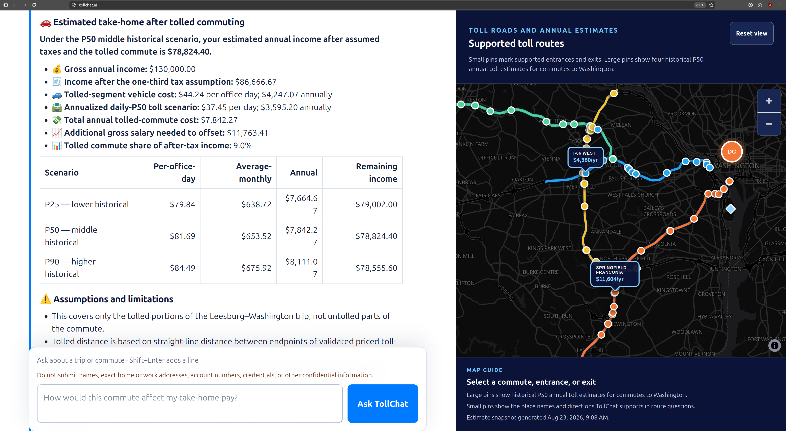
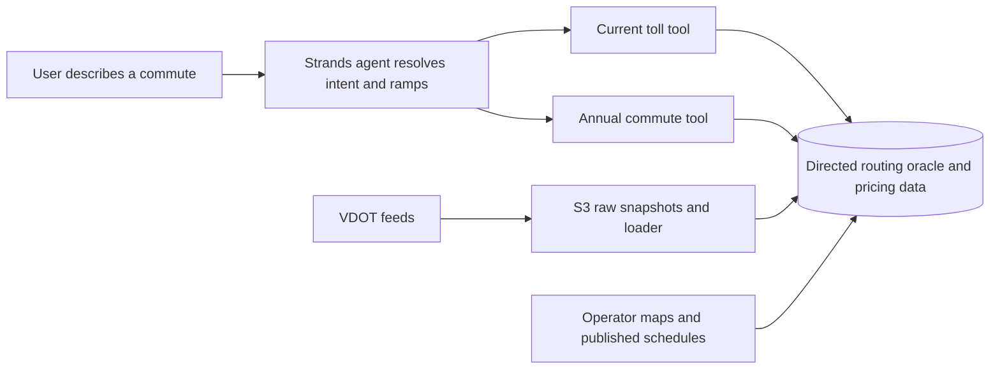

# TollChat

**A deployed AI agent that turns Northern Virginia's fragmented toll data
into route-aware commute costs.**

[Try TollChat](https://tollchat.ai/) · [Technical guide](v2/README.md) ·
[Evaluation results](v2/eval/results/README.md)

**What I built:** I reverse-engineered public VDOT and toll-operator data,
designed the directed PostGIS route model, implemented two deterministic
pricing tools, constrained a Strands agent to use them, deployed TollChat on
AgentCore, and built code-graded evals for tool use, clarification, money, and
grounding.

*TollChat pairs an annual affordability answer with the supported toll-road
entrances, exits, and commute routes.*

## The problem

A job seeker considering an offer in Tysons may know their home, office, and
working hours, but not the official name of the entrance ramp they would use.
Even with the right ramps, Northern Virginia does not have one toll system. It
has four pricing systems with different rules:

| Facility | What makes it difficult |
| --- | --- |
| **I-66 Inside the Beltway** | Dynamic prices during weekday directional windows; free outside them |
| **I-95/I-395 and I-495 Express Lanes** | Dynamic origin/destination prices, reversible I-95/I-395 direction, and cross-network trips with multiple toll components |
| **Dulles Toll Road** | Fixed mainline and ramp charges that must be composed for the actual route |
| **Dulles Greenway** | Peak/off-peak fares, directional ramp limits, and a separate Dulles Toll Road connection charge |

VDOT's feeds publish prices against opaque zone and origin/destination IDs.
Operator maps describe which directed ramps connect. Public schedules define
when a road is tolled or even usable. None of those sources directly answers
the human question: **"What would this commute cost me?"**

## From public data to a route model

TollChat started by reverse-engineering how VDOT's live feeds line up with the
public I-66 calculator and the Express Lanes operator's entry/exit map. That
work recovered directed ramp roles, aliases, pricing keys, one-way access,
cross-road handoffs, and the measured publication cadence of each feed. The
Dulles roads were modeled separately from their published rate schedules
because their pricing rules are different. The
[routing contract](v2/docs/oracle-spec.md) records the source mappings,
curated handoffs, and validation checks.

The result is a directed PostgreSQL/PostGIS graph and pricing engine, called
the routing oracle inside the project. It encodes source-backed toll-road
movements and explicit cross-road connections, then validates the complete path
before pricing anything. Coordinates help the agent discuss nearby ramps; they
never create a road connection merely because two points look close on a map.

That reverse engineering also exposed a consequential v1 gap: the I-95/I-495
route map referenced **330 distinct pricing IDs, while VDOT history contained
only 314**. The missing 16 affected 107 of 685 published routes. V2 maps each
missing product to the closest VDOT-priced proxy found in the retained source
overlap and explicitly labels the value as modeled rather than observed. See
the [data-gap methodology and limitations](v2/docs/i95-missing-od-pricing.md).

## The agent has two tools and does not do the math

The [Strands Agents](https://strandsagents.com/) agent receives a bounded list
of supported entry and exit points, including labels, aliases, directions, and
coordinates. It uses conversation for the part language models are good at:
understanding places, noticing ambiguity, and helping someone choose the right
on/off ramps when they do not know the official names.

Once the endpoints are clear, the agent can call exactly two deterministic
tools:

1. [`get_current_toll_price`](v2/docs/current-pricing-mvp-contract.md) validates the route, applies live facility direction and tolling schedules, selects fresh VDOT observations or published fixed rates, and returns ordered components plus a total.
2. [`get_annual_toll_ballpark`](v2/docs/annual-toll-ballpark-tool-contract.md) validates both commute directions and turns recent same-date toll scenarios, office days, income, and tolled-leg distance into an affordability range for comparing a job offer.

The model cannot submit its own route plan or pricing components. Route
selection, freshness rules, schedule logic, money arithmetic, and provenance
stay behind typed, versioned contracts.

## Deployed agent engineering

TollChat is a single-agent [Strands](https://strandsagents.com/) application
deployed on [Amazon Bedrock AgentCore](https://aws.amazon.com/bedrock/agentcore/).
AgentCore runs inside the project's AWS network; PostgreSQL access uses narrow
IAM-authenticated roles, credentials remain in SSM Parameter Store, and the
public streaming interface is protected by CloudFront and WAF. Tool schemas,
database schemas, and the rendered system prompt are independently versioned
so behavioral changes are reviewable rather than mysterious.

The project uses the
[Strands Agents Evals SDK](https://github.com/strands-agents/evals) to
code-grade exact tool selection, parameters, route behavior, clarification,
money, and response grounding.

## Evidence, with limits

| Claim | Evidence | Important limit |
| --- | --- | --- |
| [Missing-price proxy](v2/docs/i95-missing-od-pricing.md) | 1,200 chronological holdout comparisons; **$0.106 mean absolute error**; **96.1% within $0.50** | 578 captures over five days; $8.05 maximum error; a provisional ballpark, not an operator quote |
| [Quantitative grounding](v2/eval/ballpark-hallucination-report.md) | **996/1,000** strict grounding passes; **999/1,000** without a genuinely incorrect quantitative fact; **93.1%** conservative end-to-end result | One frozen route fixture across five prompt variants; repetitions are correlated |
| [Live agent behavior](v2/eval/results/README.md) | **9/9** curated current-price and annual-affordability cases passed their code-graded contracts | Small, deliberately curated scenario set, not a general route-coverage claim |

**Verify it:** [run the local agent](v2/README.md#local-agent-console) ·
[build and test](v2/docs/agentcore-deployment.md#build-and-review) ·
[run offline eval checks](v2/eval/README.md#offline-check) ·
[run live evals](v2/eval/README.md#live-run)

## Repository map

| Area | Purpose |
| --- | --- |
| [`v2/agent/`](v2/agent/) | Strands agent, prompt contract, AgentCore entrypoint, and browser experience |
| [`v2/agent_tools/`](v2/agent_tools/) | The two agent tools and shared deterministic pricing/route logic |
| [`v2/db/`](v2/db/) and [`v2/oracle/`](v2/oracle/) | Versioned pricing schema, directed route graph, migrations, and source evidence |
| [`v2/eval/`](v2/eval/) | Offline checks, timed live evaluations, and curated reports |
| [`v2/infra/`](v2/infra/) | Application runtime, edge, observability, and least-privilege infrastructure |
| [`infra/`](infra/) | Shared polling, raw storage, RDS, networking, security, and Terraform state |

Start with the [v2 technical guide](v2/README.md) for implementation and
operations details.

## License

Unless otherwise noted, project-authored source code and documentation are available under the [Apache License 2.0](LICENSE).
