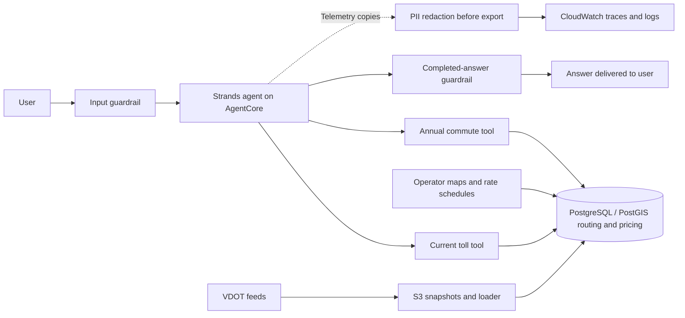
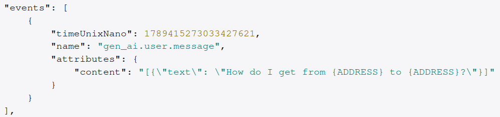
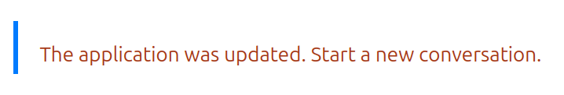

# TollChat

[Cost dashboard](https://tollchat.ai/cost-dashboard) · Daily AWS and OpenAI billing; per-answer cost is not yet measured.

**A deployed AI application with separate development and production environments, deterministic pricing tools, input and output guardrails, and PII redaction before trace export.**

[Live demo](https://tollchat.ai/) · [Engineering evidence](#engineering-evidence) ·
[Evaluation status](#evaluation-status) · [Technical guide](v2/README.md)

## For humans

TollChat answers a practical question: **"What would this Northern Virginia commute cost me?"** It turns fragmented toll feeds, operator maps, and rate schedules into current prices and annual commute estimates.

I built the data pipeline, directed PostgreSQL/PostGIS route model, two deterministic pricing tools, and the Strands agent that uses them. I deployed the application on Amazon Bedrock AgentCore with separate AWS development and production environments, reviewed release workflows, and safety checks around the conversation. Diagnostic traces redact detected personal information before export.

This reference implementation demonstrates how I build and operate an AI application, including the boundaries around the model. Six scheduled scenarios now exercise simulated conversations with deterministic tool-call checks and model-based judges. A representative golden dataset and repeatable measurements of agent improvements are still in progress.

## Engineering evidence

Each row links a claim to its implementation and a way to inspect or verify it. Tests describe checked behavior; workflow definitions describe delivery controls. Neither alone proves a successful live deployment. Recorded results below retain their original scope.

| Claim | Implementation | Verification evidence | Status / limits |
| --- | --- | --- | --- |
| Separate development and production environments | [Development backend](infra/backend.development.hcl), [production backend](infra/backend.production.hcl), and [account contract](infra/account-contract.json) | [Infrastructure contract tests](v2/tests/test_infrastructure_contract.py) and [delivery documentation](v2/README.md#verify-the-build) | Separate account/state configuration; release evidence is specific to an artifact and run. |
| Reviewed, reproducible delivery | [Development delivery](.github/workflows/v2-development-delivery.yml), [production release](.github/workflows/v2-production-release.yml), and [production plan/apply](.github/workflows/v2-production-plan.yml) | [Release checks](v2/tests/test_check_production_release.py), [plan workflow tests](v2/tests/test_production_plan_workflow.py), and [operator runbook](v2/RUNBOOK.md) | Production delivery checks the candidate and saved plan and requires protected review. PR checks use disposable database validation. |
| Blue-green delivery protects release and conversation boundaries | [Release controller](v2/scripts/release_blue_green.py) and [chat proxy](v2/lambdas/chat_proxy/handler.mjs) | [Deployment tests](v2/tests/test_blue_green.py), [session isolation tests](v2/lambdas/chat_proxy/handler.test.mjs), and [browser restart tests](v2/tests/test_public_chat_ui.mjs) | Separate production cutover approval; retained release for recovery. Sessions restart across releases. See the [deployment runbook](v2/runbooks/blue-green-deployments.md). |
| The model delegates route validation and money arithmetic to deterministic tools | [Current toll tool](v2/agent_tools/get_current_toll_price.py), [annual commute tool](v2/agent_tools/get_annual_toll_ballpark.py), and [routing contract](v2/db/oracle/CONTRACT.md) | [Tool contract tests](v2/tests/test_tool_contract.py) and [curated live results](v2/eval/results/README.md) | Tools own pricing; generated explanations still need grounding evaluation. |
| Guardrails check inputs and completed answers | [Runtime checks](v2/agent/agentcore_entrypoint.py) and [versioned guardrail policy](v2/infra/agentcore.tf) | [Input/output blocking and safe-failure tests](v2/tests/test_agentcore_entrypoint.py) and [live release gates](v2/scripts/check_development_release.py) | Configured content, prompt-attack, and credential protections reduce abuse risk; they do not guarantee prevention. |
| Detected PII is redacted from telemetry before export | [Telemetry exporter](v2/agent/telemetry.py) and [additional masking and alarms](v2/infra/trace_redaction.tf) | [Redaction and failure-path tests](v2/tests/test_telemetry_redaction.py), [observed trace example](#observed-trace-redaction), and [verification runbook](v2/runbooks/telemetry-pii-redaction.md) | Detection can miss information. Redaction failures omit affected content; the screenshot demonstrates one address-redaction example. |
| Runtime access and credentials have explicit boundaries | [Runtime IAM permissions](v2/infra/agentcore.tf), [database roles](v2/db/roles.sql), and [security policy](SECURITY.md) | [Infrastructure contract tests](v2/tests/test_infrastructure_contract.py) and [database validation instructions](v2/README.md#verify-the-build) | IAM-authenticated database access; deployed credentials live in SSM Parameter Store. |
| Agent behavior has executable evaluation checks | [Scheduled simulation and judges](v2/eval/simulated.py), [evaluation runner](v2/eval/run_evaluation.py), and [evaluation guide](v2/eval/README.md) | [Simulation contract tests](v2/tests/test_simulated_evaluation.py), [dashboard runbook](v2/runbooks/eval-dashboard.md), and [recorded experiments](#evaluation-status) | Six scheduled current-toll scenarios; development dashboard publication first, production activation pending. Representative golden set and measured improvements remain in progress. |

## Architecture and safety

The agent resolves intent and helps users choose supported entrances and exits. It can call exactly two tools. The tools validate directed routes, apply schedules and freshness rules, and return pricing components and totals. The model cannot submit its own route plan or pricing components.

The public interface uses CloudFront and WAF. Inside the runtime, the input check runs before the agent, and the output check runs before answer delivery. Guardrail errors return a safe failure response. Tool activity can stream while the final answer waits for its check.

Telemetry uses a separate guardrail. It scans copies of diagnostic content without changing the active conversation or tool results. If redaction times out, fails, or cannot process content safely, the exporter substitutes an omission marker. CloudWatch masking adds another layer, but does not erase underlying originals. See the [privacy notice](v2/agent/privacy.txt) for processing and retention limits.

### Observed trace redaction

*Supplied trace capture: both addresses appear as `{ADDRESS}` in a `gen_ai.user.message` event.*

The visible message is `How do I get from {ADDRESS} to {ADDRESS}?`. This is evidence of address redaction in this trace, not a measurement of detection coverage across PII types or environments. Automated detection can miss information; the [telemetry runbook](v2/runbooks/telemetry-pii-redaction.md) describes synthetic verification across export destinations.

### Source-backed routing and pricing

Northern Virginia has four distinct pricing systems: I-66 Inside the Beltway, the I-95/I-395/I-495 Express Lanes, Dulles Toll Road, and Dulles Greenway. Their dynamic prices, directional schedules, ramp charges, and cross-road connections require different rules.

I reverse-engineered VDOT feed identifiers against public calculators and operator maps to recover directed ramps, aliases, pricing keys, and cross-road handoffs. The [source mappings](v2/oracle/sources/) and [data builder](v2/oracle/build_oracle_data.py) produce the routing oracle's checked-in SQL inputs. Coordinates help identify nearby ramps; proximity alone never creates a road connection.

That work exposed 330 pricing IDs in the I-95/I-495 route map but only 314 in retained VDOT history. The missing 16 affected 107 of 685 published routes. The [proxy mapping](v2/db/analysis.sql) uses source-overlap evidence to select available price proxies and labels those prices as modeled. The [holdout report](v2/eval/results/i95-missing-od-pricing.md) documents their measured error and limitations.

## Blue-green deployments and conversation cutover

**An agent release changes both the application and the context in which a conversation runs.** I built blue-green delivery to validate the next release while the active release continues serving traffic. Candidate checks verify the actual release identity, a grounded agent answer, guardrail behavior, and trace redaction. Production requires a separate human approval before cutover, followed by fresh validation before traffic switches.

Promotion changes routing to the validated candidate and retains the previous release for recovery. During post-cutover observation, two consecutive probe failures trigger one rollback attempt. The [deployment runbook](v2/runbooks/blue-green-deployments.md) documents the validation gates and recovery procedure; public and private routing updates are not globally atomic.

**Conversation state has an explicit release boundary.** Each session carries a release ID. If a request reaches a different release—or uses a legacy session without an ID—the chat proxy rejects it before invoking or resetting AgentCore, clears the session cookie, and tells the user to start a new conversation. In-flight requests may finish, but prompts are never automatically replayed. I chose a visible restart so an existing conversation is not silently continued under a different agent release.

*The user-facing restart message when a session does not match the serving release.*

## Evaluation status

**A representative golden evaluation set and repeatable before/after measurements of agent improvements are in progress.** The scheduled suite covers six current-toll scenarios with simulated users, a deterministic tool-call count check, and model-based completeness and correctness judges. The broader regression catalog checks parameters, clarification, route availability, money, and grounding. The reports below are scoped experiments, not a current whole-agent accuracy score or evidence of improvement between agent versions.

| Experiment | Recorded result | Scope and limits |
| --- | --- | --- |
| [Live agent behavior, August 22, 2026](v2/eval/results/README.md) | 9/9 curated current-price and annual-affordability cases passed their code-graded contracts | Small curated set across three recorded runs; not a representative golden benchmark. |
| [Frozen-fixture quantitative grounding](v2/eval/ballpark-hallucination-report.md) | 996/1,000 strict grounding passes; 999/1,000 without an incorrect quantitative fact; 93.1% conservative end-to-end result | One frozen route fixture, five prompt variants, correlated repetitions, and adjudication of flagged claims. Not an agent-wide hallucination rate. |
| [Missing-price proxy holdout](v2/eval/results/i95-missing-od-pricing.md) | 1,200 comparisons; $0.106 mean absolute error; 96.1% within $0.50 | Five days of matched data; $8.05 maximum error. Measures a pricing proxy, not improvement to the agent. |

The new [`/eval-dashboard`](v2/runbooks/eval-dashboard.md) shows seven days of scheduled results, the latest synthetic conversations, tool evidence, and judge explanations. It distinguishes graded failures from execution errors and missing runs. Publication is enabled for development first; production activation remains pending. Judge accuracy still needs live verdict review.

The next evaluation milestone is to establish the representative golden set, record a baseline, and compare agent changes against that same set with documented failures and regressions. No improvement percentage is claimed here.

## Reproduce and inspect

- [Run the local agent](v2/README.md#local-agent-console) or try the [deployed application](https://tollchat.ai/).
- Inspect [daily AWS and OpenAI billing](https://tollchat.ai/cost-dashboard) in the cost dashboard; per-answer cost is not yet measured.
- [Build and validate](v2/README.md#verify-the-build), including disposable database checks.
- [Run offline evaluation checks](v2/eval/README.md#offline-check) or follow the separately credentialed [live evaluation instructions](v2/eval/README.md#live-run).
- Inspect [release operations](v2/RUNBOOK.md), [telemetry verification](v2/runbooks/telemetry-pii-redaction.md), and [shared foundation changes](v2/README.md#shared-foundation-changes).

| Area | Contents |
| --- | --- |
| [`v2/agent/`](v2/agent/) and [`v2/agent_tools/`](v2/agent_tools/) | Agent, frontend, versioned prompt/tool contracts, and deterministic tools |
| [`v2/db/`](v2/db/), [`v2/oracle/`](v2/oracle/), and [`v2/lambdas/`](v2/lambdas/) | Database, migrations, source mappings, data ingestion, and chat proxy |
| [`v2/tests/`](v2/tests/) and [`v2/eval/`](v2/eval/) | Executable checks, evaluation cases, and recorded experiments |
| [`v2/infra/`](v2/infra/), [`infra/`](infra/), and [`.github/workflows/`](.github/workflows/) | Application/shared infrastructure and delivery workflows |

## License

Unless otherwise noted, project-authored source code and documentation are available under the [Apache License 2.0](LICENSE).
