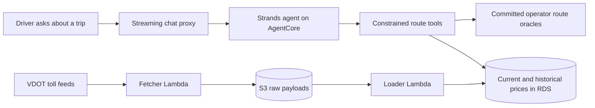

# TollChat

**Open beta:** [Ask TollChat at tollchat.ai](https://tollchat.ai)

[](https://github.com/rhprasad0/nova-toll-budget-agent/actions/workflows/ci.yml)

TollChat answers a deceptively expensive question: **what will this Northern
Virginia trip cost in tolls?** Describe the trip in plain language and the
agent resolves real entry and exit points, finds the applicable prices, and
adds the supported legs into one estimate.

> **Evals-first development:** user-visible behavior is defined and graded
> before the agent is expanded. [Review the curated evaluation evidence →](eval/results/README.md)

## One trip should not require five toll calculators

Northern Virginia toll pricing is split across multiple operators and sites.
I-66, the 95/395 and 495 Express Lanes, the Dulles Toll Road, and the Dulles
Greenway each publish different calculators, schedules, maps, or feeds. A
driver planning a route may need to:

- identify which toll facilities the trip crosses;
- translate everyday place names into valid ramps and directions;
- check live prices and lane availability, or retrieve a supported historical
  price;
- visit another authority for the next road and add the charges manually; and
- repeat the browsing and math for every trip being considered.

TollChat turns those minutes of site-hopping and arithmetic into one question:

> **Dumfries to Westpark right now—what should I budget for tolls?**

The agent prices supported legs from authoritative data and says when it cannot
price something. It does not quietly turn a missing number into a confident
guess—a charming habit in dinner conversation, less so in money software.

**Coverage:** I-66 Inside the Beltway, 95/395 Express Lanes, 495 Express Lanes,
the Dulles Toll Road, and the Dulles Greenway. The connection between I-95 and
I-495 has no published junction price; TollChat adds the known corridor fares
and explicitly excludes that gap.

> TollChat provides estimates, not official toll quotes. Verify current rates
> and road access with the relevant toll operator before travel.

## Evals first: prove behavior before expanding it

TollChat demonstrates an **evals-first development approach**. Each behavior
starts as a concrete contract—expected tool calls, arguments, results, response
content, and forbidden shortcuts—then gets the cheapest evaluator capable of
proving it. Objective behavior is code-graded; simulated users and model judges
are added only when conversation quality or adaptation is the thing under test.

### Representative evaluation evidence

| Behavior under test | Evidence | Observed result |
|---|---|---|
| Historical I-95 closures and official-source follow-ups | [Live simulation](eval/results/20260808T140554Z.json) and [Batch verdicts](eval/results/batch-judges-batch_6a7737dfbd388190a78681ff30118b13-verdicts.json) | 8/8 deterministic verdicts and 4/4 goal-success judgments passed; 0 execution errors |
| Prompt-attack and harmful-content boundaries | [Guardrail boundary report](eval/results/20260807T213709Z-guardrail-boundary.json) | 6/6 block/pass cases behaved as expected |
| Concurrent conversation isolation and reset behavior | [AgentCore session report](eval/results/20260807T214229Z-agentcore-session-isolation.json) | Interleaved sessions, turn budgets, reset isolation, and runtime rotation passed |
| Reciprocal single-leg pricing and Greenway arithmetic | [Single-leg report](eval/results/20260804T214058Z.json) | 16/16 route and response judgments passed; 0 execution errors |

The [eval-authoring SOP](agent-sops/eval-authoring.sop.md) captures the loop:
define the behavior contract, validate evaluators offline, run billed live
suites only with explicit authorization, inspect raw traces, preserve observed
scores without rerunning for a prettier number, and promote stable checks into
CI or nightly automation.

**[Explore all curated evaluation evidence →](eval/results/README.md)**

## What this project demonstrates

- **Grounded agent design:** an OpenAI-powered Strands agent chooses among
  narrow pricing tools; it cannot issue SQL or inspect the database directly.
- **Evals-first development:** deterministic checks establish objective
  contracts before simulated users, live integrations, trace grading, and
  report-only judges assess higher-level behavior.
- **Production boundaries:** parameterized read-only queries, SSM-managed
  credentials, Bedrock Guardrails, session isolation, sanitized traces, and
  explicit launch and rollback controls.
- **Real data engineering:** scheduled VDOT ingestion preserves current and
  historical prices while operator-published route maps remain reproducible,
  versioned inputs.

## Choose a review path

| If you want to review… | Start here | What it shows |
|---|---|---|
| Agent orchestration | [`agent/toll_agent.py`](agent/toll_agent.py) and the [Agent SOP](agent-sops/nova-toll-pricing-assistant.sop.md) | Stateful Responses, prompt caching, tool planning, ambiguity handling, and versioned contracts |
| Grounded pricing tools | [`agent_tools/`](agent_tools/) and the [tool specification](docs/oracle-tools-spec.md) | Deterministic route resolution, fixed parameterized queries, temporal pricing, and explicit failures |
| Evaluation strategy | [**Curated results**](eval/results/README.md), [evaluation suites](eval/), and the [evaluation report](eval/eval-report.md) | Deterministic, simulated-user, integration, guardrail, and judge evidence |
| Security and safety | [`SECURITY.md`](SECURITY.md) and the [runbooks](docs/runbooks/) | Least privilege, secret handling, guardrail boundaries, spend controls, and operational controls |
| AWS architecture | [Terraform](infra/), [deployment decisions](docs/architecture/decisions.md), and [runbooks](docs/runbooks/) | AgentCore, Lambda, RDS, private networking, observability, rollback, and a kill switch |
| Engineering investigation | [Oracle findings](docs/oracle-findings.md) and the [poller specification](docs/poller-spec.md) | Data-source reconciliation, discovered edge cases, migrations, and documented tradeoffs |
| Quality gates | [CI workflow](.github/workflows/ci.yml) and [browser tests](tests/browser/) | Strict typing, linting, unit and integration tests, UI checks, and agent evaluations |

## How it works



The two paths meet only inside the pricing tools. The agent receives tool
results, not database access. Input and output pass through guardrail checks,
while sanitized application records and AgentCore spans make each invocation
reviewable without copying credentials into logs or Terraform state.

## The important design decision: less agent authority

An earlier design exposed schema discovery and free-form SQL to the agent. That
surface was [deliberately removed](db/drop_agent_surface.sql). The replacement
uses corridor-specific tools that resolve trips against committed route maps
and run only fixed, parameterized pricing queries.

That smaller surface is easier to evaluate and safer to operate. It also keeps
the agent honest about real road constraints: one-way ramps, closed lanes,
historical availability, unsupported cross-corridor trips, and missing prices
are modeled as outcomes—not invitations to improvise.

The route-map investigation behind those choices is recorded in
[`docs/oracle-findings.md`](docs/oracle-findings.md), including discrepancies
between published topology and live pricing data and why some seemingly simple
route combinations remain out of scope.

## Run the reviewable checks

The default suite excludes tests that require a network, model API, or RDS:

```sh
uv sync --locked
npm ci
uv run ruff check .
uv run pyright
uv run pytest
npm run test:ui
```

For an example deterministic agent check:

```sh
uv run python eval/deterministic/single_leg_base_cases/deterministic_single_leg_base_cases.py --check
```

Cloud-backed development uses the loopback chat console:

```sh
uv run python -m agent.dev_chat
```

It requires the repository's AWS and Tailscale environment. Runtime credentials
come from SSM Parameter Store—never a local secrets file—and the database role
is read-only. See [`SECURITY.md`](SECURITY.md) before running live workflows.

## Built by Ryan Prasad

TollChat is designed and built by [Ryan Prasad](https://github.com/rhprasad0)
as an applied AI engineering project: useful to drivers, constrained enough to
trust, and instrumented enough to debug when reality gets weird.

Questions or beta feedback: [contact@tollchat.ai](mailto:contact@tollchat.ai)
