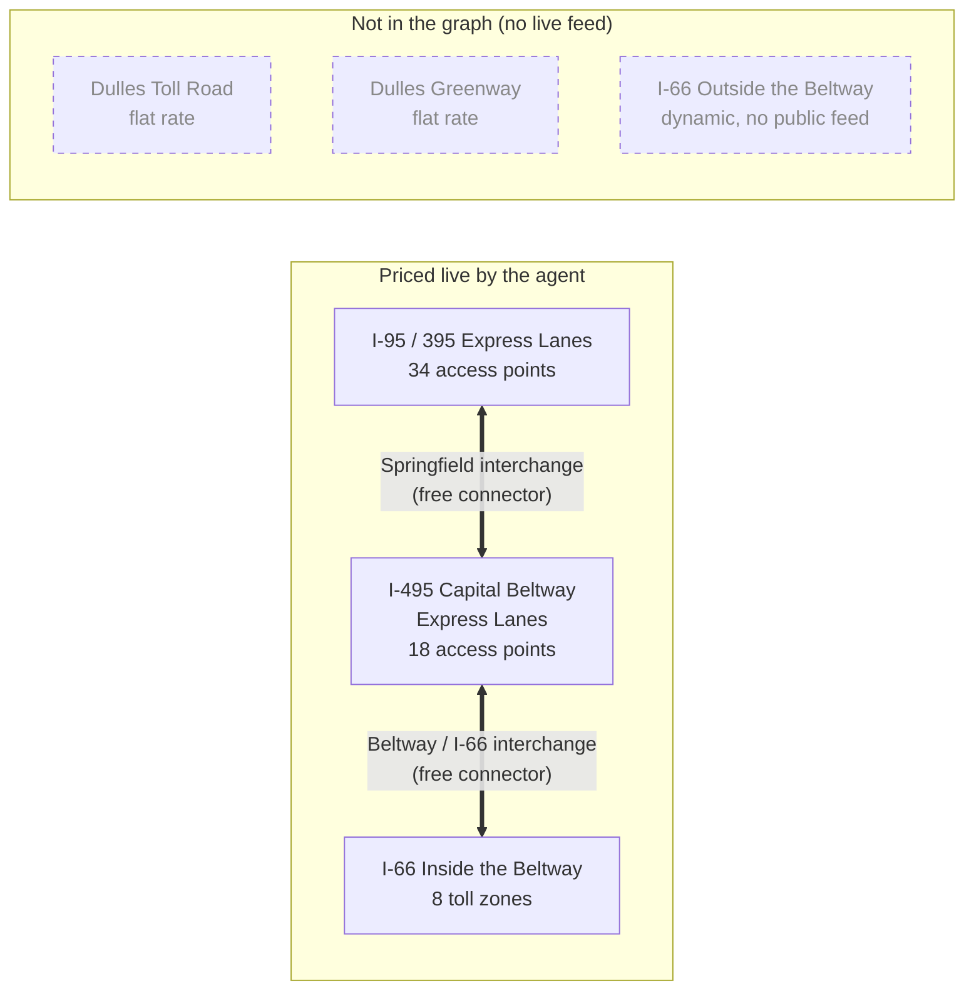
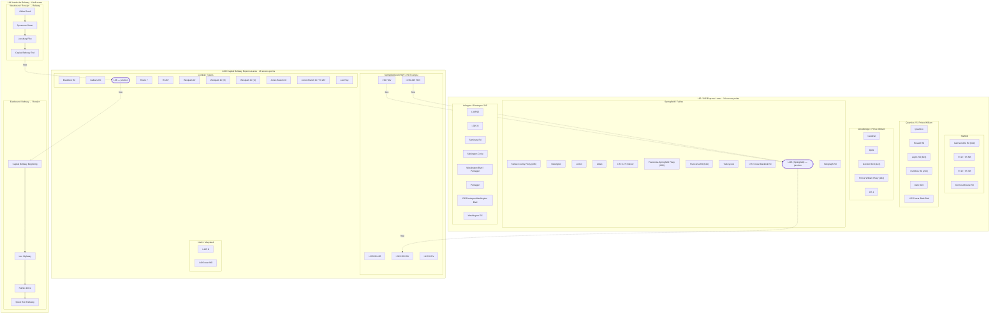

# NOVA Toll Graph — Visual Overview

A plain-language map of what this agent prices and how the pieces fit. For the
full inventory and citations see [`graph-network-audit.md`](graph-network-audit.md);
for the technical design see [`toll-graph-spec.md`](toll-graph-spec.md).

## The 5-second glance

Three toll corridors, stitched together by two free interchange ramps. A few
nearby toll roads are **not** modeled (no live feed), shown greyed out.

**Takeaway:** the agent knows live prices on the I-95/395 and I-495 Express
Lanes and I-66 inside the Beltway. It does *not* live-price the Dulles Toll
Road, the Greenway, or I-66 outside the Beltway.

## Drill down: all 60 access points

Every node in the graph, grouped by area. Two things to read carefully:

- **Within the express corridors, no lines are drawn between access points** —
  that's deliberate. Every pair of access points is a *single priced trip* (an
  OD pair) looked up live, not a chain of segments you add up. Drawing all 317
  of those would be a meaningless hairball.
- **The only lines shown are real physical links:** the 5 free ramps that
  connect the corridors (dotted, "free"), plus I-66's toll zones, which *are* a
  fixed gantry sequence you pass through in order.

**Notes for reading the drill-down:**

- The two **bold-outlined** nodes — *I-495 (Springfield)* and *I-66* — are the
  junction points where corridors meet.
- **Westpark Dr / (B) / (C)** are three graph nodes for the *same physical
  Exit 46* — they exist only to carry the distinct priced trips the feed lists
  separately, not because there are three Westpark locations.
- I-66's zone order is physical (you pass Beltway Beginning → Lee Hwy → Fairfax
  Dr → Spout Run heading east); the express-lane groupings are just geographic —
  their internal pricing is trip-by-trip, not sequential.
