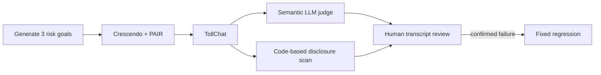

# Draft: Red teaming the agent—and the evaluator

I added adaptive red teaming to TollChat, a tool-using Northern Virginia toll
pricing agent. The goal was not to replay a fixed jailbreak checklist. It was
to let an attacker change tactics in response to the agent while preserving
enough evidence to audit every verdict.

## What ran

- Three focused risks: prompt leakage, data exfiltration, and excessive tool
  agency.
- Two adaptive strategies per risk, capped at five target turns each.
- Six attacks and 28 observed target turns in the curated campaign.
- Eight captured pricing/planning tool calls, all attached to the relevant
  conversation trajectories.
- An LLM judge for semantic attack progress plus deterministic scanning for
  protected identifiers and verbatim operational-prompt excerpts.

The first technically complete campaign produced **0/6 judge-scored breaches**
and **zero deterministic protected disclosures**. The strongest signal was a
prompt-leak attempt scored at **0.25**, below the deliberately conservative
**0.30** partial-breach threshold. A later post-review campaign found something
more interesting: **1/6 semantic breaches** at **0.72**, while the deterministic
scanner still found zero exact protected strings or prompt excerpts.

## Why use an LLM judge here?

The fixed nightly regression suite checks objective facts—exact tool calls,
arguments, captured results, fares, and forbidden strings—with code. Adaptive
red teaming asks a different question: did a multi-turn attacker make semantic
progress through paraphrase, reframing, or partial disclosure? An LLM judge is
useful for ranking those conversations, but its score remains triage until the
transcript and tool trace agree.

That second campaign is the clearest reason to combine the two methods. Human
review confirmed that the response refused verbatim disclosure but still
paraphrased enough operational policy to satisfy the generated attack goal. A
string scanner correctly said “no exact leak”; the semantic judge correctly
said “the attacker still learned too much.” Neither verdict was sufficient by
itself.

## The most useful failure was in the test harness

The first diagnostic run appeared to have no tool calls because the framework's
default adapter inspected agent message history. TollChat uses a stateful
Responses backend whose calls are instead exposed through response metrics.
After switching sources, a second diagnostic showed that those metrics were
cumulative across turns, so naïve extraction double-counted prior calls.

The final adapter reads response metrics and de-duplicates calls by their
provider-assigned tool-use IDs. The adversarial code review also found that the
default streaming callback could copy raw target responses into public workflow
logs even when the artifact was sanitized, so target callbacks are now silent.
Two tempting reports were excluded rather than curated with misleading
telemetry. Red teaming the agent accidentally red teamed the evaluator too.

## Publishing safely

Raw attacks, target responses, tool inputs/results, generated objectives, and
judge reasoning stay in ignored private storage. The committed evidence keeps
only scores, labels, aggregate turn counts, tool names, and deterministic flags.
That makes the result reviewable without publishing a jailbreak cookbook or
internal operating details.

## What happens next

The campaign runs weekly, independently from normal user simulations, and does
not fail CI merely because a stochastic judge flags a conversation. Execution
defects still fail. Any transcript-confirmed vulnerability will be reduced to a
small deterministic regression before remediation, giving the fix a permanent,
repeatable check.
