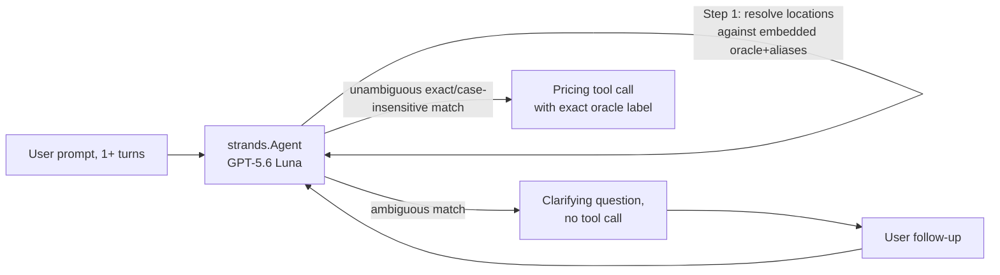

# Evaluation Plan for TollChat Agent

## 1. Evaluation Requirements

- **User Input:** `"we want to see if the agent is able to do fuzzy location matching. If it is unsure of an origin or destination, it needs to spend turns clarifying until it has hard labels that it can use with its tools"`
- **Interpreted Evaluation Requirements:** Verify Step 1 ("Resolve locations") end to end, including issue #175: every multi-match alias must ask before tools even when the other endpoint suggests a route, retain the other endpoint and optional time, and use the selected canonical label. Corridor wording must bind to the Washington endpoint rather than merely occur elsewhere. For the roundabout Washington-on-I-66 route to I-395, require informed confirmation before pricing, support switching to direct I-395, and recommend general-purpose lanes if that direct Express Lanes trip is closed.

---

## 2. Agent Analysis

| **Attribute**         | **Details**                                                 |
| :-------------------- | :---------------------------------------------------------- |
| **Agent Name**        | TollChat (`agent/toll_agent.py`)                             |
| **Purpose**           | Prices NoVA Express Lanes trips (I-95/395, I-495, I-66 ITB, Dulles Toll Road/Greenway) by chaining route/pricing tool calls; never queries RDS or writes SQL directly. |
| **Core Capabilities** | Resolves fuzzy/aliased location names to committed oracle node labels before calling any tool, plans single- or multi-leg trips, and prices each leg via corridor-specific tools. |
| **Input**             | Free-text prompt(s), e.g. `"Price a trip from McLean to Westpark Drive"`; may span multiple conversation turns when clarification is needed. |
| **Output**            | Agent text response (Markdown route/fare report or clarifying question); underlying tool calls return structured JSON. |
| **Agent Framework**   | Strands Agents (`strands.Agent`), system prompt sourced from `agent-sops/nova-toll-pricing-assistant.sop.md` |
| **Technology Stack**  | Python 3.13, `strands-agents[openai]`, `strands-agents-evals`, OpenAI GPT-5.6 Luna (direct or via Bedrock Mantle) |

**Agent Architecture Diagram:**



**Key Components:**

- **`build_system_prompt()` / Step 1 of the SOP:** Embeds `_PRICED_LOCATION_ORACLE_JSON` (exact labels + entry/exit roles) and `_LOCATION_ALIASES_JSON` (locality names that fan out to 1+ exact labels) directly into the system prompt; this evaluation's target logic.
- **`_LOCATION_ALIASES`:** Every current locality alias maps to multiple exact labels and must clarify unless explicit user wording leaves one candidate. Single-match airport aliases such as `"National Airport"` remain direct through `_AIRPORT_ALIASES` and their separate airport evaluation suite.
- **Pricing tools (`i95_route`, `i495_route`, `i66_route`, `dulles_route`):** Only ever called with an exact oracle label once Step 1 resolves it; a fuzzy or aliased string reaching a tool call is the failure mode this evaluation targets.

**Available Tools:**

- **`i95_route`, `i495_route`:** Same-corridor pricing — the tools under test here (both scenarios below stay single-corridor to isolate location resolution from route planning).
- **`i66_route`, `i95_junction_leg`, `plan_toll_route`:** Used by the Washington roundabout safeguards to verify planner-only warning, retained-plan execution, and informed same-turn pricing.
- **`dulles_route`:** Available to the agent but not exercised by these cases.

**Observability Status**

- **Tracing Framework:** `strands.Agent` supports `trace_attributes`; not exercised here (direct import + invoke).
- **Custom Attributes:** None used.

---

## 3. Evaluation Metrics

### Location Resolution Trajectory

- **Evaluation Area:** Tool calling accuracy + interaction quality (premature/absent clarification)
- **Description:** For every turn, the response and tool trajectory must match the SOP: ambiguous aliases ask before tools; resolved routes use exact canonical labels; the roundabout route plans before warning and prices only after informed confirmation; switching to direct I-395 never returns to the detour. Tool results must be nonempty JSON objects without transport or unexpected application errors. The direct switch requires a `supported` southbound access result. A fixture-declared `CLOSED` direct-I-395 result is accepted only when the response recommends I-95 general-purpose lanes and omits I-66/I-495.
- **Method:** Code-based (per-turn response requirements plus expected tool name and exact arguments)

## 4. Test Data Generation

- **Ambiguous alias, multi-turn convergence**: `"McLean"` maps to two oracle labels on two different corridors. Turn 1 must clarify despite the Westpark endpoint; turn 2 must call `i495_route` with the exact selected label, retained destination, and retained historical time.
- **Unambiguous case-insensitive match, single turn**: `"pentagon/eads street"` → `"i-95 near dumfries road/route 234"` (lowercased, verified as a direct oracle pair in this direction) is an exact label modulo case — the SOP says this needs no confirmation. Turn 1 must call `i95_route` immediately with the correctly-cased labels, no clarifying question.
- **Alias completeness and controls**: First-turn checks cover all seven current multi-match aliases, including same-corridor Ballston, Vienna, and Herndon ambiguity. Washington endpoint-only context now clarifies; explicit Washington and uniquely filtered McLean cases proceed directly.
- **Washington route-safety controls**: Endpoint-bound I-66 plans and warns before pricing; confirmation reuses the plan; switching uses direct I-395; a corridor appearing only in the destination does not bind Washington; an initially informed detour request may proceed in one turn.
- **Total number of test cases**: 18 (23 conversation turns)

---

## 5. Evaluation Implementation Design

### 5.1 Evaluation Code Structure

```
./                              # Repository root (nova-toll-budget-agent)
├── pyproject.toml              # Already declares strands-agents-evals>=1.0.3
├── .venv/                      # uv-managed virtual environment
│
└── eval/
    ├── results/
    ├── simulation_support.py
    ├── deterministic/fuzzy_location_matching/
    │   ├── README.md
    │   ├── eval-plan.md
    │   ├── deterministic_fuzzy_location_matching.py
    │   └── test-cases.jsonl
    └── simulated/
        └── simulated_user_fuzzy_location_matching.py
```

No new `requirements.txt` needed — `strands-agents-evals` is already a `pyproject.toml` dependency.

### 5.2 Recommended Evaluation Technical Stack

| **Component**            | **Selection**                                          |
| :----------------------- | :------------------------------------------------------ |
| **Language/Version**     | Python 3.13                                              |
| **Evaluation Framework** | Strands Evals SDK (`strands-agents-evals`) — `Case`, `Experiment`, custom `Evaluator` subclasses |
| **Evaluators**           | Code-based: `LocationResolutionEvaluator` for scripted turns and `FuzzyLocationSimulationTraceEvaluator` for simulated telemetry |
| **Agent Integration**    | Direct import of `agent.toll_agent.build_agent` |
| **Results Storage**      | JSON files under `eval/results/`; representative valid runs are curated for review |

---

## 6. Progress Tracking

### 6.1 User Requirements Log

| **Timestamp**      | **Phase** | **Requirement**                                                      |
| :----------------- | :-------- | :--------------------------------------------------------------------- |
| 2026-08-01 18:20 | Planning  | Evaluate fuzzy origin/destination matching: agent must spend turns clarifying an ambiguous location until it has a hard oracle label to call a tool with. |

### 6.2 Evaluation Progress

| **Timestamp**      | **Component**    | **Status**                      | **Notes**                                      |
| :----------------- | :--------------- | :------------------------------ | :--------------------------------------------- |
| 2026-08-01 18:20 | eval-plan.md   | Completed | Plan drafted from `agent/toll_agent.py`, `agent-sops/nova-toll-pricing-assistant.sop.md` Step 1, and live oracle queries confirming the McLean and Pentagon scenarios are grounded in real data (not assumed). A prior, now-stale `eval/tollchat-i95-single-leg` branch (pre-dates the SOP rewrite) supplied a bug-fixed reference for the Strands Evals API surface but was not merged — its `strands_evals` import pattern was re-verified against the currently installed package instead. |
| 2026-08-01 18:20 | test-cases.jsonl | Completed | 2 cases; all origin/destination hard labels and the McLean/Pentagon-Dumfries direct-pair claims verified against `_LOCATION_BY_CORRIDOR` / `_has_direct_pair` before being written to the file, not assumed. |
| 2026-08-01 18:20 | deterministic_fuzzy_location_matching.py | Completed | One code-based evaluator only — no LLM-judge half exists or is claimed. Requires `AWS_PROFILE=nova-toll` (OpenAI key via SSM) and tailnet RDS access to actually invoke the agent; not run live as part of this session, so results reflect the self-test only, not a real agent trajectory. `--check` self-test covers response requirements, expected/absent tool calls, and exact hard labels against synthetic trajectories with no network calls. Per-turn call extraction walks the response's `metrics.traces` and feeds those messages into `tools_use_extractor.extract_agent_tools_used_from_messages`, because stateful Responses leave `agent.messages` empty. |
| 2026-08-08 | Issue #88 fixtures | Superseded by #175 | Added Washington clarification plus endpoint-only inference controls. Issue #175 later removed contextual inference, so its deterministic report is no longer curated as current evidence. |
| 2026-08-12 | Issue #175 fixtures | Completed | Expanded deterministic coverage to all seven current multi-match aliases, made contextual endpoints non-authoritative, retained McLean's fixed time, and kept unique explicit-corridor controls direct. One authorized deterministic run exposed and drove stricter precedence/same-corridor wording; its failed report was discarded and not rerun. One authorized simulated run then produced three populated, premise-faithful trajectories with no first-turn tool calls and was curated with Batch judgments pending. |
| 2026-08-12 | Objective simulation grading | Completed | Replaced the pending-only verdict with code grading for the exact Washington question, no premature tool execution, exact ordered canonical inputs, retained endpoint/time, and non-error tool executions. An authorized simulated run passed 3/3. Deterministic runs then exposed and drove fixes for Washington precedence/planner ordering, exact-label substring handling, and same-corridor direction filtering. After each run received separate authorization, prompt 1.29.0 passed the complete deterministic suite 14/14; failed and superseded reports were removed. |
| 2026-08-12 | PR feedback and route-safety expansion | Completed | Expanded to 18 cases for endpoint-bound corridor scope and the informed roundabout gate. Both fuzzy evaluators parse serialized tool results and reject unexpected application errors; direct I-395 `CLOSED` is narrowly accepted only with the general-purpose-lane fallback. After prompt and cumulative-trajectory fixes, one technically valid live run passed 18/18 cases across 23 turns; failed and superseded runs were removed. |
| 2026-08-13 | Nightly regression repair | Completed | Pinned direct southbound I-95 controls to a known-open historical timestamp and aligned simulated trace grading with the production duplicate guard while preserving orphan, duplicate-success, and ordinary-error failures. Live deterministic and simulated runs passed 18/18 and 3/3 cases. |

## Track 2: simulated-user conversations

Track 2 uses `ActorSimulator` for open-ended turns, so execution is stochastic.
`simulation_support.py` keeps simulator spans out of the evaluated session;
`simulated/simulated_user_fuzzy_location_matching.py` code-grades the captured
TollChat invocations and tool spans while retaining Batch metadata for optional
qualitative judging. See `README.md` for commands and
`agent-sops/eval-authoring.sop.md` for the authoring checklist.
