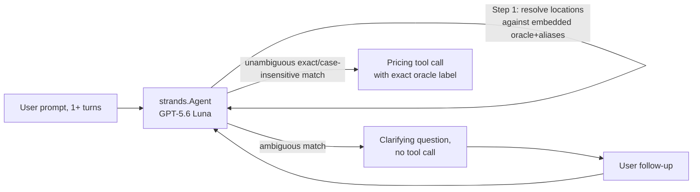

# Evaluation Plan for TollChat Agent

## 1. Evaluation Requirements

- **User Input:** `"we want to see if the agent is able to do fuzzy location matching. If it is unsure of an origin or destination, it needs to spend turns clarifying until it has hard labels that it can use with its tools"`
- **Interpreted Evaluation Requirements:** Verify Step 1 ("Resolve locations") end to end, including issue #88: bare Washington must ask I-66 versus I-395 as either endpoint, retain the other endpoint after the answer, and use the selected canonical label. Explicit corridor context and exact case-insensitive labels must proceed without asking.

---

## 2. Agent Analysis

| **Attribute**         | **Details**                                                 |
| :-------------------- | :---------------------------------------------------------- |
| **Agent Name**        | TollChat (`agent/toll_agent.py`)                             |
| **Purpose**           | Prices NoVA Express Lanes trips (I-95/395, I-495, I-66 ITB, Dulles Toll Road/Greenway) by chaining route/pricing tool calls; never queries RDS or writes SQL directly. |
| **Core Capabilities** | Resolves fuzzy/aliased location names to committed oracle node labels before calling any tool, plans single- or multi-leg trips, and prices each leg via corridor-specific tools. |
| **Input**             | Free-text prompt(s), e.g. `"Price a trip from McLean to Westpark Drive"`; may span multiple conversation turns when clarification is needed. |
| **Output**            | Agent text response (Markdown route/fare report or clarifying question); underlying tool calls return structured JSON. |
| **Agent Framework**   | Strands Agents (`strands.Agent`), system prompt sourced from `agent-sops/nova-toll-pricing-assistant.sop.md` |
| **Technology Stack**  | Python 3.13, `strands-agents[openai]`, `strands-agents-evals`, OpenAI GPT-5.6 Luna (direct or via Bedrock Mantle) |

**Agent Architecture Diagram:**



**Key Components:**

- **`build_system_prompt()` / Step 1 of the SOP:** Embeds `_PRICED_LOCATION_ORACLE_JSON` (exact labels + entry/exit roles) and `_LOCATION_ALIASES_JSON` (locality names that fan out to 1+ exact labels) directly into the system prompt; this evaluation's target logic.
- **`_LOCATION_ALIASES`:** Some aliases (e.g. `"National Airport"`) map to exactly one label — expected to resolve without asking. Others (e.g. `"McLean"`) map to two labels on different corridors — expected to require a clarifying question.
- **Pricing tools (`i95_route`, `i495_route`, `i66_route`, `dulles_route`):** Only ever called with an exact oracle label once Step 1 resolves it; a fuzzy or aliased string reaching a tool call is the failure mode this evaluation targets.

**Available Tools:**

- **`i95_route`, `i495_route`:** Same-corridor pricing — the tools under test here (both scenarios below stay single-corridor to isolate location resolution from route planning).
- **`i66_route`, `dulles_route`, `i95_junction_leg`, `plan_toll_route`:** Available to the agent but out of scope; a failure mode to watch for is any of these firing where a resolution question was expected instead.

**Observability Status**

- **Tracing Framework:** `strands.Agent` supports `trace_attributes`; not exercised here (direct import + invoke).
- **Custom Attributes:** None used.

---

## 3. Evaluation Metrics

### Location Resolution Trajectory

- **Evaluation Area:** Tool calling accuracy + interaction quality (premature/absent clarification)
- **Description:** For every turn in a case's conversation, the agent's actual response and tool trajectory must match what the SOP's fuzzy-matching rule requires: an ambiguous turn must ask a relevant question and make no pricing call, while a resolvable turn must call exactly the expected tool with the expected origin/destination — the exact case-correct oracle label, not the user's raw wording. The argument check is a subset match on the case's `input` keys (origin/destination), not full dict equality, so an unpinned optional argument (e.g. `i495_route`'s `at_time`) can't produce a false `label_mismatch` for a case that never specified a time.
- **Method:** Code-based (per-turn response requirements plus expected tool name and exact arguments)

## 4. Test Data Generation

- **Ambiguous alias, multi-turn convergence**: `"McLean"` maps to two oracle labels on two different corridors (`Route 123 - Dolley Madison Blvd` on I-66 ITB, entry-only; `Jones Branch Drive/Route 123` on I-495, entry+exit). Turn 1 must produce a clarifying question and no tool call; turn 2, after the user picks the I-495 interchange, must call `i495_route` with the exact labels `"Jones Branch Drive/Route 123"` → `"Westpark Drive"` (verified as a direct oracle pair).
- **Unambiguous case-insensitive match, single turn**: `"pentagon/eads street"` → `"i-95 near dumfries road/route 234"` (lowercased, verified as a direct oracle pair in this direction) is an exact label modulo case — the SOP says this needs no confirmation. Turn 1 must call `i95_route` immediately with the correctly-cased labels, no clarifying question.
- **Washington ambiguity and controls**: Two multi-turn cases cover Washington as origin and destination with opposite corridor choices; four single-turn controls cover explicit corridor names and disambiguation from the other endpoint alone on I-66 and I-395.
- **Total number of test cases**: 8

---

## 5. Evaluation Implementation Design

### 5.1 Evaluation Code Structure

```
./                              # Repository root (nova-toll-budget-agent)
├── pyproject.toml              # Already declares strands-agents-evals>=1.0.3
├── .venv/                      # uv-managed virtual environment
│
└── eval/
    ├── results/
    ├── simulation_support.py
    ├── deterministic/fuzzy_location_matching/
    │   ├── README.md
    │   ├── eval-plan.md
    │   ├── deterministic_fuzzy_location_matching.py
    │   └── test-cases.jsonl
    └── simulated/
        └── simulated_user_fuzzy_location_matching.py
```

No new `requirements.txt` needed — `strands-agents-evals` is already a `pyproject.toml` dependency.

### 5.2 Recommended Evaluation Technical Stack

| **Component**            | **Selection**                                          |
| :----------------------- | :------------------------------------------------------ |
| **Language/Version**     | Python 3.13                                              |
| **Evaluation Framework** | Strands Evals SDK (`strands-agents-evals`) — `Case`, `Experiment`, custom `Evaluator` subclasses |
| **Evaluators**           | Code-based only: `LocationResolutionEvaluator` (per-turn response + hard-label args) |
| **Agent Integration**    | Direct import of `agent.toll_agent.build_agent` |
| **Results Storage**      | JSON files under `eval/results/`; representative valid runs are curated for review |

---

## 6. Progress Tracking

### 6.1 User Requirements Log

| **Timestamp**      | **Phase** | **Requirement**                                                      |
| :----------------- | :-------- | :--------------------------------------------------------------------- |
| 2026-08-01 18:20 | Planning  | Evaluate fuzzy origin/destination matching: agent must spend turns clarifying an ambiguous location until it has a hard oracle label to call a tool with. |

### 6.2 Evaluation Progress

| **Timestamp**      | **Component**    | **Status**                      | **Notes**                                      |
| :----------------- | :--------------- | :------------------------------ | :--------------------------------------------- |
| 2026-08-01 18:20 | eval-plan.md   | Completed | Plan drafted from `agent/toll_agent.py`, `agent-sops/nova-toll-pricing-assistant.sop.md` Step 1, and live oracle queries confirming the McLean and Pentagon scenarios are grounded in real data (not assumed). A prior, now-stale `eval/tollchat-i95-single-leg` branch (pre-dates the SOP rewrite) supplied a bug-fixed reference for the Strands Evals API surface but was not merged — its `strands_evals` import pattern was re-verified against the currently installed package instead. |
| 2026-08-01 18:20 | test-cases.jsonl | Completed | 2 cases; all origin/destination hard labels and the McLean/Pentagon-Dumfries direct-pair claims verified against `_LOCATION_BY_CORRIDOR` / `_has_direct_pair` before being written to the file, not assumed. |
| 2026-08-01 18:20 | deterministic_fuzzy_location_matching.py | Completed | One code-based evaluator only — no LLM-judge half exists or is claimed. Requires `AWS_PROFILE=nova-toll` (OpenAI key via SSM) and tailnet RDS access to actually invoke the agent; not run live as part of this session, so results reflect the self-test only, not a real agent trajectory. `--check` self-test covers response requirements, expected/absent tool calls, and exact hard labels against synthetic trajectories with no network calls. Per-turn call extraction walks the response's `metrics.traces` and feeds those messages into `tools_use_extractor.extract_agent_tools_used_from_messages`, because stateful Responses leave `agent.messages` empty. |
| 2026-08-08 | Issue #88 fixtures | Completed | Added origin/destination Washington clarification, I-66/I-395 follow-up convergence, explicit and endpoint-only controls, and two matching simulated drivers. Offline checks and full validation passed; post-review deterministic live grading passed 8/8, and all three simulated executions produced populated, premise-faithful trajectories. |

## Track 2: simulated-user conversations

Track 2 uses `ActorSimulator` for open-ended turns and is **not a regression
gate**: the user and judges are LLMs. `simulation_support.py` keeps simulator
spans out of the judged session; `simulated/simulated_user_fuzzy_location_matching.py`
shows the McLean case with pinned Haiku 4.5 judges. See `README.md` for commands and
`agent-sops/eval-authoring.sop.md` for the authoring checklist.
