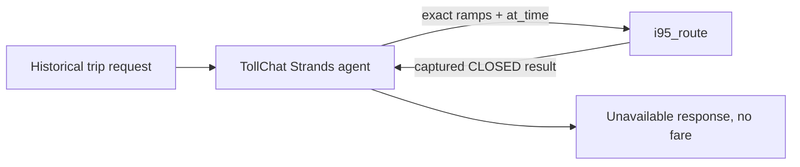

# Evaluation Plan for TollChat Historical I-95 Closures

## 1. Evaluation Requirements

- **User Input:** `Create one deterministic and one simulated-user eval for each "Historical single-corridor closure eval" in GitHub Issue #17, following the existing eval patterns.`
- **Interpreted Evaluation Requirements:** Cover all four pinned historical I-95 closure requests. Each deterministic case must use a fresh TollChat agent, capture the complete ordered trace, require exactly one `i95_route` call with the issue's exact ramps and `at_time`, verify the captured tool result is the expected closed OD pair with no monetary fields, and reject a final answer that quotes a fare. Mirror all four prompts in an observational simulated-user experiment.

---

## 2. Agent Analysis

| **Attribute** | **Details** |
| :-- | :-- |
| **Agent Name** | TollChat (`agent/toll_agent.py`) |
| **Purpose** | Price supported Northern Virginia toll trips from registered tool results. |
| **Core Capabilities** | Resolve locations, choose the corridor tool, pass historical travel time, and report priced or unavailable results. |
| **Input** | Natural-language trip request with origin, destination, and travel time. |
| **Output** | Markdown fare report or tool-grounded unavailability explanation. |
| **Agent Framework** | Strands Agents with the project pricing SOP as system prompt. |
| **Technology Stack** | Python 3.13+, `strands-agents`, `strands-agents-evals`, OpenAI agent model, historical VDOT data in RDS. |

**Agent Architecture Diagram:**



**Key Components:**

- **`build_agent()`:** Creates a fresh agent for every case.
- **`i95_route`:** Reads the historical VDOT row for the requested OD pair and rejects a lane whose direction is not open.
- **Pricing SOP:** Forbids invented prices, retries, and substituted routes.

**Available Tools:**

- **`i95_route`:** The only authorized tool in these single-corridor cases.
- All other registered tools are forbidden for this evaluation trace.

**Observability Status**

- **Tracing Framework:** Strands response metrics for deterministic cases; Strands Evals in-memory telemetry for simulations.
- **Custom Attributes:** Simulations scope `session.id` and `gen_ai.conversation.id` to agent-under-test calls.

---

## 3. Evaluation Metrics

### Closure Tool Trace

- **Evaluation Area:** Tool selection, arguments, order, and captured result.
- **Description:** Require exactly one `i95_route` call with exact ramps/time. Its captured result must identify the expected OD pair and `CLOSED`, and expose no monetary fields.
- **Method:** Code-based.

### Unavailable Response

- **Evaluation Area:** Final-answer grounding.
- **Description:** Require the final answer to report the requested route unavailable, suggest the I-95 general-purpose lanes, and reject any dollar amount, USD amount, or decimal fare.
- **Method:** Code-based for deterministic cases; `GoalSuccessRateEvaluator` plus `HelpfulnessEvaluator` for observational simulations.

---

## 4. Test Data Generation

- **`i95-nb-closed`:** `US-1` → `I-395 Near Edsall Road`, `2026-07-29T15:40:00-04:00`, OD 1132.
- **`i95-sb-closed`:** Reverse trip, `2026-07-29T10:10:00-04:00`, OD 1151.
- **`i95-both-closed-nb`:** Northbound trip at `2026-07-29T10:50:00-04:00`, OD 1132.
- **`i95-both-closed-sb`:** Southbound trip at the same time, OD 1151.
- **Total number of test cases:** 4, explicitly requested despite EvalKit's default maximum of 3.

---

## 5. Evaluation Implementation Design

### 5.1 Evaluation Code Structure

```text
eval/
├── deterministic/i95_historical_closures/
│   ├── README.md
│   ├── eval-plan.md
│   ├── test-cases.jsonl
│   └── deterministic_i95_historical_closures.py
├── simulated/simulated_user_i95_historical_closures.py
├── simulation_support.py
└── results/
```

### 5.2 Recommended Evaluation Technical Stack

| **Component** | **Selection** |
| :-- | :-- |
| **Language/Version** | Python 3.13+ |
| **Evaluation Framework** | Installed Strands Evals SDK, verified against Context7 `/strands-agents/evals` |
| **Evaluators** | Custom deterministic trace/response evaluators; simulated goal-success and helpfulness judges |
| **Agent Integration** | Direct `build_agent()` import, fresh per case |
| **Results Storage** | JSON under `eval/results/` |

---

## 6. Progress Tracking

### 6.1 User Requirements Log

| **Timestamp** | **Phase** | **Requirement** |
| :-- | :-- | :-- |
| 2026-08-02 | Planning | Four Issue #17 historical closure cases; one deterministic and one simulated-user case for each; follow existing patterns. |

### 6.2 Evaluation Progress

| **Timestamp** | **Component** | **Status** | **Notes** |
| :-- | :-- | :-- | :-- |
| 2026-08-02 | Plan and test data | Completed | Scope and pinned inputs taken from Issue #17 and existing historical route-tool tests. |
| 2026-08-02 | Deterministic implementation | Completed | Offline mutation checks passed; no billed live run was authorized. |
| 2026-08-02 | Simulated implementation | Completed | All four case shapes passed offline checks; simulator, telemetry mapping, and judges were not run live. |
