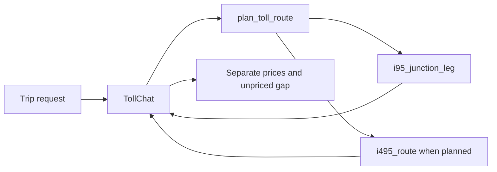

# Evaluation Plan for TollChat Direction-Aware I-95/I-495 Junctions

## 1. Evaluation Requirements

- **User Input:** Create the ten missing direction-aware 95/495 junction evals from GitHub Issue #17 in deterministic and simulated-user tracks.
- **Interpreted Evaluation Requirements:** Use a fresh TollChat agent per case and code-grade the complete ordered planner/pricing trace plus the final answer. Preserve historical times across every call, compare dynamic facts with captured tool results, keep the junction unpriced, and reject retries, substitutions, overshoot, skipped legs, or combined totals. The alias-control case pins the approved historical northbound-open time.

---

## 2. Agent Analysis

| **Attribute** | **Details** |
| :-- | :-- |
| **Agent Name** | TollChat (`agent/toll_agent.py`) |
| **Purpose** | Price supported Northern Virginia toll segments from registered tool results. |
| **Core Capabilities** | Resolve aliases, plan cross-corridor routes, select the reversible I-95 direction, and report independently priced segments. |
| **Input** | Natural-language trip request with origin, destination, and historical time. |
| **Output** | Markdown with known segment prices and an explicit unpriced junction. |
| **Agent Framework** | Strands Agents with the project pricing SOP as its system prompt. |
| **Technology Stack** | Python 3.13+, Strands Agents/Evals, OpenAI agent model, Bedrock simulation, historical VDOT data in RDS. |



**Key Components and Tools:**

- **`build_agent()`:** Creates the real agent afresh for each case.
- **`plan_toll_route`:** Returns normalized time and the only authorized ordered steps.
- **`i95_junction_leg`:** Selects Franconia or Edsall from historical reversible-lane state, or fails safe.
- **`i495_route`:** Independently prices only the Braddock-bounded I-495 segment.

**Observability Status:** Strands response metrics provide deterministic traces; simulations use in-memory OpenTelemetry scoped only to the agent under test.

---

## 3. Evaluation Metrics

### Authorized Junction Trace

- **Evaluation Area:** Planner result, tool order, exact required inputs, and captured results.
- **Description:** Require one planner call, exactly one junction call, only planned I-495 calls, one shared `at_time`, correct directional boundaries/statuses, and captured dynamic prices.
- **Method:** Code-based custom evaluator.

### Grounded Junction Response

- **Evaluation Area:** Final-answer completeness and non-fabrication.
- **Description:** Require captured prices and Eastern observed times, the selected boundary when available, Braddock and the unpriced gap, and independent I-495 pricing after unavailable I-95. Reject `$0.00`, arithmetic, subtotal, final price, or complete total.
- **Method:** Deterministic code grading; response-only goal/helpfulness judges in the observational simulation.

---

## 4. Test Data Generation

- Four open-direction cases cover both corridor orders and both reversible directions.
- Two both-closed cases and one transition case require I-95 failure without suppressing I-495.
- One inside-gap case forbids `i495_route`; one adversarial case rejects a free override; one pinned alias case resolves Dumfries/Westpark without overshoot.
- **Total number of source cases:** 10, explicitly required by Issue #17.

---

## 5. Evaluation Implementation Design

```text
eval/
├── deterministic/i95_i495_junctions/
│   ├── README.md
│   ├── eval-plan.md
│   ├── test-cases.jsonl
│   └── deterministic_i95_i495_junctions.py
├── simulated/simulated_user_i95_i495_junctions.py
└── results/
```

| **Component** | **Selection** |
| :-- | :-- |
| **Language/Version** | Python 3.13+ |
| **Evaluation Framework** | Installed Strands Evals 1.0.3, checked against Context7 and AWS Strands documentation |
| **Evaluators** | Custom deterministic trace/response evaluators; simulated goal-success and helpfulness judges |
| **Agent Integration** | Direct `build_agent()` import, fresh per case |
| **Results Storage** | Timestamped JSON under `eval/results/` |

---

## 6. Progress Tracking

### 6.1 User Requirements Log

| **Timestamp** | **Phase** | **Requirement** |
| :-- | :-- | :-- |
| 2026-08-02 | Planning | Ten Issue #17 junction scenarios, both deterministic and three-turn simulated tracks, alias-control pinned to the historical northbound-open time. |
| 2026-08-02 | Execution | One deterministic live suite authorized: ten OpenAI agent invocations plus historical RDS reads; no simulated Bedrock run. |
| 2026-08-02 | Remediation | Remove zero-dollar examples from junction instructions, forbid echoing the user's proposed amount, version the compatible prompt change as 1.1.0, and perform one additional deterministic live suite. |

### 6.2 Evaluation Progress

| **Timestamp** | **Component** | **Status** | **Notes** |
| :-- | :-- | :-- | :-- |
| 2026-08-02 | Plan and fixtures | Completed | Facts copied from Issue #17 and committed planner/tool contracts. |
| 2026-08-02 | Deterministic runner | Completed | Ten fixtures and all five named mutation checks pass offline. |
| 2026-08-02 | Simulated runner | Completed | Ten explicit three-turn profiles pass offline shape/error checks; no billed run performed. |
| 2026-08-02 | Live evidence | Completed | One authorized run produced 18/20 passing verdicts and no execution errors. Corrected the Dumfries fixture to Route 234; the free-override response genuinely violated the no-`$0.00` invariant. No retry was performed and the failed report was not curated. |
| 2026-08-02 | Prompt remediation | Completed | System-prompt contract 1.1.0 removed the tempting zero-dollar example and forbids echoing proposed amounts. All offline gates passed; the one authorized comparison run scored 1.0000 with 20/20 verdicts and no execution errors. Curated as `eval/results/20260802T200228Z.json`. |
| 2026-08-02 | Adversarial review | Completed | Hardened response grading against uncaptured dollar amounts and affirmative free-gap claims, and require the specific Edsall/Franconia boundary. The saved live trajectories passed the final evaluator offline 20/20; no additional live calls were made. |
