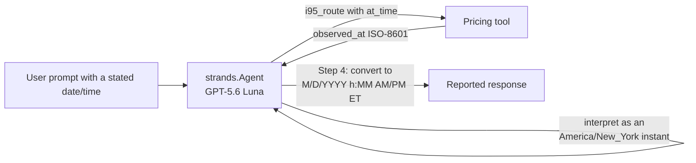

# Evaluation Plan for TollChat Agent — NY-time handling & US date/time format

## 1. Evaluation Requirements

- **User Input:** `"create evals that verify whether the agent can handle variations of dates/times in New York time. It should also validate that dates and times reported by the agent to the user are in the US Standard format ... Follow the pattern that the fuzzy location evals follows"`
- **Interpreted Evaluation Requirements:** Two behaviors, both rooted in `agent_tools/_oracle_route.py`'s `resolve_at_time` (a naive `at_time` is assumed America/New_York; a tz-aware one is kept as given) and SOP Step 4's requirement (added alongside this eval) to report timestamps in US Standard format:
  1. When the user states a date/time for `at_time`, the agent must pass the pricing tools an `at_time` argument that resolves to the *correct America/New_York instant* — whether the user's phrasing was already Eastern with no zone stated, a different zone entirely, or a date on the winter (EST) side of the DST boundary.
  2. Any date/time the agent reports back to the user (currently only `observed_at`) must be in US Standard format (`M/D/YYYY h:MM AM/PM ET`), not the tool's raw ISO-8601 string.

---

## 2. Agent Analysis

| **Attribute**         | **Details**                                                 |
| :-------------------- | :---------------------------------------------------------- |
| **Agent Name**        | TollChat (`agent/toll_agent.py`)                             |
| **Purpose**           | Prices NoVA Express Lanes trips by chaining route/pricing tool calls; never queries RDS or writes SQL directly. |
| **Core Capabilities** | Resolves a user-stated travel time to an `at_time` argument the pricing tools understand, prices the trip, and reports the result including VDOT's `observed_at` timestamp. |
| **Input**             | Free-text prompt with an origin, destination, and (for this eval) an explicit date/time, e.g. `"...at 3:30 PM on July 15, 2026"` or `"...at 2 PM Pacific on July 15, 2026"`. |
| **Output**            | Agent text response (Markdown route/fare report) containing a `VDOT observed at: <timestamp>` line. |
| **Agent Framework**   | Strands Agents (`strands.Agent`), system prompt sourced from `agent-sops/nova-toll-pricing-assistant.sop.md` |
| **Technology Stack**  | Python 3.13, `strands-agents[openai]`, `strands-agents-evals`, OpenAI GPT-5.6 Luna (direct or via Bedrock Mantle) |

**Agent Architecture Diagram:**



**Key Components:**

- **`agent_tools/_oracle_route.resolve_at_time`:** A naive (no-offset) `at_time` string is assumed `America/New_York` (`zoneinfo.ZoneInfo`, DST-aware); a tz-aware string is kept as given. This evaluation's target logic lives one level up — whether the *agent* produces an `at_time` argument whose instant is correct, not whether the parser itself is correct (that's `agent/tests/`, already covered).
- **SOP Step 4 (`agent-sops/nova-toll-pricing-assistant.sop.md`):** Newly requires `observed_at` (and any other reported date/time) be converted to `M/D/YYYY h:MM AM/PM ET` before being shown to the user, rather than passed through as the tool's raw ISO-8601 string.
- **Pricing tools (`i95_route`, `i495_route`, `i66_route`, `dulles_route`):** Each accepts an optional `at_time: str | None` and returns `observed_at` as `.isoformat()`.

**Available Tools:**

- **`i95_route`:** The tool under test — reused with the same verified direct pair as the fuzzy-location suite (Pentagon/Eads Street → I-95 Near Dumfries Road/Route 234, `od_pair_id` 1212) to isolate time interpretation from location resolution.
- **`i495_route`, `i66_route`, `dulles_route`, `i95_junction_leg`, `plan_toll_route`:** Available but out of scope; any call to one of these instead of `i95_route` is a failure for this suite's cases.

**Observability Status**

- **Tracing Framework:** `strands.Agent` via `response.metrics.get_summary()["traces"]`, same extraction path as the fuzzy-location suite.
- **Custom Attributes:** None used.

---

## 3. Evaluation Metrics

### Time Interpretation Correctness

- **Evaluation Area:** Tool calling accuracy
- **Description:** For each case, the agent must call `i95_route` with an `at_time` argument that — once parsed with `datetime.fromisoformat` and, if naive, treated as `America/New_York` (mirroring `resolve_at_time` itself) — equals the case's expected aware instant. This is an instant comparison, not a string comparison: `"2026-07-15T17:00:00-04:00"` and a Pacific-zone equivalent both count as correct, since they name the same moment. A naive value that is off by the Pacific/Eastern offset (the real bug this catches: silently treating "2 PM Pacific" as "2 PM Eastern") fails.
- **Method:** Code-based

### US Date/Time Format on Report

- **Evaluation Area:** Final response quality / spec compliance (SOP Step 4)
- **Description:** Whenever the agent's final response reports a VDOT-observed timestamp, it must be rendered as `M/D/YYYY h:MM AM/PM ET` (a regex asserts the US-format shape is present), never the tool's raw ISO-8601 string (a second regex, checked unconditionally, asserts no `YYYY-MM-DDTHH:MM:SS` pattern leaked through). I-95's Express Lanes are reversible (`SOUTHBOUND_OPEN`/`CLOSED`/etc. in `trip_pricing_i95.link_status`, a real schedule, not test flakiness), so a request can legitimately decline with no timestamp to check at all; that outcome is `not_applicable` for this metric, not a failure, since price/route availability is a different concern (out of scope here, same as the fuzzy-location suite's evaluators never asserting on price success either).
- **Method:** Code-based (two regexes against the final response text)

---

## 4. Test Data Generation

All three cases reuse the same verified direct pair (Pentagon/Eads Street → I-95 Near Dumfries Road/Route 234, `od_pair_id` 1212, `trip_pricing_i95` confirmed to have continuous data from 2026-04-17 through 2026-08-02 at query time) so only the stated date/time varies. `resolve_at_time`'s "at or before" lookup means a future `at_time` still returns the most recent available row rather than erroring, so all three cases exercise `i95_route` regardless of how far the stated date is from today -- though a live run can still land on the reversible-lane `CLOSED` schedule and get a legitimate decline instead of a price; see the format metric above for how that's handled.

- **Naive Eastern, EDT side**: `"...at 3:30 PM on July 15, 2026"`, no zone stated. Expected `at_time` instant: `2026-07-15T15:30:00-04:00` (July is daylight time; verified `resolve_at_time("2026-07-15T15:30:00").isoformat() == "2026-07-15T15:30:00-04:00"`). 3:30 PM was chosen, not the more obvious 2:30 PM, because a live RDS query confirmed `trip_pricing_i95` shows `SOUTHBOUND_OPEN` continuously from 14:50 through 18:00 that day but `CLOSED` just before -- an initial 2:30 PM live run caught this and returned a legitimate decline.
- **Non-Eastern zone stated**: `"...at 2:00 PM Pacific on July 15, 2026"`. Expected `at_time` instant: `2026-07-15T17:00:00-04:00` (2 PM PDT = 5 PM EDT). This is the case that catches a naive passthrough bug: an agent that just writes `14:00` and lets `resolve_at_time` assume Eastern would be off by three hours. Live-confirmed: priced successfully, `VDOT observed at: 7/15/2026 4:50 PM ET`.
- **Naive Eastern, EST side (DST boundary)**: `"...at 10:00 AM on November 3, 2026"`, no zone stated. Expected `at_time` instant: `2026-11-03T10:00:00-05:00` (after DST ends Nov 1, 2026; verified `resolve_at_time("2026-11-03T10:00:00").isoformat() == "2026-11-03T10:00:00-05:00"`). Confirms the agent (and `resolve_at_time`) select the correct offset rather than hardcoding `-04:00` from the other two EDT-side cases. A future date resolves to the latest archived row via "at or before"; at query time that row (2026-08-02 08:30 EDT) falls in the corridor's routine morning-`CLOSED` window, so this case is expected to decline (`not_applicable` on the format metric) both now and, per the observed daily pattern, likely once real November data eventually loads -- the time-interpretation check does not depend on pricing succeeding.
- **Total number of test cases**: 3

---

## 5. Evaluation Implementation Design

### 5.1 Evaluation Code Structure

```
./                              # Repository root (nova-toll-budget-agent)
├── pyproject.toml              # Already declares strands-agents-evals>=1.0.3
├── .venv/                      # uv-managed virtual environment
│
└── eval/
    ├── results/
    ├── simulation_support.py
    ├── deterministic/
    │   ├── fuzzy_location_matching/
    │   └── ny_time_us_format/
    │       ├── README.md
    │       ├── eval-plan.md
    │       ├── deterministic_ny_time_us_format.py
    │       └── test-cases.jsonl
    └── simulated/
        ├── simulated_user_fuzzy_location_matching.py
        └── simulated_user_ny_time_us_format.py
```

No new dependency — `strands-agents-evals` is already a `pyproject.toml` dependency.

### 5.2 Recommended Evaluation Technical Stack

| **Component**            | **Selection**                                          |
| :----------------------- | :------------------------------------------------------ |
| **Language/Version**     | Python 3.13                                              |
| **Evaluation Framework** | Strands Evals SDK (`strands-agents-evals`) — `Case`, `Experiment`, custom `Evaluator` subclasses |
| **Evaluators**           | Code-based only: `TimeInterpretationEvaluator` (tool-call `at_time` instant), `USFormatEvaluator` (response regex) |
| **Agent Integration**    | Direct import of `agent.toll_agent.build_agent` (same pattern as the fuzzy-location suite) |
| **Results Storage**      | JSON files under `eval/results/` (gitignored) |

---

## 6. Progress Tracking

### 6.1 User Requirements Log

| **Timestamp**      | **Phase** | **Requirement**                                                      |
| :----------------- | :-------- | :--------------------------------------------------------------------- |
| 2026-08-02 12:00 | Planning  | Evaluate NY-time date/time handling and US-format reporting; deterministic in CI, simulated-user nightly; follow the fuzzy-location pattern. |
| 2026-08-02 12:05 | Planning  | Confirmed: (1) add the US-format requirement to the SOP and gate it in CI rather than leave it observational-only; (2) target format is `M/D/YYYY h:MM AM/PM ET`; (3) deterministic/CI cases use absolute dates only, relative phrasing ("tomorrow at 5pm") is nightly-only and observational, since the agent has no injected current-date anchor. |

### 6.2 Evaluation Progress

| **Timestamp**      | **Component**    | **Status**                      | **Notes**                                      |
| :----------------- | :--------------- | :------------------------------ | :--------------------------------------------- |
| 2026-08-02 12:10 | eval-plan.md   | Completed | Plan drafted from `agent_tools/_oracle_route.py`, SOP Step 4 (as amended), and a live RDS query confirming od_pair_id 1212 has continuous `trip_pricing_i95` data 2026-04-17 through 2026-08-02 — not assumed. DST offsets for the three chosen dates verified by calling `resolve_at_time` directly, not assumed. |
| 2026-08-02 12:10 | test-cases.jsonl | Completed | 3 cases; the reused Pentagon/Eads Street → I-95 Near Dumfries Road/Route 234 pair and its `resolve_at_time`-verified expected instants are the only new claims — no new oracle pair was introduced. |
| 2026-08-02 12:10 | deterministic_ny_time_us_format.py | Completed | Two code-based evaluators, no LLM-judge half. `--check` self-test covers tool-mismatch, missing/unparseable at_time, correct/wrong instant resolution (including the naive-passthrough-treated-as-Eastern bug), and both US-format/raw-ISO-8601 regex branches against synthetic data. |
| 2026-08-02 13:30 | deterministic_ny_time_us_format.py | Run live (authorized) | First live run (`AWS_PROFILE=nova-toll`) scored 4/6 (0.67): `TimeInterpretationEvaluator` passed all 3 cases, but `USFormatEvaluator` failed 2/3 -- not an agent bug. I-95's Express Lanes are a real reversible corridor (`trip_pricing_i95.link_status`: `SOUTHBOUND_OPEN`/`CLOSED`), and the original 2:30 PM July 15 case and the Nov 3 future-date case (which falls back to the latest archived row, then in the corridor's routine morning-`CLOSED` window) both hit a legitimate decline with no `observed_at` to format. Fixed by (1) moving the EDT case to 3:30 PM, confirmed `SOUTHBOUND_OPEN` for the full window that day, and (2) making `USFormatEvaluator` return `not_applicable` rather than fail when the trip declines with no timestamp at all -- format compliance and route/price availability are different concerns, same principle the fuzzy-location suite already applies by never asserting on price success. Re-run after the fix: 6/6 (1.00). All three `at_time` values were confirmed correct live, including the EST-side case even though it declined. |

## Track 2: simulated-user conversations

Track 2 uses `ActorSimulator` for relative/fuzzy date phrasing ("tomorrow at
5pm", "next Monday morning") that Track 1 cannot assert against, since the
agent has no injected notion of "today." It is **not a regression gate**:
the simulated user and both judges are LLMs.

**Run live (authorized), 2026-08-02 13:35:** first run scored 0.08
(`GoalSuccessRateEvaluator` 0.0) -- also not an agent bug. The agent
correctly refused to guess a calendar date for "tomorrow" and asked for one
explicitly (the expected, no-anchor behavior this suite exists to observe),
but the simulated persona's `context`/`actor_goal` only said "the day after
today" in the abstract, with no concrete date to disclose when asked, so
the conversation stalled for a reason that was a scenario bug, not a
finding about the agent. Fixed by computing `tomorrow` from the real
current date at run time (`build_case_and_profile()`, `--check` pins a
fixed `today` for reproducibility) and giving the persona a concrete date
to name if pressed -- exactly what a real user would already know, not
information invented for it. Re-run after the fix: `GoalSuccessRateEvaluator`
1.00 (the agent resolved the relative time to the correct Eastern instant,
then declined cleanly when I-95 southbound was closed at that time, citing
"August 3, 2026 at 3:00 PM ET"). `HelpfulnessEvaluator` scored 0.33 on that
same run -- expected per the authoring SOP's Step 3 constraint: it only
judges the final turn's answer quality (no price was ultimately available,
the same real corridor closure Track 1 also hit) and is not evidence about
time-interpretation correctness. See
`simulated/simulated_user_ny_time_us_format.py` and this suite's `README.md`
for commands.
