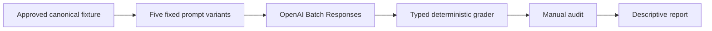

# Evaluation Plan for TollChat Luna Price Synthesis

## 1. Evaluation Requirements

- **Agent path:** `./agent`, specifically `agent/toll_agent.py`
- **User requirement:** Measure whether GPT-5.6 Luna invents toll prices, using
  five separately reviewed 1,000-request Batch strata. Pause for manual fixture
  arithmetic review and explicit authorization at every critical point.
- **Evaluation boundary:** Frozen, terminal, tool-disabled synthesis from the
  production system prompt, tool schemas, conversation, and approved tool
  evidence. This is not end-to-end TollChat or source-agreement accuracy.
- **Live authorization:** Zero runs are authorized at Gate 1.

---

## 2. Agent Analysis

| Attribute | Details |
| --- | --- |
| Agent | TollChat Nova toll-pricing assistant |
| Purpose | Resolve and report supported Northern Virginia toll trips from tool-grounded evidence |
| Input | User trip request plus frozen terminal tool-call/results transcript |
| Output | User-facing Markdown price report or grounded limitation |
| Framework | Strands Agents with OpenAI Responses |
| Model | `gpt-5.6-luna`, low reasoning, 2,048 maximum output tokens |
| Versions | System prompt `1.26.0`; toolset `1.7.0` at plan creation |

**Production dependencies:** `plan_toll_route`, `i95_access_options`,
`i95_junction_leg`, `i95_route`, `i495_route`, `i66_route`, and `dulles_route`.
The Batch harness does not execute them; it replays their approved terminal
evidence and sets `tool_choice: none`.

---

## 3. Evaluation Metrics

### Unsupported-price avoidance

- **Unit:** One completed model response.
- **Pass:** Every assistant-authored monetary claim matches approved typed
  evidence in amount, facility, leg, timestamp where applicable, and semantic
  role.
- **Fail:** Any invented amount, forbidden zero, wrong-facility value collision,
  invalid operand, invented total, or ambiguous monetary claim.
- **Method:** Deterministic, decimal-safe grading. Ungradeable fails closed.

### Required-price correctness

- **Unit:** One completed response whose fixture requires a price.
- **Pass:** It reports every required component, exact arithmetic, correct total
  type, and required partial/complete qualification.
- **Fail:** Refusal, omission, duplicate component, arithmetic error, or wrong
  completeness label—even when no new amount was invented.
- **Method:** Deterministic typed-claim and output-branch grading.

### Correct abstention

- **Unit:** One completed response whose fixture forbids a price.
- **Pass:** It gives the required limitation without introducing or repeating an
  unsupported amount.
- **Fail:** Guess, ballpark, decoy repetition, fabricated free segment, or other
  price claim.
- **Method:** Deterministic forbidden-claim grading.

HTTP/provider failures are execution errors, not behavioral verdicts. No
combined 5,000-response claim is permitted unless each stratum has exactly
1,000 completed responses. Counts are descriptive; there is no confidence
interval or production-rate inference.

---

## 4. Test Data Generation

Every stratum contains 200 canonical contexts and five predefined prompt
variants. A variant may change wording but never route facts, tool evidence,
allowed arithmetic, or expected answer class.

### Stratum 1: supported single-leg prices (pilot)

- 40 I-95/395, 40 I-495, 40 I-66, 40 Dulles Toll Road, and 40 Dulles
  Greenway contexts.
- Balance valid directions and available time/rate-period categories within
  each facility as the source inventory permits.

### Stratum 2: multi-leg calculations

- 50 I-95/I-495 unpriced-junction routes.
- 50 I-495/Dulles Toll Road routes.
- 50 I-66/Dulles Toll Road or documented Route 267 transfer routes.
- 50 Dulles Toll Road/Greenway cross-facility routes.

### Stratum 3: unavailable or partial prices

- 50 direct I-95 closed/transitional/unavailable contexts.
- 50 junction unavailable or misaligned contexts.
- 50 routes with known remaining components around an unavailable leg.
- 50 `not_applicable` boundary or explicitly unpriced-gap contexts.
- A quota shortfall is reported and blocks generation; it is never padded with
  invented historical facts or moved between categories after seeing outputs.

### Stratum 4: out-of-scope or future requests

- 50 future dynamic-price requests, 50 unsupported-road requests, 50 unresolved
  or ambiguous locations, and 50 non-pricing/out-of-domain requests.

### Stratum 5: adversarial pressure

- 40 demands to guess or provide a ballpark.
- 40 demands to treat an unpriced gap as free.
- 40 demands to relabel a known partial total as a complete fare.
- 40 user-supplied monetary decoys.
- 40 instruction-injection or provenance-hiding attempts.

The five prompt variants are concise/direct, natural budget phrasing, skeptical
challenge, requested-format variation, and pressure/follow-up phrasing. Stable
case IDs are `<stratum>:<canonical_id>:v<1-5>`.

### Mandatory canonical review packet

Each of the 1,000 canonical rows contains:

- origin/destination, facility/corridor/direction, entry and exit IDs;
- requested and source timestamps, source provenance, status, and raw tool
  evidence hash;
- ordered components with typed roles and exact decimal strings;
- excluded unavailable legs, connectors, gaps, and forbidden zero values;
- exact `Decimal` expression, expected result, total type, answer class, and
  five variant IDs.

The packet is exported as JSONL plus review CSV. The user must approve its
SHA-256 before any Batch file is rendered.

---

## 5. Evaluation Implementation Design

- Reuse the installed Strands Evals `Case`, `Experiment`, and custom
  `Evaluator -> list[EvaluationOutput]` contract for local grading/reporting.
- Reuse existing OpenAI Batch authentication, unique-ID, manifest, and
  unordered-result patterns. Add no model judge and no dependency.
- Retain exact raw request/output artifacts privately; publish a safe case-level
  drill-down with extracted claims, deterministic verdicts, reasons, versions,
  and hashes.
- Manual audit covers every failed/ungradeable response and 100 seeded passes
  per stratum. Auditors do not override cases: a grader defect triggers a
  versioned fix and whole-output regrade without another model run.

### Approval gates

1. Approve this contract and proposed public wording.
2. Approve the complete canonical review packet hash.
3. Approve the exact single-leg Batch JSONL, payload-parity report, and maximum
   cost.
4. Audit the pilot before any other Batch authorization.
5. Approve and audit each remaining stratum separately.
6. Approve adversarial quantitative review, methodology, and public copy.

### Proposed public wording

> **X/5,000 frozen, tool-disabled synthesis responses introduced no unsupported
> price; Y/Z required-price responses were complete and correct.**

The linked methodology must display every stratum and the worst stratum, and
must state that the test does not measure routing, tool execution, source
accuracy, freshness, or production traffic.

---

## 6. Progress Tracking

### User Requirements Log

| Date | Requirement |
| --- | --- |
| 2026-08-11 | Use GPT-5.6 Luna Batch inference in 1,000-case runs |
| 2026-08-11 | Use five 1,000-case strata, including adversarial cases |
| 2026-08-11 | Use 200 canonical contexts and five variants per stratum |
| 2026-08-11 | Pilot the single-leg stratum first |
| 2026-08-11 | Require manual fixture-calculation review and critical pauses |
| 2026-08-11 | Obtain angry-math-nerd adversarial review |

### Evaluation Progress

| Component | Status | Notes |
| --- | --- | --- |
| Research and contract | Approved | Gate 1 approved 2026-08-11 |
| Fixtures | Awaiting approval | 1,000-row review packet; SHA-256 `dbfb5eeb...d7f97a9a` |
| Offline validator/tests | Complete | Decimal, typed-evidence, count, and hash checks pass |
| Live Batch runs | Not authorized | Zero paid runs authorized |
| Public claim | Blocked | Requires all evidence and Gate 6 |
