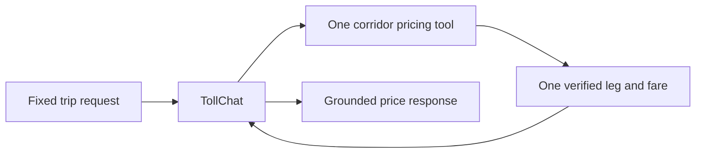

# Evaluation Plan for TollChat Single-Leg Base Cases

## 1. Evaluation Requirements

- **User Input:** Create eight routine single-leg evaluations covering both
  directions of I-95, I-495, I-66 ITB, and the Dulles Greenway; pin reversible
  I-95 trips to open-direction times, require exact prices, keep synthetic
  checks in required CI, and run live agent cases and simulations nightly.
- **Interpreted Evaluation Requirements:** Every case must call exactly one
  corridor pricing tool, return exactly one priced leg matching a verified
  fixture, and report the exact fare without crossing or planning a junction.
  Greenway mainline cases must separately attribute the additive $2.00 Dulles
  Toll Road fee, preserve toll order, and include it in the total.

---

## 2. Agent Analysis

| **Attribute** | **Details** |
| :-- | :-- |
| **Agent Name** | TollChat (`agent/toll_agent.py`) |
| **Purpose** | Prices supported Northern Virginia toll trips from registered tool results. |
| **Core Capabilities** | Resolves exact locations, selects one corridor tool, passes a requested time, and reports auditable prices. |
| **Input** | Natural-language origin, destination, facility, and Eastern travel time. |
| **Output** | Markdown route, fare calculation, final price, and VDOT observation time where applicable. |
| **Agent Framework** | Strands Agents with the project pricing SOP. |
| **Technology Stack** | Python 3.13+, Strands Agents/Evals, OpenAI agent model, Bedrock simulation, historical RDS and committed Dulles oracles. |



**Key Components:**

- **`build_agent()`:** Fresh agent for each deterministic or simulated case.
- **Corridor tools:** `i95_route`, `i495_route`, `i66_route`, or `dulles_route`.
- **Pricing SOP:** Requires tool-grounded route facts, arithmetic, and timestamps.

**Observability Status**

- **Tracing Framework:** Strands response metrics for deterministic runs and
  Strands Evals in-memory telemetry for simulations.
- **Custom Attributes:** Simulations scope session and conversation IDs around
  agent-under-test calls only.

---

## 3. Evaluation Metrics

### Exact Single-Leg Tool Result

- **Evaluation Area:** Tool choice, arguments, captured result, and price.
- **Description:** Require one expected tool call and one fixture-matching leg;
  reject planners, junction tools, result errors, route drift, and fare drift.
- **Method:** Code-based in both tracks.

### Grounded Price Response

- **Evaluation Area:** Final response and conversational consistency.
- **Description:** Require exact fixture fare, calculation, final price, route
  labels, and VDOT observation display where applicable. Simulations additionally
  observe consistency through fare-confirmation and provenance follow-ups.
- **Method:** Code-based deterministic response grading; goal-success and
  helpfulness judges for conversational behavior.

For multi-item Dulles results, code grading binds each amount to its facility
and plaza, enforces travel order, and checks exact component arithmetic.

---

## 4. Test Data Generation

- Two verified longest reciprocal one-leg trips per requested facility.
- I-95 directions use separate known-open historical times.
- I-66 directions use their respective charged commute windows.
- Greenway directions use weekday peak windows and cross the mainline plaza;
  each expects the $5.80 Greenway fare plus the separate $2.00 DTR item.
- **Total number of test cases:** 8, explicitly requested above the SOP default.

---

## 5. Evaluation Implementation Design

### 5.1 Evaluation Code Structure

```text
eval/
├── deterministic/single_leg_base_cases/
│   ├── README.md
│   ├── eval-plan.md
│   ├── test-cases.jsonl
│   └── deterministic_single_leg_base_cases.py
├── simulated/simulated_user_single_leg_base_cases.py
├── simulation_support.py
└── results/
```

### 5.2 Recommended Evaluation Technical Stack

| **Component** | **Selection** |
| :-- | :-- |
| **Language/Version** | Python 3.13+ |
| **Evaluation Framework** | Installed Strands Evals SDK 1.0.3 |
| **Evaluators** | Custom exact trace/response evaluators; goal success and helpfulness for simulation |
| **Agent Integration** | Direct fresh `build_agent()` per case |
| **Results Storage** | Timestamped JSON under `eval/results/` |

---

## 6. Progress Tracking

### 6.1 User Requirements Log

| **Timestamp** | **Phase** | **Requirement** |
| :-- | :-- | :-- |
| 2026-08-02 | Planning | Eight longest reciprocal, exact-price, single-leg base cases with boundary endpoints allowed. |
| 2026-08-02 | Automation | Code-graded live cases initially ran in trusted CI; simulations nightly. |
| 2026-08-11 | Automation | Live agent execution moved to nightly because deterministic grading does not make model execution deterministic; required CI retains `--check`. |
| 2026-08-02 | Simulation | Matching explicit-profile simulations capped at three agent turns per case. |
| 2026-08-03 | Coverage | Reuse both Greenway directions to validate the separate additive DTR mainline fee. |

### 6.2 Evaluation Progress

| **Timestamp** | **Component** | **Status** | **Notes** |
| :-- | :-- | :-- | :-- |
| 2026-08-02 | Plan and fixtures | Completed | Routes and exact historical fares verified against committed oracles and read-only RDS. |
| 2026-08-02 | Deterministic implementation | Completed | Exact captured-call and response graders with offline mutation checks. |
| 2026-08-02 | Simulated implementation | Completed | Eight immutable actor profiles capped at three turns with deterministic trace grading. |
| 2026-08-11 | Automation | Completed | Offline checks remain in required CI; code-graded and simulated live executions run nightly as observational evidence. |
| 2026-08-02 | Deterministic live execution | Reviewed, not curated | Exact tool results passed 8/8; response grading exposed presentation false negatives and one genuine missing-rate-period response. |
| 2026-08-02 | Simulated live execution | Reviewed, not curated | Goal/helpfulness passed 16/16; trace grading caught one invalid-time retry, and only 5/8 conversations reached all three turns. |
| 2026-08-02 | Adversarial review | Completed | Accepted valid human-readable route labels and Markdown arithmetic and kept tool counts in code grading; turn count remains an SDK cap because valid actors may finish early. |
| 2026-08-03 | Greenway fee fixtures and graders | Completed | Both directions require one distinct DTR item, exact multiplicity, travel order, component arithmetic, and neutral simulated follow-ups. |
| 2026-08-03 | Deterministic live execution | Completed | 1.0000 overall; 16/16 judgments passed; 0 execution errors. |
| 2026-08-03 | Simulated live execution | Completed | 0.9167 overall; 24/24 judgments passed; 0 execution errors. |
