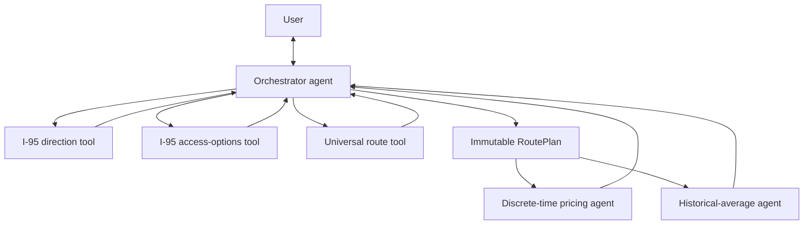

# Orchestrator Agent Contract

Status: **incomplete draft**

## Purpose

Define the responsibilities and boundaries of TollChat's multiagent
orchestrator. The orchestrator owns the conversation and the canonical route.
It validates an I-95 trip before routing, passes one immutable route plan to
pricing specialists, and turns their structured evidence into the user-facing
answer.

This contract deliberately does not define SQL, RDS views, or the internal
calculation contracts of either pricing specialist. Those come after the route
boundary is stable.

This specification is not complete. Its specialist delegation boundary and
final response rules remain provisional until separate contracts are agreed for
the discrete-time and historical-average agents. The document currently records
only the orchestrator decisions made so far.

## Architecture



The orchestrator is the only route authority. Pricing specialists are agents
used as tools; they price the supplied route and must not reinterpret locations,
change ramps, choose another corridor, or produce a replacement route.

## Responsibilities

The orchestrator MUST:

- acquire the origin and destination and retain supplied trip facts across
  clarification turns;
- normalize the requested departure time to an ISO 8601 instant with an
  explicit Eastern offset, defaulting a current-price request to the current
  Eastern instant rather than asking for an optional time;
- resolve user wording to canonical covered endpoints, asking before choosing
  among multiple plausible matches;
- use the universal route tool for every trip, including a trip contained
  within one corridor;
- run the I-95 direction gate before the route tool for every trip that uses an
  I-95/395 endpoint or documented I-95 handoff, and run the access gate whenever
  a usable Express Lanes direction exists;
- discuss direction, access, unsupported connections, and alternatives with the
  user before finalizing the route;
- create a new immutable route plan whenever the origin, destination, departure
  time, or an accepted alternative changes;
- call only the pricing specialist or specialists needed for the user's request;
- verify that every specialist response names the supplied `route_plan_id` and
  only its `route_step_id` values;
- distinguish complete totals, known partial totals, and unavailable pricing;
- own all user-facing prose and disclose source freshness and coverage; and
- preserve structured route and specialist evidence in traces.

The orchestrator MUST NOT:

- query pricing data or own corridor pricing tools;
- call a pricing specialist before a route has `status: "ready"`;
- infer an I-95 open direction from time of day, a route name, or a ramp suffix;
- silently replace an invalid or ambiguous endpoint with a nearby option;
- treat an untolled connector sentinel or an unpriced gap as a zero-dollar
  billed component;
- combine a partial known toll total into a complete `total_usd`;
- accept a specialist's attempt to reroute or return components outside the
  supplied route plan; or
- invent a fare, observation time, historical period, or source attribution.

## Conversational trip state

The orchestrator maintains structured state rather than relying only on prose
conversation history:

```json
{
  "status": "collecting",
  "origin": null,
  "destination": null,
  "requested_at": null,
  "requested_analyses": ["discrete"],
  "pending_clarification": null,
  "route_plan": null
}
```

`status` progresses through `collecting`, `validating`, and `ready`. A failed
validation keeps the trip out of `ready`; it is a normal conversational outcome,
not a specialist failure.

When a user changes a trip-defining value, the orchestrator MUST discard the
old route plan, retain unrelated supplied facts, and validate a new plan. It
MUST NOT reuse specialist results from the invalidated plan.

## Route readiness workflow

### Non-I-95 trips

1. Resolve both endpoints and the requested time.
2. Call the universal route tool.
3. If the tool returns a directional mismatch or choices, explain them and wait
   for the user; never substitute an option.
4. If it returns a supported route, finalize the route plan.

### I-95 trips

An I-95 trip includes both a direct I-95/395 trip and a cross-corridor trip that
uses a documented I-95 handoff.

1. Call the I-95 direction tool with the normalized requested time.
2. If no usable direction can be established for an I-95-only trip, explain the
   returned condition and stop. Do not call the access, route, or specialist
   tools.
3. If no usable direction can be established for a cross-corridor trip, call
   the universal route tool with that direction result. The route may end the
   priceable corridor at its documented boundary and add an explicit unpriced
   general-purpose-lane remainder. For example, Wolf Trap to Dumfries prices
   I-495 only as far as Braddock and tells the user to complete the remaining
   trip on the I-95 general-purpose lanes.
4. Otherwise, call the public I-95 access-options tool with the canonical trip
   endpoints and the direction result. This one tool covers both direct trips
   and cross-corridor endpoint handoffs.
5. If fixed ramp access is invalid, explain the affected entry or exit and offer
   only the returned alternatives. Wait for the user to choose. If the desired
   I-95 direction is closed on an I-95-only trip, explain it and stop. If it is
   closed on a cross-corridor trip, use the partial-route behavior from step 3
   instead.
6. Call the universal route tool only after the direction and access results
   support the requested trip.
7. Finalize the route plan only if the route tool returns a supported complete
   or partial route.

The route tool MUST NOT produce an I-95 Express Lanes step that contradicts the
supplied validation. An unavailable direction may authorize only a documented
partial route that omits the Express Lanes step and marks the general-purpose
remainder unpriced. Tool-boundary validation protects correctness if the model
mis-sequences a call; it does not change the orchestrator's required order.

## Canonical route plan

A successful route is immutable and structurally resembles:

```json
{
  "route_plan_id": "plan-123",
  "status": "ready",
  "requested_at": "2026-08-14T08:00:00-04:00",
  "origin": {
    "corridor": "i95",
    "node_id": "210NO",
    "label": "US-1"
  },
  "destination": {
    "corridor": "i495",
    "node_id": "182ND",
    "label": "Route 267"
  },
  "i95_validation": {
    "open_direction": "Northbound",
    "effective_at": "2026-08-14T08:00:00-04:00",
    "observed_at": "2026-08-14T07:55:00-04:00",
    "source_kind": "observed",
    "access_status": "supported",
    "validated_entry_node_id": "210NO",
    "validated_exit_node_id": "206ND"
  },
  "steps": [
    {
      "route_step_id": "step-1",
      "kind": "toll",
      "facility": "i95",
      "direction": "Northbound",
      "entry_node_id": "210NO",
      "exit_node_id": "206ND"
    },
    {
      "route_step_id": "step-2",
      "kind": "unpriced",
      "description": "I-95/I-495 junction gap"
    },
    {
      "route_step_id": "step-3",
      "kind": "toll",
      "facility": "i495",
      "direction": "Northbound",
      "entry_node_id": "191NO",
      "exit_node_id": "182ND"
    }
  ]
}
```

The exact schemas of the three orchestrator tools will be defined separately.
The route-plan contract requires these invariants:

- `route_plan_id` identifies one immutable origin, destination, time, and step
  sequence.
- Every step has a stable `route_step_id` within the plan.
- `toll` steps contain canonical facility, direction, and endpoint identifiers.
- `connector` steps describe documented untolled handoffs but are never pricing
  operands.
- `unpriced` steps remain explicitly unpriced; neither the orchestrator nor a
  specialist may convert them to `$0.00`.
- An I-95 plan carries the direction and access evidence used to admit it. A
  cross-corridor fallback carries the unavailable direction evidence and an
  explicit unpriced general-purpose-lane remainder.
- A plan contains route facts, not specialist tool names or database details.

Changing any trip-defining field creates a new identifier. Specialist results
are valid only for the exact plan identifier they received.

## Pricing-specialist delegation

This section defines the agreed direction of the boundary, not its final schema.
The two specialist contracts may add requirements or require corresponding
changes here before this orchestrator contract can be adopted.

The orchestrator passes the complete route plan to:

- the discrete-time pricing agent for a point-in-time quote;
- the historical-average agent for recent comparable pricing; or
- both agents when the user requests a comparison, budget analysis, or other
  answer requiring both evidence sets.

Specialists return structured evidence only. The orchestrator rejects a result
whose `route_plan_id` differs or whose component results name unknown route
steps. It never asks a specialist to resolve ambiguity or choose a route.

Specialist route coverage uses three outcomes:

| Status | Monetary field | Meaning |
| --- | --- | --- |
| `complete` | `total_usd` | Every toll step was priced, and the route has no required `unpriced` or unavailable step. |
| `partial` | `known_total_usd` | At least one price is known, but a required route step is explicitly unpriced or unavailable. |
| `unavailable` | none | No defensible monetary result is available. |

The orchestrator may compare current and historical results only when they
refer to the same route plan. Allowed derived metrics are documented in the
[historical pricing MVP contract](historical-pricing-mvp-contract.md). Money
arithmetic MUST use decimal values, not binary floating point or model mental
math.

## User-facing behavior

- Ask one concise clarification that requests all and only missing required
  trip facts.
- Preserve exact user-selected endpoints through later turns.
- Explain why an I-95 direction or ramp is unavailable before presenting
  alternatives.
- For a cross-corridor trip with unavailable I-95 Express Lanes, price the
  supported toll portion, identify its boundary, and direct the remainder to
  the unpriced I-95 general-purpose lanes.
- Do not claim that a general-purpose lane has a known toll when no pricing
  specialist supplied one.
- Describe a `partial` result as a known subtotal, not the trip's complete fare.
- Report connectors as untolled only when the route plan says so; keep them out
  of arithmetic.
- Report unpriced gaps as unpriced, never free.
- Format times for users in Eastern US date/time form while retaining ISO 8601
  values in structured contracts and traces.

## Error handling

Domain outcomes are structured and user-actionable:

- missing or ambiguous location;
- unsupported location or connection;
- I-95 direction unavailable;
- I-95 desired direction closed;
- invalid one-way entry or exit;
- no supported route;
- partial route coverage; and
- specialist pricing unavailable.

Operational failures include tool timeouts, invalid tool responses, database
unavailability reported by a specialist, and internal exceptions. The
orchestrator may retry only according to a bounded runtime policy; it MUST NOT
turn an operational failure into a domain answer or a zero price.

Exact duplicate calls with unchanged inputs SHOULD be suppressed within one
turn. A changed call after the user selects an alternative is not a duplicate.

## Single-agent evals to recreate

The multiagent evals must use the new tool names and trajectories. They should
preserve the following user-visible and trace-level behaviors rather than copy
the retired implementation verbatim.

| Existing eval | Behavior to preserve in the orchestrator eval |
| --- | --- |
| [Missing parameter acquisition](../../single-agent/eval/simulated/missing_parameter_acquisition/README.md) | Ask for all and only missing required endpoints, make no premature tool call, and retain supplied facts after the answer. |
| [Fuzzy location matching](../../single-agent/eval/deterministic/fuzzy_location_matching/README.md) and its [simulated user](../../single-agent/eval/simulated/simulated_user_fuzzy_location_matching.py) | Ask before choosing a multi-match alias, preserve time and the other endpoint, honor exact canonical labels, and handle the Washington I-66/I-395 choice without guessing. |
| [I-95 one-way access](../../single-agent/eval/deterministic/i95_one_way_access/README.md) and its [simulated user](../../single-agent/eval/simulated/simulated_user_i95_one_way_access.py) | Exercise direct and cross-corridor access mismatches, returned alternatives, user recovery, and the successful control. Update the expected sequence to direction, access, then universal route. |
| [Historical I-95 closures](../../single-agent/eval/deterministic/i95_historical_closures/README.md) and its [simulated user](../../single-agent/eval/simulated/simulated_user_i95_historical_closures.py) | Move closure detection ahead of route planning and specialist delegation. Require no fare and no downstream calls for an I-95-only trip that the direction gate cannot admit. |
| [I-95/I-495 junctions](../../single-agent/eval/deterministic/i95_i495_junctions/README.md) and its [simulated user](../../single-agent/eval/simulated/simulated_user_i95_i495_junctions.py) | Preserve movement-aware boundaries, boundary-equal cases, explicit unpriced gaps, and qualified known totals. A both-closed cross-corridor case must still price the supported leg to Braddock and identify the general-purpose-lane remainder. Replace the old junction-pricing trajectory with orchestrator gates, one route plan, and specialist calls. |
| [Non-I-95 directional access](../../single-agent/eval/deterministic/non_i95_directional_access/README.md) and its [simulated user](../../single-agent/eval/simulated/simulated_user_non_i95_directional_access.py) | Preserve fixed one-way ramp mismatches and recovery options for I-66, I-495, and the Greenway through the universal route tool. |
| [Airport endpoints](../../single-agent/eval/deterministic/airport_endpoints/README.md) and its [simulated user](../../single-agent/eval/simulated/simulated_user_airport_endpoints.py) | Preserve IAD and DCA canonicalization, directed handoffs, untolled airport connectors, the Dulles charge after IAD access, and rejection of Access Highway misuse. DCA cases also exercise the I-95 gates. |
| [I-66/Dulles junction](../../single-agent/eval/deterministic/dulles_connector_junction/README.md) | Preserve both directed handoffs and ensure an untolled connector is present in the route but absent from pricing arithmetic. |
| [Single-leg base cases](../../single-agent/eval/deterministic/single_leg_base_cases/README.md) and its [simulated user](../../single-agent/eval/simulated/simulated_user_single_leg_base_cases.py) | Reuse the canonical trips as universal-route controls. The new trajectory must always include route planning before the selected specialist, including single-corridor trips. |
| [New York time handling](../../single-agent/eval/deterministic/ny_time_us_format/README.md) and its [simulated user](../../single-agent/eval/simulated/simulated_user_ny_time_us_format.py) | Preserve Eastern normalization, conversion from other zones, DST behavior, relative-time interpretation, and user-facing US formatting. Future-direction policy should follow the eventual direction-tool contract rather than the retired agent's blanket refusal. |
| [Duplicate tool guard](../../single-agent/eval/deterministic/duplicate_tool_guard/README.md) | Reject duplicate successful executions while allowing a corrected call after clarification and all required downstream calls. |
| [Price hallucination](../../single-agent/eval/deterministic/price_hallucination/README.md) | Split grading across specialist grounding and orchestrator synthesis; the final response may contain only returned component prices and explicitly permitted derived metrics. |

Each recreated suite SHOULD retain an offline deterministic trajectory grader.
Simulated-user runs remain observational and manually authorized. Failed or
superseded evidence must not be curated as a representative result.

## Deferred

- Specialist input and output schemas beyond the common route-plan and coverage
  invariants.
- Exact schemas for the direction, access-options, and universal route tools.
- The authoritative source and policy for future I-95 direction availability.
- RDS relations and historical aggregation views.
- Forecasting, travel-time routing, and general-purpose-lane pricing.

These are separate contracts. None requires expanding the orchestrator's role
into pricing or route invention.
