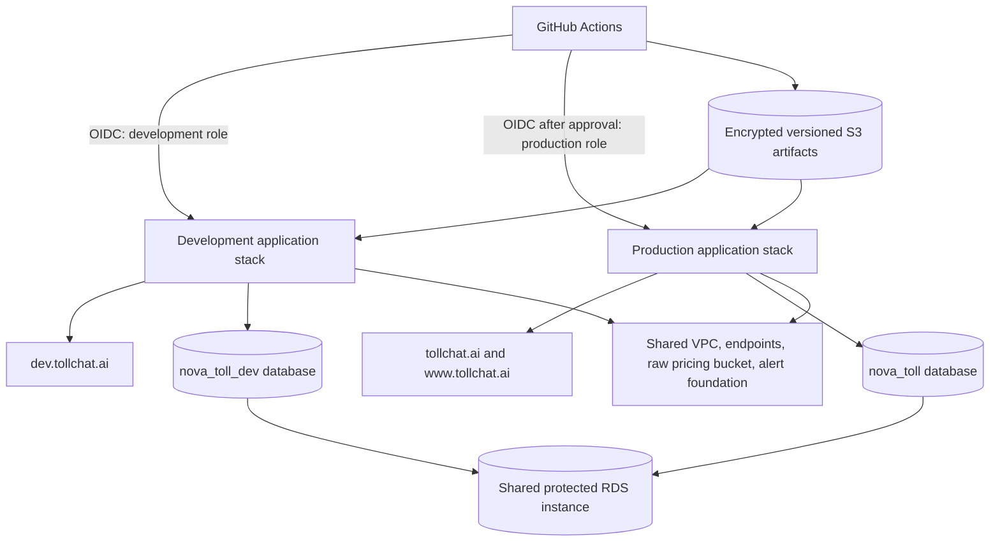

# TollChat Environment, Migration, and Release Plan

Status: proposed for review

Scope: TollChat v2 application infrastructure and delivery

Target region: AWS `us-east-1`

## 1. Objective

Create a persistent development environment at `dev.tollchat.ai` and retain
production at `tollchat.ai`. A merge to `main` should deploy to development. A
published release should promote the exact development-proven revision to
production after database, evaluation, and human approval gates.

The result should demonstrate production engineering judgment without cloning
expensive shared foundations or adding tools that TollChat does not need.

## 2. Current state

- `infra/` owns shared network, RDS, storage, polling, security, and the
  `nova-toll/terraform.tfstate` state.
- `v2/infra/` owns the TollChat application stack in the fixed
  `nova-toll/v2/terraform.tfstate` state.
- `v2/infra/` currently hard-codes production domains and many globally unique
  resource names, so a second state would collide rather than create an
  isolated environment.
- Production deployment is manual and follows `v2/RUNBOOK.md`.
- Pull-request CI already runs PostgreSQL 17/PostGIS migration tests from each
  declared prior version, checks migration immutability and idempotence, and
  compares migrated schemas with canonical bootstrap schemas.
- Pull-request CI checks the evaluator itself without making model calls.
- Scheduled protected workflows run live, code-graded TollChat evaluations
  against time-sensitive pricing windows.

## 3. Decisions

| Area | Decision | Reason |
| :-- | :-- | :-- |
| Remote environments | Development and production | Enough promotion ceremony without a speculative third environment. |
| AWS accounts | One account initially | Account separation is valuable later, but duplicates foundations and cost before the workflow is proven. |
| Terraform source | One `v2/infra` root | Prevent configuration drift and preserve one application definition. |
| Terraform state | Explicit S3 state key per environment | More visible and harder to select accidentally than CLI workspaces. |
| Production compatibility | Preserve current state key and physical names | The environment refactor must not replace production resources. |
| Database isolation | Separate PostgreSQL databases, users, grants, and migrator roles on the existing RDS instance | Isolates ordinary schema and migration mistakes while sharing the expensive database host. It is not an instance-level security boundary. |
| Deployable artifact | Build once per commit and address by SHA-256 | Development and production should execute identical bytes. |
| Migration execution | GitHub Actions deployment jobs, outside Terraform | SQL migrations have ordering, version, and failure semantics that Terraform should not impersonate. |
| Production trigger | Published GitHub Release with an allowed `v*` tag | Creates an auditable promotion event distinct from merging code. |
| Evaluation | Cheap PR checks, live dev smoke, repeated release gate, bounded prod canary | Spends model calls where they affect a deployment decision. |
| Rollback | Roll Lambda and AgentCore versions back; roll schemas forward | Backward-compatible migrations keep the prior application usable without risky automatic down-migrations. |

## 4. Target architecture

### 4.1 Shared foundations

Keep the existing `infra/` state responsible for:

- AWS account and region selection;
- VPC, private subnets, endpoints, and shared security foundations;
- the protected RDS PostgreSQL instance and its backups;
- raw pricing storage and common KMS foundations;
- Terraform state storage and locking;
- the existing production alert destination.

Shared does not mean broadly writable. Development deployment and runtime roles
must receive only the environment-specific grants they require.

### 4.2 Environment-isolated resources

Each application environment should have its own:

- CloudFront distribution, ACM certificate, WAF ACL, DNS record, and site S3
  bucket;
- Lambda functions, aliases, queues, log groups, EventBridge rules, and alarms;
- AgentCore runtime and application roles;
- DynamoDB session and measurement data;
- PostgreSQL database and database roles/grants, bootstrapped outside Terraform;
- application KMS keys and environment-scoped IAM roles;
- a non-paging development alert topic or disabled alarm actions;
- deployment outputs and smoke-test endpoints.

Production retains its existing names. Development receives an explicit `-dev`
suffix or `dev-` prefix wherever AWS requires global uniqueness.

### 4.3 Intentional environment differences

Development should resemble production but remain cheaper and quieter:

- no provisioned Lambda concurrency until measurements justify it;
- a Terraform-enforced provisioned-concurrency value of zero;
- shorter Terraform-enforced log retention where policy permits;
- alarms visible but not routed as production pages;
- tighter public rate limits and explicit `noindex` behavior;
- separate anonymous-session and usage data;
- a dedicated PostgreSQL database and migration principal;
- the same application packages and schema definitions as production.

## 5. Terraform design

### 5.1 Configuration

Add the minimum environment inputs needed to remove singleton assumptions:

- `environment`: `development` or `production`;
- domains and canonical public URL;
- environment resource-name affix;
- database name and environment-specific database roles;
- operational differences such as provisioned concurrency and alarm actions.

Centralize derived names in locals. The production values must resolve to the
current literal names so existing state addresses and physical resources remain
unchanged.

Do not split every resource into a module merely to call it twice. The same
root will be initialized against one of two explicit backend configurations:

- production: existing `nova-toll/v2/terraform.tfstate`;
- development: `nova-toll/v2/development/terraform.tfstate`.

Commit non-secret backend configuration and tfvars. Credentials remain in OIDC,
IAM, and SSM Parameter Store.

The AWS provider does not manage PostgreSQL databases or roles. Create the
development database and its initial roles through a separately approved,
one-time SQL bootstrap using a database administrator identity. Do not add a
PostgreSQL Terraform provider or `null_resource` merely to hide that operation
inside an application plan. Ongoing schema changes use the migration workflow.

### 5.2 Plan safety

Before creating development:

1. Initialize the refactored root against the existing production state.
2. Run a full production plan with the current reviewed packages.
3. Require zero resource changes.
4. If an unavoidable metadata-only change exists, review and isolate it before
   continuing.

Pull requests should produce non-mutating development and production plan
summaries. Saved binary plans can contain sensitive values and must not be
published as artifacts from a public repository.

For a production release, upload the exact saved plan to a unique versioned key
in a private S3 prefix. Require SSE-KMS with the exact key, an S3 SHA-256 object
checksum, a locally computed plaintext SHA-256, and Object Lock Compliance
retention. Record the object version, both checksums, KMS key ARN, creation time,
and expected state serial in the deployment manifest. The apply job must fetch
that exact version and verify every value before running Terraform.

Plans are eligible for approval for 24 hours, immutable for 48 hours, and
expired by lifecycle after three days. S3 lifecycle is day-granular and Object
Lock retention wins if expiration runs earlier. Do not use the SSE-KMS ETag as
an integrity digest; it is not a reliable MD5 of either plaintext or ciphertext.

The trusted plan job may write only a unique plan object and any required S3
state lockfile. It otherwise receives Describe/Get/List discovery permissions.
The production apply role may read only the recorded plan version and its own
state key. Bucket policy and KMS encryption-context conditions provide a second
layer. Planning uses a Cloudflare zone/DNS read token; applying uses separate
mutation credentials released only after approval.

## 6. Database migration policy

### 6.1 Pull-request CI

Pull requests must never mutate a deployed database. Retain the existing
disposable checks:

1. Detect changed schema-owned files and new upgrade migrations.
2. Reject edits to previously released migrations.
3. Start from each migration's declared prior schema version.
4. Apply new migrations in dependency order with `ON_ERROR_STOP`.
5. Verify target versions, failure atomicity, and safe reruns.
6. Compare the final schema and canonical data with the bootstrap definition.

### 6.2 Environment deployment

Use one reviewed migration runner for development and production. It should:

1. Connect using an environment-specific migrator identity obtained through
   GitHub OIDC and RDS IAM authentication.
2. Acquire a PostgreSQL advisory lock so only one deployment can migrate a
   target database at a time.
3. Read every registered schema version.
4. Fail if the installed versions differ from the expected release baseline.
5. Apply only the contiguous pending migration chain in dependency order.
6. Re-read versions and compare the deployed schema with the release bootstrap.
7. Emit a non-secret migration report into the deployment summary.

Development applies pending migrations after a successful merge build and
before application code that needs the new schema. Production repeats the same
operation during the approved release.

### 6.3 Compatibility and recovery

- Applied migrations remain immutable.
- Every migration is declared `expansion` or `contract` in reviewed metadata.
- Expansion migrations must work with the currently deployed application and
  may run before the new application version.
- Renames, removals, and incompatible constraints use expand, migrate, and
  contract across separate releases.
- The runner must refuse a production contract migration unless the deployment
  manifest proves the compatible application version is already live and
  telemetry or code search proves the old path is unused.
- Automatic down-migrations are prohibited.
- Before a non-trivial production migration, verify RDS point-in-time recovery
  and the latest restorable time. A destructive contract release also requires
  a tested recovery procedure and an explicit snapshot decision. RDS point-in-
  time recovery restores the whole instance; single-database recovery requires
  restoring to another instance and exporting/importing `nova_toll`.
- If application deployment fails after an expansion migration, the prior
  application remains compatible while the release rolls forward or the
  application artifact rolls back.

### 6.4 Shared-instance database boundary

- Never use the RDS master user or any `rds_superuser` identity in CI,
  migrations, or application runtime.
- Create distinct PostgreSQL login roles for dev/prod runtime and migration.
  Revoke `CONNECT` on both databases from `PUBLIC`, then grant it only to the
  named roles for that environment. Scope schema and object privileges likewise.
- RDS IAM policies must use the exact `dbuser:DB_RESOURCE_ID/DATABASE_USER` ARN
  for each migrator, never a wildcard. RDS IAM policy resources do **not**
  contain the database name, so database separation is enforced by PostgreSQL
  `CONNECT`, ownership, role membership, and object grants.
- Assert that application and migration roles are not members of `pg_monitor`,
  `rds_superuser`, `rdsadmin`, `rds_replication`, or `rds_extension`.
- Audit installed extensions and user mappings. Do not give development roles
  `dblink`, `postgres_fdw`, cross-database credentials, or extension-install
  privileges. If `pg_cron` is used, keep it out of `nova_toll_dev`.
- Add automated isolation probes: each dev identity must fail to connect to or
  inspect production, and each prod identity must fail against development.

## 7. Delivery workflows

```mermaid
flowchart LR
  PR[Pull request] --> CI[Tests, disposable DB migrations, eval check, tf plans]
  CI --> MAIN[Merge to main]
  MAIN --> BUILD[Build once and record digests]
  BUILD --> DMIG[Migrate development]
  DMIG --> DAPPLY[Apply development Terraform]
  DAPPLY --> DSMOKE[Dev smoke and live eval]
  DSMOKE --> RELEASE[Publish v* release]
  RELEASE --> REVAL[Repeated candidate release eval]
  REVAL --> PPLAN[Production plan and migration preflight]
  PPLAN --> APPROVE[Production environment approval]
  APPROVE --> PMIG[Apply expansion migrations]
  PMIG --> PAPPLY[Apply exact saved plan]
  PAPPLY --> CANARY[Production canary and evidence]
  CANARY -. later contract release .-> PCONTRACT[Verify live app, apply contract, canary]
```

### 7.1 Pull request

- Run existing application, database, security, and offline evaluator checks.
- Build deterministic packages and verify their manifests.
- Run read-only plans for both application states.
- Do not expose apply roles, Cloudflare credentials, or database migrator
  privileges to pull-request jobs.

### 7.2 Merge to `main`

- Wait for required CI checks.
- Build each deployable package once.
- Store packages in encrypted, versioned S3 keys addressed by commit and digest.
- Apply development migrations.
- Plan and apply development using those package versions.
- Wait for CloudFront and runtime readiness.
- Run endpoint smoke checks and a small live agent evaluation.
- Record a successful GitHub development deployment for the commit.

Development concurrency must serialize deployments and must not cancel an
apply that has started. A newer commit may wait and then supersede an older
queued deployment.

### 7.3 Published release

- Accept only allowed release tags whose commit has a successful development
  deployment.
- Resolve packages by the development-proven commit and verify every digest.
- Run the release evaluation gate against that exact candidate.
- Generate a production migration preflight and saved Terraform plan.
- Present non-secret plan, migration, artifact, and eval summaries for review.
- Require the protected production environment approval.
- Apply expansion migrations, then the exact saved Terraform plan. Run a
  contract migration only in its separately eligible contract release after
  the compatible application is confirmed live.
- Run bounded production canaries and record deployment evidence.

Production concurrency must allow only one plan/apply sequence at a time and
must never cancel an active migration or apply.

### 7.4 Edge and runtime ordering

Do not use `terraform apply -target` to manufacture deployment phases. The
CloudFront origin depends on the Lambda Function URL, while the IAM-only URL is
restricted to the CloudFront distribution ARN; Terraform should retain that
dependency graph and apply the reviewed saved plan as a whole.

Before any initial DNS enablement or canary, verify that CloudFront reports
`Deployed`, the WAF ARN is associated, the Function URL still requires AWS IAM,
and the origin access control is effective. If a future release introduces a
new distribution or hostname, use a separate normal saved plan with an
explicit DNS-enable input after readiness, not a targeted apply. Existing
production DNS normally remains unchanged.

New or materially changed custom WAF blocking rules first deploy with
`action { count {} }` in development and then in a production observation
release before promotion to `block`. Managed rule groups use their appropriate
rule-action overrides. Unchanged proven rules need not cycle through COUNT on
every release.

## 8. Evaluation ceremony

The existing deterministic code graders remain the primary evaluators. They are
better than an LLM judge for exact route selection, money, tool arguments,
disclosures, and forbidden behavior.

### 8.1 Tiers

| Tier | Trigger | Environment | Purpose |
| :-- | :-- | :-- | :-- |
| Evaluator check | Every pull request | Network-free | Prove cases load and every grader's pass/fail branches behave. |
| Dev smoke | Successful development deployment | Development live services | Catch packaging, IAM, database, endpoint, and obvious agent regressions. |
| Scheduled suite | Existing timed schedules | Development, then selected production observation | Exercise real time-sensitive pricing states without blocking arbitrary merges. |
| Release gate | Published release before prod approval | Exact development candidate | Measure full agent behavior repeatedly under controlled inputs. |
| Production canary | Successful production apply | Production | Confirm the public path and one or two critical journeys, not rerun the full suite. |

### 8.2 Deterministic release environment

The current live suite depends on tolling direction and feed freshness, so it
cannot be the sole release gate. Add versioned recorded tool results for the
full candidate behavior suite. Run the real agent with those controlled tool
results, then retain live dev smoke cases to detect integration drift. Avoid a
new eval service until this combination proves insufficient.

### 8.3 Release measurements and gates

- Run each critical case three times.
- Require `pass^3` for routing, money grounding, safety, and required tool use.
- Record dataset hash, commit, artifact digests, model identifier, prompt and
  renderer versions, and tool-contract versions.
- Record per-case tool calls, turns, input/output tokens, latency, and estimated
  model cost.
- Classify infrastructure, quota, and dependency failures separately from agent
  quality failures. Either class blocks release, but only agent failures affect
  the quality score.
- Use fixed correctness gates initially. Collect cost and latency for the first
  releases, then adopt regression thresholds only after a stable baseline
  exists.
- If the model, system prompt, tool contract, or dataset changes, include a
  small human review sample of transcripts with the approval packet.

All release workflow results may be retained in restricted operational storage.
Only technically valid, representative reports should be curated in
`v2/eval/results/`; failed and superseded reports must not be committed.

## 9. Identity, secrets, and permissions

- Use GitHub OIDC; do not create long-lived AWS access keys.
- Create a trusted planner, development deploy, production deploy,
  `tollchat-db-migrator-dev`, and `tollchat-db-migrator-prod` role. The trusted
  planner may also be the plan-object writer; do not create another dedicated
  writer role or grant this capability to untrusted pull-request CI.
- Every trust policy requires `aud = sts.amazonaws.com` and an exact immutable
  repository `sub`. Development requires `ref:refs/heads/main`; production
  deploy and production migration require the protected `production` GitHub
  environment. Production also requires the exact reusable
  `job_workflow_ref`, pinned to the repository workflow path and reviewed ref.
- IAM currently exposes `job_workflow_ref` as a GitHub OIDC condition key. Keep
  `sub` and `aud` as mandatory controls; the workflow claim supplements them.
- Give the planner explicit discovery reads plus only the narrow state-lock and
  unique plan-object writes it needs. A permissions boundary prevents other
  infrastructure mutation. Do not attempt a brittle hand-written deny list of
  every AWS mutation, and do not authorize `sts:TagSession` or trust unverified
  principal tags in resource policies.
- Scope deploy roles and bucket policies to their exact state prefixes:
  development under `nova-toll/v2/development/`, production at
  `nova-toll/v2/terraform.tfstate` and its lockfile. Apply matching `s3:prefix`
  conditions to list operations.
- Give each migrator only its exact RDS database-user ARN and required network
  path. PostgreSQL grants, not the IAM ARN, select its database.
- Give each deploy role write access only to its artifacts and application
  resources. Development raw-pricing access is Get-only on required `raw/`
  prefixes with no write/delete grant.
- Use distinct Tailscale ACL identities such as `tag:ci-dev` and `tag:ci-prod`
  and test that only approved jobs can reach the RDS endpoint. AWS security
  groups cannot match a Tailscale tag, and because both databases share one
  endpoint the database grants remain the decisive boundary.
- Production mutation credentials must not be available before environment
  approval. A release workflow may use separately scoped read-only AWS,
  database-inspection, and Cloudflare credentials for the approval packet.
- Read the Cloudflare write token from SSM only inside the approved Terraform
  apply process and unset it afterward.
- Never place database credentials, provider tokens, plan files, or decrypted
  parameters in job summaries or public artifacts.
- Use exact KMS key ARNs in IAM, key, and bucket policies. Verify development
  principals are absent from production key policies and grants; a KMS alias
  does not itself grant access.
- Configure the IAM OIDC provider using current AWS guidance. Do not build a
  manual GitHub certificate-rotation ceremony unless AWS again requires a
  pinned thumbprint.

### 9.1 Plan object permissions

- Writer: `PutObject` only to a unique `plans/ENV/RUN_ID/` key, with required
  SHA-256 checksum, exact SSE-KMS key, and Object Lock headers.
- Applier: `GetObject`, `GetObjectVersion`, and metadata reads only for the
  manifest-recorded key/version.
- Neither CI role may overwrite/delete plan versions or change retention.
- KMS writer permissions are limited to encryption/data-key operations;
  production apply receives decrypt only, both constrained by encryption
  context. No CI role receives `kms:*`.
- Deny insecure transport and missing/wrong encryption in bucket policy.
  Compliance retention, rather than a root-deny statement, protects the object.

## 10. Deployment evidence

Every development and production deployment should produce a machine-readable
manifest containing:

- environment and public URL;
- Git commit and release tag, when present;
- package object versions and SHA-256 digests;
- Terraform version, state key, plan object version, plaintext SHA-256, S3
  SHA-256 checksum, KMS key, age, and result;
- installed `pricing` and `oracle` schema versions;
- current and prior AgentCore runtime ARN, endpoint ARN, live version, and
  target version, plus the Lambda alias/version;
- model, prompt, renderer, tool-contract, and eval-dataset versions;
- eval pass counts plus separated infrastructure failures;
- smoke-test result and deployment timestamps.

Store the manifest in encrypted operational storage and render a non-secret
summary in GitHub. It is evidence for review and incident reconstruction, not a
second configuration database.

## 11. Failure behavior

| Failure | Required behavior |
| :-- | :-- |
| PR migration or plan fails | Block merge; no deployed state was touched. |
| Development migration fails | Stop before application apply; retain the prior dev deployment. |
| Development smoke/eval fails | Mark the commit unhealthy and prohibit production promotion. |
| Release eval fails | Stop before production credentials or mutations. |
| Production baseline differs | Stop and investigate drift; never skip versions automatically. |
| Production migration fails | Stop before application apply and preserve diagnostic evidence. |
| Saved plan is stale or digest differs | Reject it and require a new plan and approval. |
| Production apply fails after compatible migration | Keep or restore the prior application artifact and roll forward the infrastructure fix. |
| Production canary fails | Stop further actions; repoint the Lambda alias and AgentCore endpoint to the recorded prior versions when indicated, then follow the runbook. |

## 12. Implementation checklist

- [ ] Step 1: Record the delivery contract and protect the production baseline.
- [ ] Step 2: Make the existing application Terraform root environment-aware.
- [ ] Step 3: Bootstrap the isolated development database and application stack.
- [ ] Step 4: Add pull-request plans and least-privilege GitHub identities.
- [ ] Step 5: Automate development migration, deployment, and smoke checks.
- [ ] Step 6: Add deterministic release evals and deployment evidence.
- [ ] Step 7: Automate the approved production release.
- [ ] Step 8: Exercise failure and recovery paths, then update public documentation.

## 13. Implementation steps

### Step 1: Record the delivery contract and protect the production baseline

**Objective:** Make environment, migration, artifact, evaluation, and rollback
rules explicit before infrastructure changes.

**Guidance:** Update agent guidance and the runbook to prohibit deployed database
mutations on pull requests, define main and release behavior, and document the
existing production names and state key that must remain stable.

**Tests:** Add or retain contract checks for migration immutability, production
backend selection, and absence of production credentials from PR jobs.

**Integration:** This becomes the acceptance contract for every later step.

**Demo:** A reviewer can follow one written flow from a database-changing pull
request through development and production without finding contradictory
instructions.

### Step 2: Make the existing application Terraform root environment-aware

**Objective:** Allow one root to describe development and production while
producing no production drift.

**Guidance:** Introduce the minimal inputs and derived names, explicit backend
configs, domains, and operational settings. Preserve production defaults and
resource addresses.

**Tests:** Run formatting and validation, add focused infrastructure contract
tests, and require a zero-change production plan before merge.

**Integration:** Builds on the written production baseline and prepares the
same root for a second state.

**Demo:** Initialize production and development backends from the same checkout;
production plans zero changes and development plans distinct names and domain.

### Step 3: Bootstrap the isolated development database and application stack

**Objective:** Create `nova_toll_dev` and deploy a usable `dev.tollchat.ai`.

**Guidance:** Run one separately approved administrator bootstrap to create the
development database and environment-specific identities/grants, bootstrap
canonical schemas, apply the development Terraform state, and keep shared
foundations read-only where possible.

**Tests:** Verify database-role isolation, canonical schema versions, DNS/TLS,
private origins, WAF behavior, public API gates, and no production resource
changes.

**Integration:** Uses the environment-aware root and existing shared network,
RDS, raw data, and state foundations.

**Demo:** Load the development site, stream a development chat response, and
show that its session data and database are separate from production.

### Step 4: Add pull-request plans and least-privilege GitHub identities

**Objective:** Make proposed infrastructure changes visible without granting PR
jobs mutation authority.

**Guidance:** Add the trusted planner, two deploy roles, and two database
migrator roles; bind production to `sub`, `aud`, and `job_workflow_ref`; add
environment-scoped state and database access; and emit sanitized plan summaries.

**Tests:** Verify allowed branch/environment/workflow claims, denied cross-
environment state and database access, state locking, prohibited session tags,
and fork-safe pull-request behavior.

**Integration:** Reuses existing CI and both initialized states.

**Demo:** A pull request shows development and production plan summaries while
attempts to apply or read deployment secrets fail.

### Step 5: Automate development migration, deployment, and smoke checks

**Objective:** Deploy every accepted `main` commit to development safely.

**Guidance:** Build once, publish digest-addressed packages, run the shared
migration runner against development, apply Terraform, wait for readiness, and
run endpoint plus agent smoke checks.

**Tests:** Exercise migration locking, expected-version rejection, failed build,
failed migration, failed apply, and failed smoke paths. Confirm active applies
are never canceled.

**Integration:** Converts successful CI output into the first complete CD path.

**Demo:** Merge a harmless visible change and show the same commit, artifact
digests, schema versions, and successful checks on `dev.tollchat.ai`.

### Step 6: Add deterministic release evals and deployment evidence

**Objective:** Produce a repeatable quality decision for an exact candidate.

**Guidance:** Add versioned recorded tool results, three repeated runs for
critical cases, efficiency measurements, failure classification, and the
deployment manifest. Keep existing timed live checks as the higher-fidelity
outer layer.

**Tests:** Intentionally break tool choice, money grounding, latency collection,
artifact identity, and infrastructure classification. Prove each failure blocks
promotion with an actionable report.

**Integration:** Runs against the development-proven artifact before production
credentials are available.

**Demo:** A release candidate produces a review packet showing `pass^3`, exact
versions and digests, cost/latency observations, and selected transcripts.

### Step 7: Automate the approved production release

**Objective:** Promote an accepted development candidate to production without
rebuilding or bypassing migration and evaluation gates.

**Guidance:** Validate the tag and dev deployment, create the migration
preflight and immutable encrypted saved plan, require production approval,
verify its object version/checksums/age, apply eligible expansion migrations,
apply the exact plan, and run bounded canaries. A later contract release first
verifies the compatible application is healthy, then migrates and canaries.

**Tests:** Reject unproven commits, disallowed tags, stale plans, digest changes,
schema drift, concurrent releases, missing approval, and production-role use
from development.

**Integration:** Completes the promotion path using the artifact, migration
runner, eval gate, and manifest built in previous steps.

**Demo:** Publish a release and show an approval packet, exact artifact
promotion, production schema advancement, successful `tollchat.ai` canary, and
the final deployment record.

### Step 8: Exercise failure and recovery paths, then update documentation

**Objective:** Prove the workflow handles failure rather than merely describing
it.

**Guidance:** Run controlled development game days for stale or changed plan,
migration failure, eval regression, Lambda rollback, AgentCore endpoint revert,
and whole-instance/single-database recovery assumptions. Update the runbook,
ADR, architecture diagram, and portfolio-facing README with actual evidence and
measured costs.

**Tests:** The exercises are the tests. Each must leave development healthy,
preserve production, and produce a concise incident or game-day record.

**Integration:** Validates the complete system and closes gaps found during
real operation.

**Demo:** Walk through one failed release from automated detection to recovery,
including the evidence that explains what changed and why production remained
safe.

## 14. Completion criteria

- The refactored production Terraform plan is zero-change before development is
  created.
- `dev.tollchat.ai` and `tollchat.ai` use isolated application resources and
  PostgreSQL databases.
- Pull requests cannot mutate AWS resources or deployed databases.
- Merges to `main` automatically deploy the exact built artifacts to
  development and record success or failure.
- Production accepts only an allowed release whose commit is healthy in
  development and whose repeated eval gate passes.
- Production migration and apply jobs require environment approval and
  environment-scoped identities, including distinct database migrator roles.
- Migrations are contiguous, backward-compatible, immutable after application,
  and verified after deployment.
- Production applies the reviewed plan and artifacts identified by recorded
  versions and SHA-256 checksums.
- Development identities cannot connect to the production database or assume
  production roles in automated negative tests.
- The rollback runbook records and can restore both Lambda and AgentCore
  versions.
- Dev log retention and zero provisioned concurrency are Terraform-enforced;
  dev alerts do not page the production destination.
- Account-level AWS Budget notifications fire at 80% forecast/actual and 100%
  actual monthly spend.
- Development and production deployments serialize safely and cannot cancel an
  active migration or apply.
- A failed release exercise demonstrates diagnosis and recovery.
- CI, deployment, eval, and curated evidence instructions agree with one
  another.

## 15. Deferred until evidence justifies them

- Separate AWS accounts for development and production.
- A third persistent staging environment.
- Kubernetes, GitOps controllers, or a custom deployment platform.
- Canary traffic shifting beyond the existing Lambda alias and concurrency
  controls.
- An LLM judge for requirements already covered exactly by code graders.
- HCP Terraform or another paid remote-run service.
- Automatic destructive schema rollback.
- S3 Intelligent-Tiering for the artifact bucket until object sizes and
  retention measurements show savings beyond its monitoring overhead.
- Parameterized CloudWatch dashboards until duplicate dashboards actually
  exist; use one environment selector when they do.

## 16. Review questions

1. Is sharing the protected RDS instance while using separate databases an
   acceptable initial blast-radius and cost tradeoff?
2. Should development report publication and all timed schedules run
   continuously, or should expensive schedules be selectively enabled?
3. Should a published GitHub Release initiate production deployment, or should
   the Release be created only after a `v*` tag has passed and deployed?
4. Where should short-lived sensitive saved plans live within the existing
   encrypted artifact foundation?
5. Which production canary conversation is safe, inexpensive, and stable enough
   to run on every release?

## 17. AWS Q review disposition

Accepted controls: production `job_workflow_ref`, separate environment
migrators, exact state prefixes, PostgreSQL role/extension isolation, immutable
short-lived plans, migration classification, explicit AgentCore rollback,
environment Tailscale ACL identities, dev retention/alert controls, raw-bucket
read scoping, exact KMS grants, and account budget alarms.

Corrections applied after checking current platform behavior:

- RDS IAM ARNs scope an instance resource and database user, not a database
  name; PostgreSQL privileges enforce the database boundary.
- SSE-KMS ETags are not content digests; use S3 and local SHA-256 checksums plus
  the object version.
- Terraform `-target` is not a safe deployment sequencer here; retain the
  dependency graph and use a separate normal DNS-enable plan only when a new
  edge endpoint requires it.
- WAF COUNT syntax differs for custom and managed rules; canary only new or
  materially changed rules.
- An SNS topic fans out to every subscription, so development needs a separate
  non-paging topic or no alarm action.
- AWS security groups cannot select a Tailscale ACL tag; Tailscale gates the
  network path and PostgreSQL gates the shared endpoint.
- Object Lock Compliance mode supplies root-resistant retention; a bucket root
  deny would add recovery risk without improving object immutability.
- Planner permissions use an allow-list and boundary plus narrowly necessary
  lock/plan writes, not an inevitably incomplete deny list of AWS mutations.

## 18. Research inputs

- [Agentic Evals: A Software Engineer's Guide](https://yeshas93.substack.com/p/agentic-evals-a-software-engineers)
- [GitHub Actions deployments and environments](https://docs.github.com/en/actions/reference/workflows-and-actions/deployments-and-environments)
- [GitHub Actions OIDC with AWS](https://docs.github.com/en/actions/how-tos/secure-your-work/security-harden-deployments/oidc-in-aws)
- [AWS IAM GitHub OIDC condition keys](https://docs.aws.amazon.com/IAM/latest/UserGuide/reference_policies_iam-condition-keys.html#condition-keys-wif)
- [RDS IAM database access policies](https://docs.aws.amazon.com/AmazonRDS/latest/UserGuide/UsingWithRDS.IAMDBAuth.IAMPolicy.html)
- [Amazon S3 object integrity](https://docs.aws.amazon.com/AmazonS3/latest/userguide/checking-object-integrity.html)
- [Amazon S3 Object Lock](https://docs.aws.amazon.com/AmazonS3/latest/userguide/object-lock.html)
- [Terraform environment organization](https://developer.hashicorp.com/terraform/tutorials/modules/organize-configuration)
- [Flyway production migration principles](https://documentation.red-gate.com/flyway/deploying-database-changes-using-flyway/rolling-out-updates-from-a-single-schema-to-multiple-production-databases)
