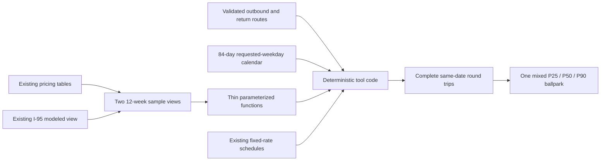

# 12-Week Toll Ballpark Database Design

## Status

This is a deliberately lightweight replacement for the earlier database
proposal. It supports a screening question, not a budgeting product:

> Could the toll cost of this commute be large enough that I should investigate
> before accepting the offer?

The result mixes observed and provisional modeled prices into one clearly
labeled estimate. It is recent price context, not a forecast, quote, or budget.

This design implements the
[annualized toll ballpark product](annual-toll-train-product.md).

## Smallest design

Mirror the current pricing tool:

| Object | Decision |
| --- | --- |
| `oracle.validate_pricing_route` | Reuse for outbound and return routes. |
| `oracle.route_pricing_component` | Reuse for ordered dynamic and fixed components. |
| Existing fixed-rate schedule logic | Reuse current published DTR and Greenway rates. |
| `pricing.modeled_trip_pricing_i95` | Reuse for provisional I-95 proxy prices. |
| `pricing.i66_ballpark_samples` | Add one 12-week I-66 history view. |
| `pricing.i95_i495_ballpark_samples` | Add one 12-week I-95/I-495 view containing observed and modeled rows. |
| Two narrow `oracle` functions | Add parameterized, least-privilege access to the views. |
| Current pricing tool pattern | Reuse to assemble route totals in deterministic Python. |

Do not add pricing-regime tables, ingestion watermarks, revision timestamps,
materialized views, separate source cohorts, or an immutable evidence store.

## Why not use the current views unchanged?

The current comparison views are close to what we need. They already:

- use facility-specific 6-minute and 10-minute bins;
- select one candidate deterministically;
- preserve observation time and modeled method;
- combine observed and modeled I-95 rows in one view contract; and
- enforce the I-95 reversible-lane schedule and observed direction.

They are anchored to `statement_timestamp()`, however. A user asking about an
8:00 a.m. commute needs samples around 8:00 a.m., even if TollChat runs at
3:00 p.m. PostgreSQL views cannot accept that requested time.

The new views therefore expose recent binned rows. Thin functions accept the
user's local departure time and bounded eligible-date list, select matching
samples, and keep direct table access away from the agent role.

## Data flow



## View contracts

Both views cover the most recent 84 completed local dates. They are ordinary
views over existing tables, not stored or refreshed copies.

### `pricing.i66_ballpark_samples`

One row is one usable I-66 component price in its six-minute source bin.

| Column | Meaning |
| --- | --- |
| `sample_date` | `interval_end_at` converted to an Eastern local date. |
| `sample_isodow` | ISO weekday, 1 through 7. |
| `bin_start_at`, `bin_end_at` | Six-minute comparison bin. |
| `interval_end_at` | Selected source interval. |
| `observed_at` | Source `calculated_at`. |
| `start_zone_id`, `end_zone_id` | I-66 component identity. |
| `price_usd` | Observed component price. |
| `uses_modeled` | Always `false`. |
| `pricing_method` | `source_observation`. |

### `pricing.i95_i495_ballpark_samples`

One row is one usable observed or modeled I-95/I-495 component price in its
ten-minute source bin.

| Column | Meaning |
| --- | --- |
| `sample_date` | `interval_end_at` converted to an Eastern local date. |
| `sample_isodow` | ISO weekday, 1 through 7. |
| `bin_start_at`, `bin_end_at` | Ten-minute comparison bin. |
| `interval_end_at` | Selected source or proxy interval. |
| `observed_at` | Source or proxy `calculated_at`. |
| `od_pair_id` | Requested component identity. |
| `price_usd` | Observed or provisional modeled price. |
| `uses_modeled` | `true` only for a proxy price. |
| `pricing_method` | `source_observation` or `identity_proxy_v1`. |
| `proxy_od_pair_id` | Proxy identity for modeled rows; otherwise null. |

Conceptually, the I-95 view keeps both sources in one stream:

```sql
SELECT
    zone_toll_rate_usd AS price_usd,
    false AS uses_modeled,
    'source_observation' AS pricing_method
FROM pricing.trip_pricing_i95

UNION ALL

SELECT
    zone_toll_rate_usd AS price_usd,
    true AS uses_modeled,
    pricing_method
FROM pricing.modeled_trip_pricing_i95;
```

The real view also applies the existing canonical and observed I-95 direction
checks. Missing, closed, reversal, or otherwise unusable intervals do not
become zero-dollar samples.

## Thin access functions

The functions follow the existing `SECURITY DEFINER` pricing boundary:

```sql
oracle.get_i66_ballpark_samples(
    requested_start_zone_id integer,
    requested_end_zone_id integer,
    requested_local_time time,
    requested_dates date[]
)

oracle.get_i95_i495_ballpark_samples(
    requested_od_pair_id integer,
    requested_local_time time,
    requested_dates date[]
)
```

Each function:

1. validates the requested time and at most 84 completed local dates;
2. matches each requested date and local time to the facility bin;
3. rejects future or out-of-window dates;
4. selects at most one row per component and date, preferring observed over
   modeled if both exist; and
5. returns a bounded set ordered by date.

The functions return the view columns above. They do not calculate route
totals, percentiles, or annualized values.

## Tool calculation

The deterministic tool code should:

1. Validate the outbound and return routes and reject an overnight schedule.
2. Generate every requested-weekday date in the 84-day target window before
   querying prices. This calendar also supports routes containing only fixed
   charges.
3. Call the applicable history function for every dynamic route component,
   passing the same eligible-date list.
4. Apply current published DTR and Greenway charges to every sampled day with
   the existing schedule logic, and disclose that they are not historical
   rates.
5. Sum a trip only when every required component has a price.
6. Pair outbound and return trips only when both are complete on the same local
   date.
7. Mix all complete daily totals into one sample, regardless of whether their
   components were observed or modeled.
8. Set `uses_modeled = true` when any selected component was modeled.
9. Calculate nearest-rank P25, P50, and P90 as `x[ceil(p × n)]` over sorted
   complete daily round-trip totals.
10. Multiply each statistic by the user's planned annual commute days using
   decimal arithmetic.

```text
annualized scenario = complete daily round-trip statistic
                      × planned annual commute days
```

No missing component is imputed, borrowed from another date, or treated as
free. This is the one place where being lazy would merely create a smaller but
more confident lie.

## User-facing result

Return one low, middle, and high directional estimate with:

- route and schedule;
- 12-week date range;
- eligible dates, complete round-trip counts, and coverage overall and by
  requested weekday;
- every missing or underrepresented weekday;
- annual commute days;
- recent daily P25, P50, and P90 values;
- whether any modeled components were used; and
- when applicable, that current fixed rates were applied to every sampled day.

When modeled prices appear anywhere in the sample, show:

> Includes provisional modeled toll prices that may differ from operator
> prices, sometimes materially. This is a prompt to investigate the commute
> cost, not a budget or forecast.

The intended takeaway is simple:

> Recent prices suggest this commute could annualize to roughly **$X–$Y** for
> your schedule. That may be material to the offer; investigate before deciding.

`$X–$Y` is the annualized P25 through annualized P90. Coverage is complete
paired days divided by requested-weekday dates in the 84-day target window.
When weekday counts are unequal, use “for the sampled weekdays” and show the
counts instead of adding statistical weights.

## Product-contract alignment

The product contract and this design both require a 12-week mixed sample,
same-day commute inputs, complete same-date round trips, modeled-price and
current-fixed-rate disclosure, defined coverage, returned calculation evidence,
decimal arithmetic, and no forecast or budget claims.

## Explicitly skipped

- No new source-provenance columns.
- No pricing-regime or ingestion-watermark tables.
- No materialized or annual-results views.
- No cohort-specific percentiles.
- No durable evidence-manifest system.
- No train data or advice.

Add those only if this becomes a product people are expected to budget from.
