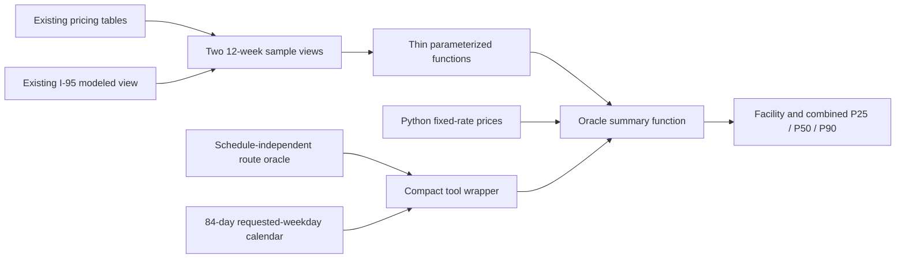

# 12-Week Toll Ballpark Database Design

## Status

This is a deliberately lightweight replacement for the earlier database
proposal. It supports a screening question, not a budgeting product:

> Could the toll cost of this commute be large enough that I should investigate
> before accepting the offer?

The result mixes observed and provisional modeled prices into one clearly
labeled estimate. It is recent price context, not a forecast, quote, or budget.

This design implements the
[annualized toll ballpark product](annual-toll-train-product.md) and its
[agent tool contract](annual-toll-ballpark-tool-contract.md).

## Smallest design

Mirror the current pricing tool:

| Object | Decision |
| --- | --- |
| `oracle.validate_ballpark_route` | Add schedule-independent structural validation for outbound and return routes. |
| `oracle.validate_pricing_route` | Leave unchanged for the current pricing tool. |
| `oracle.route_pricing_component` | Reuse for ordered dynamic and fixed components. |
| Existing fixed-rate catalogs | Reuse current published DTR and Greenway rates; classify Greenway periods at each sampled trip time. |
| `pricing.modeled_trip_pricing_i95` | Reuse for provisional I-95 proxy prices. |
| `pricing.i66_ballpark_samples` | Add one 12-week I-66 history view. |
| `pricing.i95_i495_ballpark_samples` | Add one 12-week I-95/I-495 view containing observed and modeled rows. |
| Two ballpark sample functions | Reuse parameterized, least-privilege access to the views. |
| `oracle.get_annual_ballpark_summary` | Add one bounded call that intersects complete dates and returns facility plus exact combined P25/P50/P90 values. |
| Current pricing tool pattern | Dispatch fixed facilities in Python and dynamic facilities through Oracle. |

Do not add pricing-regime tables, ingestion watermarks, revision timestamps,
materialized views, separate source cohorts, or an immutable evidence store.

## Why not use the current views unchanged?

The current comparison views are close to what we need. They already:

- use facility-specific 6-minute and 10-minute bins;
- select one candidate deterministically;
- preserve observation time and modeled method;
- combine observed and modeled I-95 rows in one view contract; and
- enforce the I-95 reversible-lane schedule and observed direction.

They are anchored to `statement_timestamp()`, however. A user asking about an
8:00 a.m. commute needs samples around 8:00 a.m., even if TollChat runs at
3:00 p.m. PostgreSQL views cannot accept that requested time.

The new views therefore expose recent binned rows. Thin functions accept the
user's local departure time and bounded eligible-date list, select matching
samples, and keep direct table access away from the agent role.

## Why not reuse current route validation unchanged?

`oracle.validate_pricing_route` correctly gates current pricing on live I-95
reversible-lane availability. That cannot validate a historical round trip:
when one direction is open now, the opposite direction normally is not.

Add `oracle.validate_ballpark_route(text, text)` to validate structural
connectivity and return ordered pricing legs without consulting live I-95
state. It returns only `valid`, `invalid_origin`, `invalid_destination`,
`no_supported_route`, or `traversal_limit_exceeded`. Historical sample
selection remains responsible for canonical and observed direction checks at
each requested date and time. The current pricing function and contract do not
change.

## Data flow



## View contracts

Both views cover the most recent 84 completed local dates relative to
`transaction_timestamp()`. They are ordinary views over existing tables, not
stored or refreshed copies. The tool queries them inside one read-only
repeatable-read transaction so every facility sees the same window and source
snapshot.

### `pricing.i66_ballpark_samples`

One row is one usable I-66 component price in its six-minute source bin.

| Column | Meaning |
| --- | --- |
| `sample_date` | `interval_end_at` converted to an Eastern local date. |
| `sample_isodow` | ISO weekday, 1 through 7. |
| `bin_start_at`, `bin_end_at` | Six-minute comparison bin. |
| `interval_end_at` | Selected source interval. |
| `observed_at` | Source `calculated_at`. |
| `start_zone_id`, `end_zone_id` | I-66 component identity. |
| `price_usd` | Observed component price. |
| `uses_modeled` | Always `false`. |
| `pricing_method` | `source_observation`. |

### `pricing.i95_i495_ballpark_samples`

One row is one usable observed or modeled I-95/I-495 component price in its
ten-minute source bin.

| Column | Meaning |
| --- | --- |
| `sample_date` | `interval_end_at` converted to an Eastern local date. |
| `sample_isodow` | ISO weekday, 1 through 7. |
| `bin_start_at`, `bin_end_at` | Ten-minute comparison bin. |
| `interval_end_at` | Selected source or proxy interval. |
| `observed_at` | Source or proxy `calculated_at`. |
| `od_pair_id` | Requested component identity. |
| `price_usd` | Observed or provisional modeled price. |
| `uses_modeled` | `true` only for a proxy price. |
| `pricing_method` | `source_observation` or `identity_proxy_v1`. |
| `proxy_od_pair_id` | Proxy identity for modeled rows; otherwise null. |

Conceptually, the I-95 view keeps both sources in one stream:

```sql
SELECT
    zone_toll_rate_usd AS price_usd,
    false AS uses_modeled,
    'source_observation' AS pricing_method
FROM pricing.trip_pricing_i95

UNION ALL

SELECT
    zone_toll_rate_usd AS price_usd,
    true AS uses_modeled,
    pricing_method
FROM pricing.modeled_trip_pricing_i95;
```

The real view also applies the existing canonical and observed I-95 direction
checks. Missing, closed, reversal, or otherwise unusable intervals do not
become zero-dollar samples.

## Thin access functions

The four functions follow the existing `SECURITY DEFINER` pricing boundary:

```sql
oracle.validate_ballpark_route(
    origin_point_id text,
    destination_point_id text
)
```

The route function returns structural route fields and ordered
`facility_legs` using `oracle.route_pricing_component`. It does not read live
I-95 evidence or return current-availability statuses. Non-valid routes return
an empty component list. Structural general-purpose gaps use
`fallback_required = null` because no live direction was evaluated.

The two sample functions are:

```sql
oracle.get_i66_ballpark_samples(
    requested_start_zone_id integer,
    requested_end_zone_id integer,
    requested_local_time time,
    requested_dates date[],
    requested_evaluated_at timestamptz
)

oracle.get_i95_i495_ballpark_samples(
    requested_od_pair_id integer,
    requested_local_time time,
    requested_dates date[],
    requested_evaluated_at timestamptz
)
```

Each function:

1. validates that `requested_evaluated_at = transaction_timestamp()`, plus the
   requested time and at most 84 completed local dates;
2. matches each requested date and local time to the facility bin;
3. rejects future or out-of-window dates and rows whose `interval_end_at` or
   `observed_at` is later than the shared evaluation anchor;
4. returns no sample when the requested wall time is nonexistent or ambiguous
   on a daylight-saving transition date;
5. ranks candidates by observed before modeled, latest `interval_end_at`, then
   latest `observed_at`; I-95/I-495 uses ascending source start and end zone
   IDs as its final stable tie-breakers, matching the current comparison view;
   and
6. returns the first candidate per component and date in a bounded set ordered
   by date.

The sample functions return the view columns above. The agent role retains
execute access during the migration-first rollout. The compact wrapper calls:

```sql
oracle.get_annual_ballpark_summary(
    requested_legs jsonb,
    requested_outbound_time time,
    requested_return_time time,
    requested_dates date[],
    requested_fixed_prices jsonb,
    requested_annual_days integer,
    requested_evaluated_at timestamptz
)
```

This function strictly validates the JSON shapes, composite direction/step
identities, date cardinality, fixed cent values, and transaction anchor. It
calls the sample functions, requires every route leg on a common date, then
returns compact coverage and scenario values. Direct pricing-view access is
still unavailable to `tollchat_agent`.

## Tool calculation

The deterministic tool code should:

1. Validate both routes with `oracle.validate_ballpark_route` and reject an
   overnight schedule.
2. Generate every requested-weekday date in the 84-day target window before
   querying prices. This calendar also supports routes containing only fixed
   charges.
3. Obtain one database transaction timestamp.
4. Calculate DTR and Greenway fixed prices in Python for each date and wall
   time, then send them with the validated dynamic legs to the summary function.
5. Consume the returned facility and combined P25/P50/P90 values without
   fetching raw samples.

```text
annualized scenario = complete daily round-trip statistic
                      × planned annual commute days
```

No missing component is imputed, borrowed from another date, or treated as
free. This is the one place where being lazy would merely create a smaller but
more confident lie.

## User-facing result

Return P25, P50, and P90 scenarios with:

- route and schedule;
- 12-week date range;
- eligible dates, complete round-trip counts, and coverage overall and by
  requested weekday;
- annual commute days;
- facility and exact combined daily and annualized values;
- whether any modeled components were used; and
- when applicable, that current fixed rates were applied to every sampled day.

Do not return raw complete days, excluded dates, route paths, pricing keys, or
component evidence. Combined percentiles come from same-date route totals;
facility percentiles must never be added together.

When modeled prices appear anywhere in the sample, show:

> Includes provisional modeled toll prices that may differ from operator
> prices, sometimes materially. This is a prompt to investigate the commute
> cost, not a budget or forecast.

The intended takeaway is simple:

> Recent prices suggest this commute could annualize to roughly **$X–$Y** for
> your schedule. That may be material to the offer; investigate before deciding.

`$X–$Y` is the annualized P25 through annualized P90. Coverage is complete
paired days divided by requested-weekday dates in the 84-day target window.
When weekday counts are unequal, use “for the sampled weekdays” and show the
counts instead of adding statistical weights.

## Product-contract alignment

The product, tool, and database contracts require a 12-week mixed sample,
schedule-independent structural route validation, same-day commute inputs,
complete same-date round trips, modeled-price and current-fixed-rate disclosure,
defined coverage, compact facility scenarios, decimal arithmetic, and no
forecast or budget claims.

## Explicitly skipped

- No new source-provenance columns.
- No pricing-regime or ingestion-watermark tables.
- No materialized or annual-results views.
- No cohort-specific percentiles.
- No durable evidence-manifest system.
- No train data or advice.

Add those only if this becomes a product people are expected to budget from.
