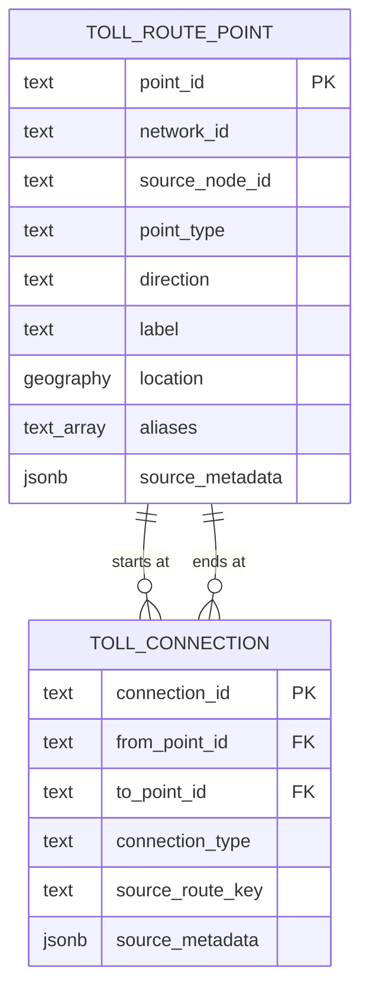

# TollChat v2 routing oracle

- **Status:** Proposed
- **Scope:** V2 directed toll-road reachability
- **Pricing:** Out of scope

## Purpose

The v2 oracle answers one question: can a supported toll-road entry reach a
supported exit, including across explicitly recorded road connections?

It is not a navigation system and does not model roadway geometry, proximity,
or travel time. PostGIS coordinates are retained for a later spatial phase but
are not queried by the routing operation.

## Scope

The initial toll facilities are I-95/395 Express Lanes, I-495 Express Lanes,
I-66 Inside the Beltway, Dulles Toll Road, and Dulles Greenway. Dulles
International Airport and Reagan National Airport are external route
endpoints, not toll facilities or ramps.

Dulles Toll Road and Dulles Greenway are separate networks. V2 does not
reproduce v1's combined logical Dulles unit.

The oracle imports the routing and spatial facts that v1 currently stores in
its oracle JSON and curated cross-road connections. Pricing identifiers and
charges remain in retained source files until pricing integration is designed.

A source node is not automatically a ramp. Only a directed `entry` or `exit`
movement is imported as a toll access point. A source node with no access
function is excluded and recorded in the import report. The two airport points
are explicit exceptions used only as route origins or destinations.

## Database schema boundary

All routing-oracle objects live in the dedicated `oracle` PostgreSQL schema.
The initial schema contains `oracle.toll_route_point`,
`oracle.toll_connection`, and the eventual read-only
`oracle.validate_toll_route` operation. Importers, migrations, tests, and
application queries always use schema-qualified names and do not rely on
`search_path`.

Pricing objects live separately in the `pricing` schema. The oracle tables do
not contain prices or foreign keys to pricing tables. The only initial
cross-schema dependency is a read of `pricing.current_i95_direction` for live
I-95/395 availability. That dependency is one-way: pricing does not depend on
the oracle.

Database roles receive only the required schema privileges: the migration
owner manages `oracle`, while the agent's runtime role receives `USAGE` on the
schema plus `SELECT` or `EXECUTE` on its read-only interface. No routing or
pricing object is intentionally created in `public`.

## Data model

The canonical model has two tables.

### `oracle.toll_route_point`

One row represents one directed toll entry/exit movement or one airport
endpoint.

| Column | Meaning |
| --- | --- |
| `point_id` | Stable v2 identifier |
| `network_id` | Toll facility or external airport identifier |
| `source_node_id` | Identifier from the retained source |
| `point_type` | `entry`, `exit`, or `airport` |
| `direction` | Toll travel direction; null only for an airport |
| `label` | Canonical user-facing name |
| `location` | Exact `geography(Point,4326)` route coordinate |
| `aliases` | Small set of known alternate names |
| `source_metadata` | Provenance needed to audit the imported row |

A v1 node that supports several roles or directions becomes several rows. For
example, a location supporting northbound entry and southbound exit is two
route points, even if both rows share coordinates and a source node ID. This
keeps a map marker from erasing access semantics.

Every row has a location. Toll movements have one cardinal direction and are
unique by network, source node, point type, and direction. Distinct source
movements remain distinct even when their labels and coordinates match. The
two airport points use `network_id` values `airport_iad` and `airport_dca`.

### `oracle.toll_connection`

One row states that travel may proceed from one route point to another.
Connections are directed; reversing a connection requires another row.

| Column | Meaning |
| --- | --- |
| `connection_id` | Stable v2 identifier |
| `from_point_id` | Starting route point |
| `to_point_id` | Reachable route point |
| `connection_type` | Connection classification |
| `source_route_key` | Optional route identifier from the source oracle |
| `source_metadata` | Provenance needed to audit the connection |

`connection_type` is `within_facility`, `toll_handoff`,
`general_purpose_gap`, or `airport_access`. A same-facility v1 entry-to-exit
pair becomes a `within_facility` connection. An operator-published I-95/I-495
entry-to-exit pair becomes a `general_purpose_gap` connection. Other
transitions between roads or an airport use the same table with a different
type.

Network and direction come from the two route-point rows and are not copied
onto the connection. A `general_purpose_gap` is supported connectivity, but
the agent must disclose that it is not uninterrupted Express Lane travel. An
`airport_access` connection is restricted to a trip whose origin or
destination is that airport; an airport can never be an intermediate waypoint.

## V1 import mapping

The v1 sources contain 145 nodes and 970 directed pairs across four JSON
files. I-95 and I-495 receive distinct network identifiers during import from
their shared source, but all published pairs are retained. Of the 970 pairs,
670 stay within one facility and 300 cross between I-95 and I-495.

| V1 fact | V2 representation |
| --- | --- |
| Access-capable node | One row per entry/exit direction |
| Latitude and longitude | PostGIS `location` |
| Same-facility entry-to-exit pair | `within_facility` connection |
| Published I-95/I-495 pair | `general_purpose_gap` connection |
| Curated road transition | Cross-road connection |
| Curated airport endpoint | `airport` route point |
| Curated airport connector | `airport_access` connection |
| Source URL and import evidence | `source_metadata` |
| OD IDs, zone IDs, and charges | `source_metadata` and retained source file |

V2 defines two airport endpoints and seven directed airport connections:

- IAD to and from I-66 node `6` through the airport-only, untolled Dulles
  Airport Access Highway;
- IAD to the northbound and southbound I-495 entries `182NO` and `182SO`;
- the northbound and southbound I-495 exits `182ND` and `182SD` to IAD; and
- the northbound I-95 exit `223ND` at Pentagon/Eads Street to DCA.

The four IAD/I-495 connections let airport traffic use the untolled Airport
Access Highway without requiring a priced Dulles Toll Road leg. They do not
make ordinary Dulles Toll Road travel free. The routing result preserves the
airport-access classification but does not calculate a toll.

DCA is destination-only in this oracle. It has no outgoing connection, no
southbound I-95 connection, and no connection from southbound exit `2239ND` or
to southbound entry `2233SO`.

### Required airport connections

| Connection ID | From | To |
| --- | --- | --- |
| `iad_to_i66` | `airport_iad` | `i66:6` entry |
| `i66_to_iad` | `i66:6` exit | `airport_iad` |
| `iad_to_i495_north` | `airport_iad` | `i495:182NO` |
| `iad_to_i495_south` | `airport_iad` | `i495:182SO` |
| `i495_north_to_iad` | `i495:182ND` | `airport_iad` |
| `i495_south_to_iad` | `i495:182SD` | `airport_iad` |
| `i95_north_to_dca` | `i95:223ND` | `airport_dca` |

These seven `airport_access` rows are the complete airport connection set.
They are never made reversible implicitly.

### Required junction connections

The importer creates the following curated `toll_handoff` connections. Each
source node resolves to the route point having the stated exit or entry role;
the node ID alone is not the movement identity.

Dulles Greenway and Dulles Toll Road require two directed Route 28 handoffs:

| Connection ID | From exit | To entry |
| --- | --- | --- |
| `greenway_to_dtr` | `greenway:28:EB` | `dtr:28:EB` |
| `dtr_to_greenway` | `dtr:28:WB` | `greenway:28:WB` |

Both sources call the boundary node `28` and use the same label, but the route
points remain distinct because they have different network IDs. The importer
does not create a combined Greenway/DTR pair; a cross-network route contains a
Greenway leg, one handoff, and a Dulles Toll Road leg.

I-66 and I-495 require four directed handoffs:

| Connection ID | From exit | To entry |
| --- | --- | --- |
| `i66_to_i495` | `i66:5` | `i495:187SO` |
| `i66_to_i495_north` | `i66:5` | `i495:187NO` |
| `i495_to_i66` | `i495:187ND` | `i66:3` |
| `i495_south_to_i66` | `i495:187SD` | `i66:5` |

I-66 and Dulles Toll Road require two directed handoffs:

| Connection ID | From exit | To entry |
| --- | --- | --- |
| `i66_to_dulles_toll_road` | `i66:6` | `dtr:66` |
| `dulles_toll_road_to_i66` | `dtr:66` | `i66:6` |

Dulles Toll Road and I-495 require four directed handoffs:

| Connection ID | From exit | To entry |
| --- | --- | --- |
| `dulles_toll_road_to_i495` | `dtr:1819` | `i495:182SO` |
| `dulles_toll_road_to_i495_north` | `dtr:1819` | `i495:182NO` |
| `i495_to_dulles_toll_road` | `i495:182ND` | `dtr:1819` |
| `i495_south_to_dulles_toll_road` | `i495:182SD` | `dtr:1819` |

These handoffs are connectivity facts, not priced route legs. They are never
made reversible implicitly; only the twelve rows above authorize travel across
the four junctions.

The shared I-95 source contains 300 published pairs that cross between I-95
and I-495: 148 from I-495 into I-95/395 and 152 in the reverse direction.
They are valid published routes and are imported. Each connection preserves
the source pair's ordered `ods` array in `source_metadata` and is classified as
a disclosed `general_purpose_gap`; it is not presented as uninterrupted
Express Lane travel.

Of those 300 pairs, 107 reference at least one OD ID from `1374` through
`1389`. V1 excluded the entire junction when those products were unavailable
from the live VDOT table. V2 defines modeled pricing for all 16 IDs, so that
old pricing limitation is not a reason to discard the published routes.

Generalized frontend markers are not canonical coordinates. Initial data uses
operator coordinates or reviewed ramp endpoints from authoritative GIS
sources. Source metadata records where each coordinate came from.

The importer rejects or reports:

- non-access source nodes;
- pairs whose entry or exit movement cannot be resolved;
- `within_facility` connections whose endpoints have different networks;
- cross-road connections whose endpoints have the same network;
- toll-road handoffs that do not go from an exit to an entry;
- `general_purpose_gap` rows that are not published I-95/I-495 entry-to-exit
  pairs;
- airport connections that are not airport-to-entry or exit-to-airport; and
- within-facility pairs whose roles or directions disagree with the source.

## I-95 availability

I-95/395 is never modeled as bidirectionally open. The oracle classifies the
raw statuses and timestamps exposed by `pricing.current_i95_direction`:

| Fresh source statuses | Result |
| --- | --- |
| `NORTHBOUND_OPEN` / `CLOSED` | Northbound open |
| `CLOSED` / `SOUTHBOUND_OPEN` | Southbound open |
| `CLOSED` / `CLOSED` | Closed |
| Any other combination | Unknown |

Both observations must exist and describe the same `interval_end_at`.
Freshness is measured independently from each row's `calculated_at` against
the database transaction time, with a maximum age of 20 minutes. Missing,
stale, mismatched, future-dated, contradictory, or transitional evidence is
unknown. This classification is a query rule, not another stored table.

An I-95 route is currently usable only when its direction matches the open
direction. The DCA connection is usable only when I-95 is northbound. The
fixed one-way restrictions recorded for I-66 and I-495 are always applied.

## Agent operations

The application exposes one narrow, read-only operation,
`oracle.validate_toll_route`. Its exact SQL signature can be settled with the
migration.

### Validate a toll route

Given an origin route point and a destination route point, follow directed
connections and return:

- `valid` with the ordered route points and connection types;
- `currently_unavailable` when every structural path requires a known
  unavailable I-95 direction;
- `unknown_availability` when no usable path is found and an otherwise valid
  path depends on unknown I-95 evidence; or
- `no_supported_route`.

The origin is a toll entry or airport; the destination is a toll exit or
airport. An airport point cannot appear between them. The query may cross
networks only through recorded connections and does not infer a connection
from physical proximity. Traversal rejects repeated point IDs and stops after
12 connections. If several currently usable paths exist, it returns the one
with the fewest connections, breaking ties by the ordered connection IDs.

## Pricing boundary

There is no oracle-to-pricing join in this version. The only present dependency
is operational: `pricing.current_i95_direction` is derived from I-95 feed rows
and is used to filter currently usable movements.

Missing pricing data never invalidates a route point or connection. Future
pricing work may map a validated route to pricing products without changing
the spatial tables.

For I-95/I-495, the future mapping can use the ordered OD IDs retained on each
connection. IDs `1374` through `1389` resolve through
`pricing.modeled_current_trip_pricing_i95` or
`pricing.modeled_trip_pricing_i95`; modeled prices must remain labeled as
modeled rather than observed. Deploying those views is a database-migration
concern outside this routing specification.

A Greenway/Dulles Toll Road route retains two separate facility legs around
the Route 28 handoff. Future pricing maps those legs independently; the
handoff itself has no price.

## Minimum integrity rules

- Point type, network, and direction use constrained values.
- Every route point has a non-null SRID 4326 location.
- Both ends of every connection reference existing, different route points.
- Connections are unique and directed.
- Connection indexes support traversal from `from_point_id`. A spatial index
  can be added with the later spatial feature.
- All database references are schema-qualified; oracle and pricing objects are
  not created in `public`.
- Agent operations never read or return a toll price.

## Acceptance checks

- Every v1 access movement is imported without merging distinct roles or
  directions; non-access nodes are reported rather than exposed as ramps.
- All 970 v1 pairs resolve to expected directed connections, including all 300
  published I-95/I-495 routes.
- Every I-95/I-495 connection preserves its ordered OD IDs and discloses the
  general-purpose gap; the 107 routes using IDs `1374` through `1389` remain
  structurally valid.
- Greenway-to-DTR routes use only the eastbound Route 28 handoff, and
  DTR-to-Greenway routes use only the westbound handoff.
- A cross-network Dulles proof contains separate Greenway and DTR legs; it
  never returns a combined logical Dulles leg.
- Removing either Route 28 handoff breaks only its corresponding direction,
  while within-facility routes on both roads remain valid.
- All four I-66/I-495 handoffs connect the exact exit and entry movements
  listed in the junction contract.
- Both I-66/Dulles Toll Road handoffs work in their recorded direction, and an
  IAD-to-DTR route depends on the `i66_to_dulles_toll_road` handoff.
- All four Dulles Toll Road/I-495 handoffs connect the exact exit and entry
  movements listed in the junction contract, including both I-495 directions.
- Reversing or removing any junction handoff makes its dependent fixture route
  unsupported unless a separate directed handoff proves another path.
- Entry-to-entry, exit-to-exit, and direction-incompatible junction fixtures
  are rejected by the importer.
- IAD routes may use its two I-66 and four I-495 airport-access connections;
  IAD cannot be an intermediate waypoint.
- I-495/IAD fixtures in both directions use `airport_access` without requiring
  a priced Dulles Toll Road leg.
- DCA is reachable only from northbound I-95 exit `223ND` at Pentagon/Eads and
  only while I-95 is northbound.
- DCA-to-I-95 and every southbound DCA fixture return `no_supported_route`.
- Known one-way ramps cannot be used backward.
- A known cross-road route succeeds only when all required connections exist.
- The I-495/I-95 general-purpose gap is disclosed.
- Fresh northbound, fresh southbound, fully closed, stale, and contradictory
  I-95 evidence behave distinctly.
- A cyclic route fixture terminates without repeating a route point.
- Removing a cross-road connection makes the dependent route unsupported.
- A blank-database migration creates the routing objects in `oracle`, grants
  only the intended runtime access, and leaves no routing objects in `public`.
- The route operation reads I-95 state through the qualified
  `pricing.current_i95_direction` dependency.
- No oracle operation reads or returns a toll price.

## Explicit non-goals

- Turn-by-turn navigation, travel time, or shortest-path optimization.
- Road centerlines, lane geometry, and pgRouting.
- Nearby-access searches, radius filtering, and distance ranking.
- Individual incident or ramp-closure ingestion.
- Pricing joins or toll calculation.
- Facility tables or views, endpoint subtype tables, separate leg and transfer
  tables, or a future pricing adapter.
