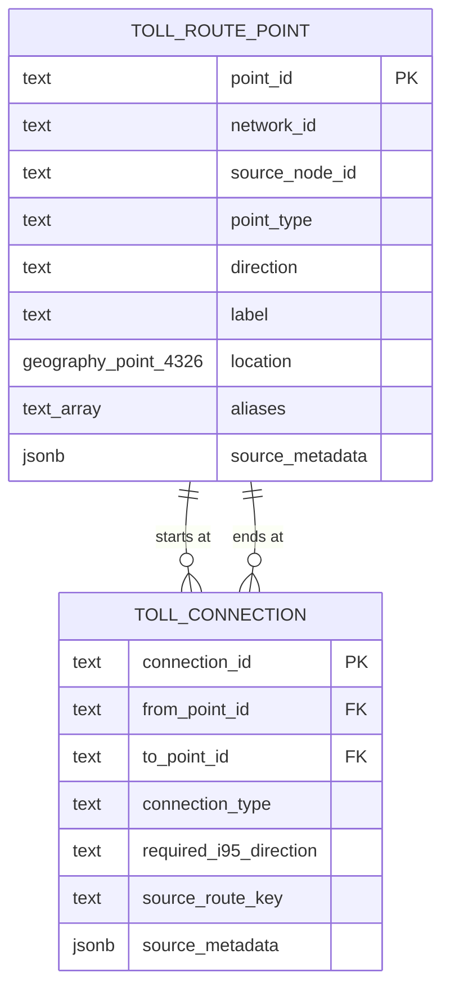

# TollChat v2 routing oracle

- **Status:** Proposed
- **Scope:** V2 directed toll-road reachability
- **Pricing:** Out of scope

## Purpose

The v2 oracle answers one question: can a supported toll-road entry reach a
supported exit, including across explicitly recorded road connections?

It is not a navigation system and does not model roadway geometry, proximity,
or travel time. PostGIS coordinates are retained for a later spatial phase but
are not queried by the routing operation.

## Scope

The initial toll facilities are I-95/395 Express Lanes, I-495 Express Lanes,
I-66 Inside the Beltway, Dulles Toll Road, and Dulles Greenway. Dulles
International Airport and Reagan National Airport are external route
endpoints, not toll facilities or ramps.

Dulles Toll Road and Dulles Greenway are separate networks. V2 does not
reproduce v1's combined logical Dulles unit.

The oracle imports the routing and spatial facts that v1 currently stores in
its oracle JSON and curated cross-road connections. Pricing identifiers and
charges remain in retained source files until pricing integration is designed.

A source node is not automatically a ramp. Only a directed `entry` or `exit`
movement is imported as a toll access point. A source node with no access
function is excluded and recorded in the import report. The two airport points
are explicit exceptions used only as route origins or destinations.

## Database schema boundary

All v2 routing-oracle and spatial objects live in the dedicated `oracle`
PostgreSQL schema. The privileged migration principal installs the RDS-provided
core PostGIS 3.5.x extension directly into `oracle` before creating
`oracle.toll_route_point`, `oracle.toll_connection`, and
`oracle.validate_toll_route`. Raster, topology, Tiger geocoder, and pgRouting
extensions are not installed. PostGIS-owned types, functions, and
`spatial_ref_sys` therefore coexist with the two TollChat application tables in
`oracle`.

The retained v1 database contract remains entirely in `public`. V2 migrations
do not move, replace, or modify those objects, and they create no v2-owned
object in `public`. Importers, migrations, tests, functions, and application
queries always use schema-qualified names and do not rely on the caller's
`search_path`. Spatial DDL and later spatial operations likewise qualify
PostGIS objects through `oracle`, for example
`oracle.geography(Point,4326)` and `oracle.ST_DWithin`.

Pricing objects live separately in the `pricing` schema. The oracle tables do
not contain prices or foreign keys to pricing tables. The only initial
cross-schema dependency is a read of `pricing.current_i95_direction` for live
I-95/395 availability. That dependency is one-way: pricing does not depend on
the oracle. Oracle `1.0.x` installation requires a compatible
`pricing.schema_version` in the `>=1.0.0,<2.0.0` range and verifies that
`pricing.current_i95_direction` exists before creating the route function.

### Ownership and runtime access

`oracle_owner` is a non-login, non-superuser role that owns the `oracle` schema,
the two TollChat tables, and every agent-callable function there. The privileged
migration principal retains ownership of the PostGIS extension and its objects.
`oracle_owner` receives only the PostGIS privileges required by its functions,
plus `USAGE` on `pricing` and `SELECT` on
`pricing.current_i95_direction`; it receives no other pricing privileges.

`tollchat_agent` is the dedicated IAM-authenticated login role for the v2
agent. It receives `rds_iam`, `USAGE` on `oracle`, and explicit `EXECUTE` grants
on approved function signatures. It receives no direct table or view access in
`oracle` or `pricing`, no write privilege, and no schema-creation privilege.
New functions are not executable by `tollchat_agent` unless a migration grants
them explicitly. An additive install rejects a pre-existing `tollchat_agent`
with any inherited role membership other than `rds_iam`; it never silently
reuses a login that could bypass the function boundary.

Agent-callable functions are `SECURITY DEFINER`, owned by `oracle_owner`, use
fixed SQL without dynamic execution, qualify every application and extension
object, and set `search_path` to `pg_catalog, pg_temp`. Creation, revocation of
the default `PUBLIC` execution privilege, ownership, and the explicit
`tollchat_agent` grant occur in one transaction. Default function privileges
for `oracle_owner` also revoke execution from `PUBLIC`.

Because PostGIS shares the `oracle` schema, the privileged migration also
revokes `PUBLIC` execution from every PostGIS function installed there and
grants the required PostGIS execution privileges only to `oracle_owner`. This
hardening is repeated after each PostGIS extension update. Schema `USAGE`
therefore does not let `tollchat_agent` bypass the approved TollChat function
interface by calling extension functions directly.

### Bootstrap order

The blank bootstrap and additive deployment use this order:

1. Verify PostgreSQL 17, the compatible `pricing.schema_version`, and
   `pricing.current_i95_direction`.
2. Create or verify `oracle_owner` and `tollchat_agent`.
3. Create `oracle`, revoke `PUBLIC` schema privileges, install core PostGIS in
   that schema, verify both its 3.5.x version and namespace, and replace its
   default `PUBLIC` function execution with the required `oracle_owner` grants.
4. Create `oracle.schema_version`, the two application tables, constraints,
   indexes, and curated data; assign the application objects to `oracle_owner`.
5. Grant `oracle_owner` its single pricing-view dependency, create the route
   function, revoke `PUBLIC` execution, and grant the exact signature to
   `tollchat_agent`.

The migration aborts rather than installing PostGIS in `public`, falling back
to an unqualified pricing view, or leaving a partially granted function.

### Schema version and CI contract

Every v2 application schema has an independent canonical SemVer contract. The
oracle starts at version `1.0.0`, stored as the single row in
`oracle.schema_version` with the same singleton, SemVer-format, and installation
timestamp invariants used by `pricing.schema_version`. The canonical oracle
bootstrap declares the same version in its file header and inserted row; a
mismatch is an error.

`v2/db/application-schemas.json` registers both `oracle` and `pricing`, their
production SQL, and normative public-contract documents. The schema-version
checker validates every registered schema and compares its canonical version
with the pull request's base commit. A change to owned SQL or a normative
contract document must advance that schema's version monotonically. A shared
change must advance every schema whose contract it changes. A version change
without a corresponding owned change, an unregistered production SQL file, a
missing canonical version, or a contract change without the affected version
bump fails CI.

The v2 database CI job runs on PostgreSQL 17 with core PostGIS 3.5.x available
and executes, at minimum:

- the existing pricing bootstrap and contracts;
- a blank bootstrap in dependency order: pricing, then oracle;
- the oracle restore and data-import contracts;
- an additive installation beside retained v1 `public` and v2 `pricing`;
- the supported upgrade path from the previous oracle version once one exists;
- guarded oracle rollback, proving that `public` and `pricing` are unchanged;
- PostGIS version, namespace, and extension-function privilege checks;
- `oracle_owner` and `tollchat_agent` least-privilege tests; and
- route-function, constraint, traversal, junction, airport, and I-95 freshness
  contracts defined below.

CI must exercise the canonical bootstrap and migration files rather than a
test-only reconstruction of their DDL.

## Data model

The canonical model has two tables.

### `oracle.toll_route_point`

One row represents one directed toll entry/exit movement or one airport
endpoint.

| Column | Meaning |
| --- | --- |
| `point_id` | Stable v2 identifier |
| `network_id` | Toll facility or external airport identifier |
| `source_node_id` | Identifier from the retained source |
| `point_type` | `entry`, `exit`, or `airport` |
| `direction` | Toll travel direction; null only for an airport |
| `label` | Canonical user-facing name |
| `location` | Nullable `oracle.geography(Point,4326)` route coordinate |
| `aliases` | Small set of known alternate names |
| `source_metadata` | Provenance needed to audit the imported row |

A v1 node that supports several roles or directions becomes several rows. For
example, a location supporting northbound entry and southbound exit is two
route points, even if both rows share coordinates and a source node ID. This
keeps a map marker from erasing access semantics.

Locations are nullable in oracle `1.0.0`. The generalized I-95/I-495 frontend
coordinates may be loaded only when their metadata marks them
`provisional_generalized`; movements without a reviewed coordinate remain
null. Exact GIS curation is a later oracle data release and does not change
stable point IDs. Toll movements have one cardinal direction and are unique by
network, source node, point type, and direction. Distinct source movements
remain distinct even when their labels and coordinates match. The two airport
points use `network_id` values `airport_iad` and `airport_dca`.

### `oracle.toll_connection`

One row states that travel may proceed from one route point to another.
Connections are directed; reversing a connection requires another row.

| Column | Meaning |
| --- | --- |
| `connection_id` | Stable v2 identifier |
| `from_point_id` | Starting route point |
| `to_point_id` | Reachable route point |
| `connection_type` | Connection classification |
| `required_i95_direction` | Required live I-95 direction, or null when none |
| `source_route_key` | Optional route identifier from the source oracle |
| `source_metadata` | Provenance needed to audit the connection |

`connection_type` is `within_facility`, `toll_handoff`,
`general_purpose_gap`, or `airport_access`. A same-facility v1 entry-to-exit
pair becomes a `within_facility` connection. An operator-published I-95/I-495
entry-to-exit pair becomes a `general_purpose_gap` connection. Other
transitions between roads or an airport use the same table with a different
type.

Network and fixed ramp direction come from the two route-point rows.
Time-dependent I-95 availability is a property of the movement, so
`required_i95_direction` is recorded on the connection rather than inferred
from either endpoint. Same-facility I-95 connections require their travel
direction. DCA arrivals require northbound I-95; DCA departures require the
direction of their northbound or southbound I-395 entry. A
`general_purpose_gap` has no I-95 requirement because its supported fallback
uses general-purpose lanes to or from the TP1 boundary. The agent must disclose
that such a route is not uninterrupted Express Lane travel. An
`airport_access` connection is restricted to a trip whose origin or destination
is that airport; an airport can never be an intermediate waypoint.

## V1 import mapping

The v1 sources contain 145 nodes and 970 directed pairs across four JSON
files. I-95 and I-495 receive distinct network identifiers during import from
their shared source, but all published pairs are retained. Of the 970 pairs,
670 stay within one facility and 300 cross between I-95 and I-495.

| V1 fact | V2 representation |
| --- | --- |
| Access-capable node | One row per entry/exit direction |
| Latitude and longitude | PostGIS `location` |
| Same-facility entry-to-exit pair | `within_facility` connection |
| Published I-95/I-495 pair | `general_purpose_gap` connection |
| Curated road transition | Cross-road connection |
| Curated airport endpoint | `airport` route point |
| Curated airport connector | `airport_access` connection |
| Source URL and import evidence | `source_metadata` |
| OD IDs, zone IDs, and charges | `source_metadata` and retained source file |

V2 defines two airport endpoints and eleven directed airport connections:

- IAD to and from I-66 node `6` through the airport-only, untolled Dulles
  Airport Access Highway;
- IAD to and from the Dulles Toll Road node `66` through a virtual composition
  of the airport highway and the I-66/DTR handoff;
- IAD to the northbound and southbound I-495 entries `182NO` and `182SO`;
- the northbound and southbound I-495 exits `182ND` and `182SD` to IAD; and
- the northbound I-95 exit `223ND` at Pentagon/Eads Street to DCA;
- DCA to northbound I-395 entry `224NO` near Pentagon/Eads; and
- DCA to southbound I-395 entry `2233SO` at Pentagon/Eads.

The four IAD/I-495 connections let airport traffic use the untolled Airport
Access Highway without requiring a priced Dulles Toll Road leg. They do not
make ordinary Dulles Toll Road travel free. The routing result preserves the
airport-access classification but does not calculate a toll.

DCA may be an origin in either I-395 direction. Northbound departures use entry
`224NO`; southbound departures use entry `2233SO`. DCA remains a destination
only from northbound exit `223ND`: there is no arrival connection from
southbound exit `2239ND`.

### Required airport connections

| Connection ID | From | To |
| --- | --- | --- |
| `iad_to_i66` | `airport_iad` | `i66:6` entry |
| `i66_to_iad` | `i66:6` exit | `airport_iad` |
| `iad_to_dtr_via_i66` | `airport_iad` | `dtr:66` entry |
| `dtr_to_iad_via_i66` | `dtr:66` exit | `airport_iad` |
| `iad_to_i495_north` | `airport_iad` | `i495:182NO` |
| `iad_to_i495_south` | `airport_iad` | `i495:182SO` |
| `i495_north_to_iad` | `i495:182ND` | `airport_iad` |
| `i495_south_to_iad` | `i495:182SD` | `airport_iad` |
| `i95_north_to_dca` | `i95:223ND` | `airport_dca` |
| `dca_to_i95_north` | `airport_dca` | `i95:224NO` |
| `dca_to_i95_south` | `airport_dca` | `i95:2233SO` |

The two DTR rows preserve the v1 composed route without creating a false turn
between opposite I-66 movements at node `6`; their metadata records the two
logical connectors they replace. These eleven `airport_access` rows are the
complete airport connection set. They are never made reversible implicitly.

### Required junction connections

The importer creates the following curated `toll_handoff` connections. Each
source node resolves to the route point having the stated exit or entry role;
the node ID alone is not the movement identity.

Dulles Greenway and Dulles Toll Road require two directed Route 28 handoffs:

| Connection ID | From exit | To entry |
| --- | --- | --- |
| `greenway_to_dtr` | `greenway:28:EB` | `dtr:28:EB` |
| `dtr_to_greenway` | `dtr:28:WB` | `greenway:28:WB` |

Both sources call the boundary node `28` and use the same label, but the route
points remain distinct because they have different network IDs. The importer
does not create a combined Greenway/DTR pair; a cross-network route contains a
Greenway leg, one handoff, and a Dulles Toll Road leg.

I-66 and I-495 require four directed handoffs:

| Connection ID | From exit | To entry |
| --- | --- | --- |
| `i66_to_i495` | `i66:5` | `i495:187SO` |
| `i66_to_i495_north` | `i66:5` | `i495:187NO` |
| `i495_to_i66` | `i495:187ND` | `i66:3` |
| `i495_south_to_i66` | `i495:187SD` | `i66:5` |

I-66 and Dulles Toll Road require two directed handoffs:

| Connection ID | From exit | To entry |
| --- | --- | --- |
| `i66_to_dulles_toll_road` | `i66:6` | `dtr:66` |
| `dulles_toll_road_to_i66` | `dtr:66` | `i66:6` |

Dulles Toll Road and I-495 require five directed handoffs:

| Connection ID | From exit | To entry |
| --- | --- | --- |
| `dulles_toll_road_to_i495` | `dtr:1819` | `i495:182SO` |
| `dulles_toll_road_to_i495_north` | `dtr:1819` | `i495:182NO` |
| `dulles_toll_road_westbound_to_i495_north` | `dtr:1819:WB` | `i495:182NO` |
| `i495_to_dulles_toll_road` | `i495:182ND` | `dtr:1819` |
| `i495_south_to_dulles_toll_road` | `i495:182SD` | `dtr:1819` |

These handoffs are connectivity facts, not priced route legs. They are never
made reversible implicitly; only the thirteen rows above authorize travel across
the four junctions.

The two northbound I-495 handoffs from DTR are distinct movements. One starts
from the eastbound DTR exit at node `1819`; the other starts from the westbound
DTR exit at the same interchange. They converge on the same northbound I-495
entry and are not made interchangeable by proximity.

### I-495/I-95 and Route 17 boundaries

The existing source movements `192NO` and `192SD` are the TP1 boundaries, not
Van Dorn ramps. V2 retains their stable point IDs but gives them explicit TP1
labels and aliases:

- `i495:192NO` is TP1NB, where a northbound I-495 tolled trip can begin after a
  general-purpose prefix from an I-95 origin; and
- `i495:192SD` is TP1SB, where a southbound I-495 tolled trip can end before a
  general-purpose suffix to an I-95 destination.

The associated I-495 pricing boundaries are zone `495001` (TP1NB) and zone
`495101` (TP1SB). A published I-95/I-495 `general_purpose_gap` remains a valid
route when I-95 is running the opposite direction because the I-495 tolled leg
still exists and the unavailable I-95 portion can use general-purpose lanes.
The route result discloses the gap; deciding which retained OD components are
chargeable belongs to later pricing integration.

The southern I-95 Express boundary is represented by the existing source
movements `234NO` and `235SD`. `234NO` is one logical northbound entry even
though through traffic and Route 17/Route 3 local traffic reach it over
different physical ramps; `235SD` is the corresponding southbound exit and
general-purpose continuation. The source and pricing data expose one movement
identity per direction, so oracle `1.0.0` records the physical access variants
in metadata instead of inventing separately priced points.

At the northern end of I-495, current pricing exposes only zone `495009`
(TP9NB) for northbound destinations and zone `495109` (TP9SB) for southbound
origins. It does not identify the dedicated GW Parkway ramps separately from
the mainline Express/general-purpose transition. Oracle `1.0.0` therefore
retains one source-backed directed point per role. A later split requires a
distinct operator point or pricing identity; geometry alone is insufficient.

Seminary Road movements are ordinary directed ramps in this version. The
oracle applies no separate occupancy or HOV-eligibility rule to them.

The shared I-95 source contains 300 published pairs that cross between I-95
and I-495: 148 from I-495 into I-95/395 and 152 in the reverse direction.
They are valid published routes and are imported. Each connection preserves
the source pair's ordered `ods` array in `source_metadata` and is classified as
a disclosed `general_purpose_gap`; it is not presented as uninterrupted
Express Lane travel.

Of those 300 pairs, 107 reference at least one OD ID from `1374` through
`1389`. V1 excluded the entire junction when those products were unavailable
from the live VDOT table. V2 defines modeled pricing for all 16 IDs, so that
old pricing limitation is not a reason to discard the published routes.

Generalized frontend markers are not canonical coordinates. Initial data uses
operator coordinates or reviewed ramp endpoints from authoritative GIS
sources. Source metadata records where each coordinate came from.

The importer rejects or reports:

- non-access source nodes;
- pairs whose entry or exit movement cannot be resolved;
- `within_facility` connections whose endpoints have different networks;
- cross-road connections whose endpoints have the same network;
- toll-road handoffs that do not go from an exit to an entry;
- `general_purpose_gap` rows that are not published I-95/I-495 entry-to-exit
  pairs;
- I-95 requirements on a general-purpose gap or non-I-95 handoff;
- missing or mismatched I-95 requirements on same-facility I-95 connections;
- airport connections that are not airport-to-entry or exit-to-airport; and
- within-facility pairs whose roles or directions disagree with the source.

## I-95 availability

I-95/395 is never modeled as bidirectionally open. The oracle classifies the
raw statuses and timestamps exposed by `pricing.current_i95_direction`:

| Fresh source statuses | Result |
| --- | --- |
| `NORTHBOUND_OPEN` / `CLOSED` | Northbound open |
| `CLOSED` / `SOUTHBOUND_OPEN` | Southbound open |
| `CLOSED` / `CLOSED` | Closed |
| Any other combination | Unknown |

Both observations must exist and describe the same `interval_end_at`.
Freshness is measured independently from each row's `calculated_at` against
`statement_timestamp()`, with a maximum age of 20 minutes. A `calculated_at`
later than that same statement timestamp is future-dated. Missing, stale,
mismatched, future-dated, contradictory, or transitional evidence is unknown.
This classification is a query rule, not another stored table.

A connection with `required_i95_direction` is currently usable only when that
direction matches the open direction. Same-facility I-95 routes therefore
remain direction-dependent. DCA arrival is usable only northbound, while each
DCA departure is usable only in its recorded direction. A cross-facility
`general_purpose_gap` has no live-I-95 requirement:
it remains valid through the TP1 general-purpose prefix or suffix when the
corresponding I-95 Express direction is unavailable. Fixed one-way restrictions
recorded for I-66 and I-495 are always applied.

For every selected `general_purpose_gap`, the route result compares its recorded
I-95 direction with the live evidence. `fallback_required` is `true` when the
needed Express direction is known unavailable, `false` when it is open, and
null when availability is unknown. Unknown evidence does not invalidate the
route because the general-purpose fallback remains supported.

## Agent operations

The normative caller behavior and response examples are defined in the
[agent-facing route-function contract](oracle-route-function-contract.md).

The application exposes one narrow, read-only database function:
`oracle.validate_toll_route(origin_point_id text, destination_point_id text)`.
It is a `STABLE SECURITY DEFINER` function owned by `oracle_owner` and is the
only initial oracle function executable by `tollchat_agent`. The application
tool passes stable point IDs as bound parameters; it does not expose arbitrary
SQL to the model.

### Validate a toll route

Given an origin route point and a destination route point, follow directed
connections and return:

- `invalid_origin` when the origin ID is missing or is not an entry/airport;
- `invalid_destination` when the destination ID is missing or is not an
  exit/airport;
- `valid` with the ordered route points, connection types, and any structured
  general-purpose fallback details;
- `currently_unavailable` when every structural path requires a known
  unavailable I-95 direction;
- `unknown_availability` when no usable path is found and an otherwise valid
  path depends on unknown I-95 evidence;
- `no_supported_route` when bounded traversal conclusively exhausts the graph;
  or
- `traversal_limit_exceeded` when the safety bound prevents a conclusive
  answer.

Origin validation takes precedence when both inputs are invalid. The function
returns one structured row containing the status, a machine-readable JSON
`reason` for every non-`valid` status, ordered point IDs, ordered connection IDs
and types, `general_purpose_gaps`, and the I-95 evidence used when applicable.
Invalid, unsupported, and traversal-limit results contain empty path arrays and
an empty `general_purpose_gaps` array. An availability result contains the
deterministic structural proof that produced the result. The function never
returns a price or database-authored user-facing prose.

`general_purpose_gaps` is a JSON array in route order. Each item contains:

| Field | Meaning |
| --- | --- |
| `connection_id` | The corresponding selected connection |
| `boundary_point_id` | `i495:192NO` (TP1NB) or `i495:192SD` (TP1SB) |
| `role` | `prefix` before the tolled I-495 leg or `suffix` after it |
| `i95_direction` | I-95 Express direction that would avoid the fallback |
| `fallback_required` | True, false, or null from the current I-95 evidence |

The function returns `i95_evidence` whenever a selected path either requires an
I-95 Express direction or contains a general-purpose gap. Consequently, a
Westpark-to-Dumfries result can explain that TP1SB is a suffix and that the
fallback is required while I-95 is northbound, even though the overall route
status remains `valid`.

The origin is a toll entry or airport; the destination is a toll exit or
airport. An airport point cannot appear between them. The query may cross
networks only through recorded connections and does not infer a connection
from physical proximity. Traversal rejects repeated point IDs and stops after
12 connections. If the depth-12 frontier has an outgoing connection to an
unvisited point, a proven `valid` path still wins; otherwise the function
returns `traversal_limit_exceeded` ahead of `unknown_availability`,
`currently_unavailable`, and `no_supported_route`. The data build also
fails unless every supported origin/destination fixture has a shortest proof
of at most 12 connections. If several currently usable paths exist, the
function returns the one with the fewest connections, breaking ties by the
ordered connection IDs; it does not rely on recursive-CTE emission order.

## Pricing boundary

There is no oracle-to-pricing join in this version. The only present dependency
is operational: `pricing.current_i95_direction` is derived from I-95 feed rows
and is used to filter currently usable movements.

Missing pricing data never invalidates a route point or connection. Future
pricing work may map a validated route to pricing products without changing
the spatial tables.

For I-95/I-495, the future mapping can use the ordered OD IDs retained on each
connection. IDs `1374` through `1389` resolve through
`pricing.modeled_current_trip_pricing_i95` or
`pricing.modeled_trip_pricing_i95`; modeled prices must remain labeled as
modeled rather than observed. Deploying those views is a database-migration
concern outside this routing specification.

A Greenway/Dulles Toll Road route retains two separate facility legs around
the Route 28 handoff. Future pricing maps those legs independently; the
handoff itself has no price.

## Minimum integrity rules

- Primary keys, required columns, foreign keys, and checks are enforced by the
  database rather than only by importer code.
- `point_type` is constrained to `entry`, `exit`, or `airport`; `direction` is
  null exactly for an airport and otherwise has a permitted cardinal value.
- A toll movement has a source node and is unique by network, source node,
  point type, and direction, using PostgreSQL 17 null-safe uniqueness where
  needed for airport rows.
- `location`, when present, is an `oracle.geography(Point,4326)`. Version 1.0.0
  permits null locations and records coordinate quality in `source_metadata`.
- Both ends of every connection are non-null foreign keys to existing,
  different route points.
- `connection_type` is constrained to the four documented values, and each
  directed endpoint pair is unique.
- `required_i95_direction`, when present, is `NB` or `SB`. Import contracts
  require it on same-facility I-95 connections and DCA access, and forbid it on
  general-purpose gaps and unrelated handoffs.
- Cross-row role, direction, network, and airport semantics remain importer
  validations backed by contract tests. No runtime role has table DML access,
  so the first version does not add constraint triggers.
- Connection indexes support traversal from `from_point_id`. A spatial index
  can be added with the later spatial feature.
- All database references are schema-qualified; no v2-owned object is created
  in `public`.
- Agent operations never read or return a toll price.

## Acceptance checks

- Every v1 access movement is imported without merging distinct roles or
  directions; non-access nodes are reported rather than exposed as ramps.
- The initial 220-point seed has 107 coordinates marked
  `provisional_generalized` and 113 null locations marked `missing`; no
  provisional coordinate is represented as authoritative.
- All 970 v1 pairs resolve to expected directed connections, including all 300
  published I-95/I-495 routes.
- Every I-95/I-495 connection preserves its ordered OD IDs and discloses the
  general-purpose gap; the 107 routes using IDs `1374` through `1389` remain
  structurally valid.
- Greenway-to-DTR routes use only the eastbound Route 28 handoff, and
  DTR-to-Greenway routes use only the westbound handoff.
- A cross-network Dulles proof contains separate Greenway and DTR legs; it
  never returns a combined logical Dulles leg.
- Removing either Route 28 handoff breaks only its corresponding direction,
  while within-facility routes on both roads remain valid.
- All four I-66/I-495 handoffs connect the exact exit and entry movements
  listed in the junction contract.
- Both I-66/Dulles Toll Road handoffs work in their recorded direction. IAD
  routes to and from DTR node `66` use the two airport-only composed edges and
  cannot create a general I-66 U-turn.
- All five Dulles Toll Road/I-495 handoffs connect the exact exit and entry
  movements listed in the junction contract, including eastbound and westbound
  DTR approaches to northbound I-495.
- Reversing or removing any junction handoff makes its dependent fixture route
  unsupported unless a separate directed handoff proves another path.
- Entry-to-entry, exit-to-exit, and direction-incompatible junction fixtures
  are rejected by the importer.
- IAD routes may use its two I-66, two DTR, and four I-495 airport-access
  connections; IAD cannot be an intermediate waypoint.
- I-495/IAD fixtures in both directions use `airport_access` without requiring
  a priced Dulles Toll Road leg.
- DCA is reachable only from northbound I-95 exit `223ND` at Pentagon/Eads and
  only while I-95 is northbound; southbound exit `2239ND` has no DCA edge.
- DCA departures use northbound entry `224NO` or southbound entry `2233SO` and
  are usable only while the corresponding I-95/395 direction is open.
- Known one-way ramps cannot be used backward.
- A known cross-road route succeeds only when all required connections exist.
- TP1NB and TP1SB resolve to source movements `192NO` and `192SD` and retain
  pricing zones `495001` and `495101` in their provenance.
- A southbound I-495 trip with an unavailable southbound I-95 continuation
  remains valid with a disclosed TP1SB general-purpose suffix,
  `fallback_required = true`, and the live I-95 evidence.
- An I-95 origin with unavailable northbound Express access can use a disclosed
  general-purpose prefix to TP1NB and then begin its northbound I-495 toll leg.
- A gap matching the currently open I-95 direction reports
  `fallback_required = false`; unknown evidence reports null, and the route's
  top-level status—not the gap value—determines overall usability.
- A route that combines a TP1 gap with a separately direction-gated connection
  can return `unknown_availability` while the gap's `fallback_required` is null.
- Route 17 northbound entry and southbound exit remain normal route points, with
  their physical access variants recorded in metadata rather than extra points.
- The northern I-495 terminus remains unsplit until source or pricing data
  supplies distinct identities for the mainline and GW Parkway movements.
- Fresh northbound, fresh southbound, fully closed, stale, and contradictory
  I-95 evidence behave distinctly.
- Freshness uses `statement_timestamp()`: a call made later in a long-running
  transaction cannot reuse the transaction start time to accept stale data.
- A cyclic route fixture terminates without repeating a route point.
- A 12-connection proof succeeds; a route whose only possible proof continues
  beyond 12 returns `traversal_limit_exceeded`; competing paths select the
  deterministic shorter proof.
- Removing a cross-road connection makes the dependent route unsupported.
- Direct SQL attempts to insert invalid constrained values, missing endpoints,
  self-connections, or duplicate directed pairs fail. Importer contract tests
  reject cross-row semantic violations.
- A blank-database bootstrap and an upgrade from pricing schema `1.0.0` install
  PostGIS 3.5.x and every v2 routing object in `oracle`, while retained v1
  objects in `public` remain unchanged.
- `oracle.schema_version` contains exactly one row at `1.0.0`, its canonical
  bootstrap declaration matches that row, and `application-schemas.json`
  registers both `oracle` and `pricing` exactly once.
- CI rejects an oracle SQL contract change without a monotonic oracle SemVer
  increase, and it does not require an unrelated pricing version increase.
- The canonical blank bootstrap, additive install, restore, guarded rollback,
  privilege, import, and route contracts all execute in the v2 database CI job
  with PostgreSQL 17 and PostGIS 3.5.x.
- The installed `postgis` extension reports `oracle` as its namespace; no
  PostGIS extension is installed in `public`.
- The route operation reads I-95 state through the qualified
  `pricing.current_i95_direction` dependency.
- Under `SET ROLE tollchat_agent`, route-function execution succeeds while
  direct reads or writes against oracle and pricing relations fail. `PUBLIC`
  cannot execute the function, `tollchat_agent` cannot call PostGIS functions
  directly, and a same-named temporary object cannot alter the route result.
- Oracle installation rejects a pre-existing `tollchat_agent` that inherits
  `pg_read_all_data`, `pricing_reader`, or any role other than `rds_iam`.
- No oracle operation reads or returns a toll price.

## Explicit non-goals

- Turn-by-turn navigation, travel time, or shortest-path optimization.
- Road centerlines, lane geometry, and pgRouting.
- Nearby-access searches, radius filtering, and distance ranking.
- Individual incident or ramp-closure ingestion.
- Pricing joins or toll calculation.
- Facility tables or views, endpoint subtype tables, separate leg and transfer
  tables, or a future pricing adapter.
