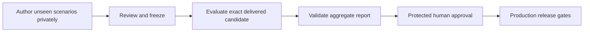

# Private production qualification

**Status: private authoring, calibration, policy approval, and infrastructure
activation remain pending.** Development scores and historical receipts cannot
qualify production.

## The release decision



The benchmark contains **100 independently authored scenarios**, each run three
times against the exact delivered application artifact. Qualification requires
**at least 240 successful trials out of 300 (80%)**, complete measurements, and
protected human approval. Approval cannot waive the numerical threshold.
Agent-caused errors are failures. Invalid actors and missing judgments are
inconclusive and block qualification.

The 80% floor is an acceptance policy for this reference implementation, not a
claim of real-world accuracy. Three attempts measure repeatability across 100
scenarios; they are not 300 independent questions. Report the distribution of
cases passing zero, one, two, or three times and scenario-level uncertainty.
There is no per-case veto, pass³ floor, mandatory production baseline, relative
regression veto, or latency/cost-per-success quality threshold.

Spending remains bounded by **$5 per execution and $25 cumulative authorization**,
including calibration, evaluator overhead, and failed/replacement executions.
Reconcile unknown usage before qualifying. Private evaluation evidence has **no
time-based expiry**. Planning, migration, and promotion recheck the exact artifact,
active policy, evidence, and approval. Reimporting a report never changes its
completion time or resets spending. The saved Terraform plan remains valid for
24 hours.

## Trust and privacy

The author and evaluator run on a separate machine outside this repository agent's
access. Use the [container setup](HOLDOUT_SETUP.md) and
[authoring contract](HOLDOUT_AUTHORING.md). Keep private cases, fixtures,
references, transcripts, detailed grading, credentials, and model traces there.
The public repository contains tooling and synthetic checks only.

This design **trusts the reviewed evaluator and application code**. It uses frozen
inputs and fresh application processes. It does not sandbox deliberately malicious
candidate code. The author sees only the public packet. Introduce the candidate
after freezing the corpus. Each model receives only the conversation and evidence
intended for its role. Private model credentials and retained telemetry must be
inaccessible to the development agent.

Only an aggregate report returns to this project. The reviewer checks privately:

- Independent authorship, frozen rubric, actors, judges, and calibration identity.
- Execution of the exact delivered bundle, complete trials, and resolved grading
  questions. Quality failures stay failures.
- Reservations before calls, reconciled usage, and cumulative costs including
  earlier attempts and calibration.
- One original execution per unchanged artifact/holdout, with no quality-only
  retries. At most one replacement is allowed for incomplete infrastructure or
  invalid actor simulation after explicit private human authorization.

Protected `golden-review` approval records accountability for these claims.
Hashes and workflow provenance bind the reviewed report to the candidate; they
cannot independently prove that the private experiment happened as reported.
No external signing key or inbox publishing credential is needed.

Reuse is allowed only for frozen release candidates, with total execution count
disclosed. Only the first use is a first-use holdout evaluation. Later uses are a
**reused private benchmark**. Even aggregate feedback can drive overfitting; do
not tune against private failures or select the best repeated run.

## Aggregate report interface

Supply one UTF-8 JSON report, limited to **16 KiB**, as `summary_json`. Duplicate
and unknown fields are rejected. Keep private cases, individual case hashes,
transcripts, and arbitrary failure text out of this report, including rejected
inputs. GitHub workflow inputs and artifacts are visible to repository operators.

The executable contract is `validate_summary` in `scripts/golden_gate.py`; the
synthetic `summary` fixture in `tests/test_golden_gate.py` demonstrates its complete
shape without representing any real held-out case. Required summary fields:

| Fields | Meaning |
| --- | --- |
| `schema_version`, `evaluation_scope` | Integer `1`, literal `private-held-out` |
| `candidate`, `bundle_id`, `bundle_digest` | Exact commit, immutable artifact ID, `sha256:` artifact digest |
| `development_run`, `development_attempt`, `development_deployment` | Successful development-delivery provenance |
| `policy_sha256` | SHA-256 of canonical active policy JSON |
| `holdout_sha256`, `evaluator_sha256`, `calibration_sha256` | Opaque digests pinned by the reviewed policy; evaluator digest includes runner, actor/judge prompts, settings and rubric; no case-level hashes |
| `cases`, `trials` | Integers `100` and `3` |
| `holdout_attempts` | Total executions across all candidates using this holdout, including failed/replacement runs |
| `cumulative_cost_usd`, `unknown_usage` | All spending under the authorization and whether reconciliation is incomplete |
| `private_review_complete` | Independent review/authorization attestation described above |
| `attempts` | One original record, or that record followed by one replacement |

Each attempt has exactly these fields:

| Fields | Meaning |
| --- | --- |
| `started_at`, `completed_at` | Timezone-aware ISO timestamps, ordered and not in the future; policy approval precedes execution |
| `replacement_reason` | `none` for original; `infrastructure` or `actor_validity` for replacement |
| `passed`, `failed`, `inconclusive`, `unmeasured` | Nonnegative integer counts summing to 300 |
| `case_pass_counts` | Four integer counts for cases with 0/1/2/3 successful trials; sum 100, weighted sum equals `passed` |
| `success_interval` | Exactly `method: case-bootstrap-95`, `lower`, `upper`; 95% interval resampling whole scenarios, not independent trials |
| `latency_p50_seconds`, `latency_p95_seconds` | End-to-end application conversation latency, excluding actor/judge time; both null only when unavailable, which blocks qualification |
| `agent_cost_usd`, `total_cost_usd` | Application calls versus all measured calls for that execution |

For uncertainty, resample 100 scenario groups with replacement, retaining all three
trials within each group; use 10,000 bootstrap samples with fixed seed 0 and the
2.5th/97.5th percentiles of successful-trial fractions. Use the fixed denominator
300; count inconclusive/unmeasured slots separately and never drop them. An
incomplete original still reports its aggregate consistency counts, treating
unmeasured slots as nonsuccesses, without labeling them failed answers.

Policy digests use UTF-8 JSON with sorted keys, compact separators, and no NaN or
Infinity (`golden_gate.canonical`). The workflow records the validated report's digest. Hashes detect changed
inputs; protected human approval attests the private evaluation.

## Activation and operation

Complete preparation before the real candidate evaluation. These instructions
do not grant model-spending or deployment authorization.

1. Export the reviewed images and public kit, rehearse the teaching examples, and
   privately author, review, and freeze the corpus. Follow
   [HOLDOUT_SETUP.md](HOLDOUT_SETUP.md) for evaluator commands.
2. Privately review calibration and actor checks. Transfer only the aggregate
   holdout, evaluator, and calibration digests. Populate `policy-4.0.0.json` and
   its reviewer, approval time, evidence reference, and exact policy digest through
   human review. Candidate executions must start after that approval. Preserve
   earlier spending and failed preparation; do not start a fresh balance.
3. Apply reviewed `infra/golden_eval.tf` permission changes. The reviewer writes
   aggregate reports, immutable outcomes/accounting, and candidate indexes. The
   reader stays read-only. Remove the unused importer role; preserve the existing
   encrypted/versioned bucket and deletion protections.
4. Verify `golden-review` requires Ryan, allows only `main`, and disables admin
   bypass. `golden-read` remains automated. No model credentials belong in these
   environments. The old `golden-evaluation` environment can remain unused.
5. Run the private evaluation and review its complete evidence. Transfer only
   `summary.json` to the connected operator machine. Dispatch:

   ```sh
   gh workflow run v2-golden-evaluation.yml --ref main \
     -f development_run="$DEVELOPMENT_RUN" \
     -F summary_json=@/path/to/summary.json
   ```

6. The first job has GitHub read permissions only. It validates the report and
   exact successful development provenance, then produces `summary.json`,
   `decision.json`, `prepared.json`, and `review.md`.
7. Compare those files with the private review and approve `golden-review` to
   **record the reported result**. The protected job revalidates the input and
   provenance, then archives valid passing and failing reports. Only qualifying
   reports get a receipt and candidate index. Below-threshold results stay
   archived and the workflow fails; approval cannot override the threshold.
8. Production planning, migration, and promotion recheck the receipt, actual
   approval, trusted workflow, active policy, and candidate. Normal
   release approval, saved-plan, migration, and canary checks still apply.
   Schema-3 receipts embed the aggregate. Historical signed receipts remain
   stored but cannot satisfy policy 4.

Malformed input stops before cloud credentials or report artifacts. Workflow
reruns are rejected. For transport or publication failures, dispatch a new import
of the identical report. Fresh approval can recover index publication only when
the earlier import has completed and the report digest is unchanged. Conditional
writes and storage versions retain prior evidence. Recovery does not authorize
another evaluation or rescoring.

An unknown-usage report cannot qualify. Its outcomes, timing, and uncertainty stay
immutable. A later report may reconcile costs without changing those measurements.
The first fully reconciled report freezes per-attempt costs; subsequent cost
changes are rejected. Keep both reports.

For an optional comparison of compatible aggregate reports:

```sh
python3 -m scripts.golden_release compare --directory /tmp/current-review \
  --previous /tmp/previous-summary.json
```

The directory contains the current `summary.json`. Comparisons are informational,
not admission requirements. Publish concise results in the
[experiment journal](EXPERIMENT_JOURNAL.md); keep per-run packets private.

## Offline verification

```sh
uv run pytest tests/test_golden_gate.py tests/test_golden_retirement.py
uv run pytest tests/test_check_production_release.py tests/test_production_plan_workflow.py \
  tests/test_production_migration_workflow.py tests/test_development_migrations.py
```

Tests use synthetic aggregates and mocked approvals. They do not author real
holdouts, call models, qualify a candidate, or deploy.
