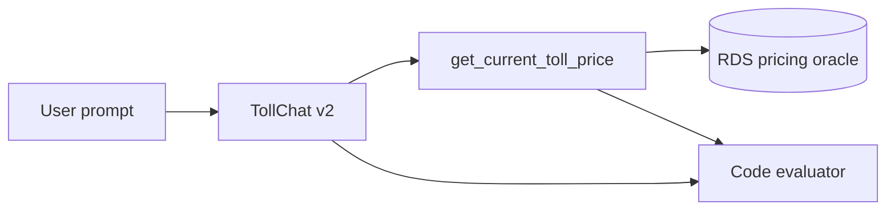

# Evaluation Plan for TollChat v2 I-95/I-495 Junction Routes

## 1. Evaluation Requirements

- **User Input:** Cover the 495/95 junction behaviors from v1 recommendations 1 and 2, fix the stale plan from recommendation 4, and leave recommendation 3 out of scope.
- **Interpreted Evaluation Requirements:** Code-grade direct prices, the TP1NB invalid-origin restart, the TP1SB closure fallback and acceptance, and unavailable northbound/southbound responses against the actual scheduled I-95 state.

---

## 2. Agent Analysis

| **Attribute** | **Details** |
| :-- | :-- |
| **Agent Name** | TollChat v2 |
| **Purpose** | Price covered Northern Virginia toll trips. |
| **Core Capabilities** | Resolve prompt points and call current or annual pricing tools. |
| **Input** | Natural-language toll question. |
| **Output** | Markdown response grounded in structured tool results. |
| **Agent Framework** | Strands Agents |
| **Technology Stack** | Python 3.13+, OpenAI Responses, IAM-authenticated PostgreSQL, Strands Evals 1.1.0 |

**Key Components:**

- **Agent SOP:** Resolves route-compatible endpoints and controls TP1NB/TP1SB offers.
- **Current-price tool:** Validates the full route, lane state, fallback gaps, and price.
- **Code evaluator:** Checks exact calls, tool results, fallback safety, and response grounding.

**Available Tools:** `get_current_toll_price`, `get_annual_toll_ballpark`.

**Observability Status:** Strands message trajectories are captured in-memory; no separate trace service is required.

---

## 3. Evaluation Metrics

### Exact route and tool-result correctness

- **Evaluation Area:** Tool-call accuracy and result validity
- **Description:** Each turn makes exactly one expected current-price call and returns the required price, invalid-origin restart, or lane-state unavailability contract.
- **Method:** Code-based

### Grounded response and fallback safety

- **Evaluation Area:** Final response quality
- **Description:** Responses use Markdown and emoji, ground prices and observation times, explain closures, make only eligible TP1NB/TP1SB offers, disclose omitted general-purpose travel, and wait for acceptance.
- **Method:** Code-based

---

## 4. Test Data Generation

- **Reagan Airport to Westpark:** Direct two-component price in the southbound window.
- **Pentagon/Eads Street to Westpark:** Direct two-component price in the southbound window.
- **Springfield-Franconia to Westpark:** TP1NB restart offer and accepted price in every I-95 window.
- **Dulles Airport to Backlick Road:** TP1SB fallback offer and accepted price in northbound and reversal windows.
- **Old Keene Mill Road to Reagan Airport:** Northbound unavailability without an ineligible fallback offer in southbound and reversal windows.
- **Total number of test cases:** 5

| **Scheduled window** | **Cases run** |
| :-- | :-- |
| `i95_northbound` | TP1NB restart; TP1SB unavailable/fallback |
| `i95_reversal` | TP1NB restart; TP1SB unavailable/fallback; northbound unavailable |
| `i95_southbound` | Two direct Westpark prices; TP1NB restart; northbound unavailable |

---

## 5. Evaluation Implementation Design

### 5.1 Evaluation Code Structure

All artifacts live in `v2/eval/`: this plan, JSONL cases, runner, README, report, and results.

### 5.2 Recommended Evaluation Technical Stack

| **Component** | **Selection** |
| :-- | :-- |
| **Language/Version** | Python 3.13+ |
| **Evaluation Framework** | Strands Evals SDK 1.1.0 |
| **Evaluators** | One custom code evaluator with scenario dispatch |
| **Agent Integration** | Fresh direct `build_agent()` per case |
| **Results Storage** | Timestamped JSON |

---

## 6. Progress Tracking

### 6.1 User Requirements Log

| **Timestamp** | **Phase** | **Requirement** |
| :-- | :-- | :-- |
| 2026-08-22 | Planning | Add tool tests and Strands evals for the two Westpark failures, then wire both into CI. |
| 2026-08-22 | Coverage | Add TP1SB acceptance and scheduled northbound/southbound/reversal unavailability; exclude the adversarial three-turn case. |

### 6.2 Evaluation Progress

| **Timestamp** | **Component** | **Status** | **Notes** |
| :-- | :-- | :-- | :-- |
| 2026-08-22 | Plan and cases | Completed | Five cases with scheduled-window selection. |
| 2026-08-22 | Offline evaluator | Completed | Pass/fail branches, CI contract, and the full non-live v2 suite pass. |
| 2026-08-22 | Live execution | Scheduled | TP1NB passed live; state-specific cases await fresh timed windows because current I-95 evidence was stale. |
