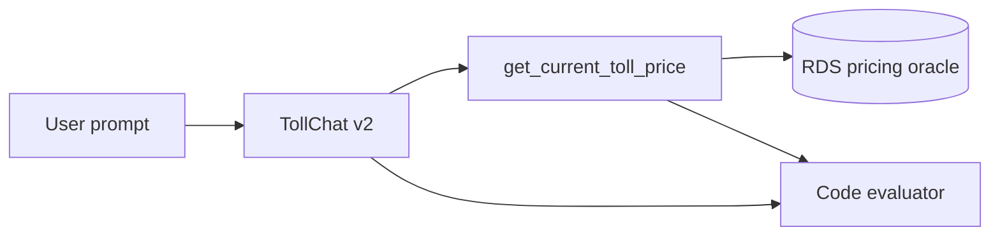

# Evaluation Plan for TollChat v2 Westpark Routes

## 1. Evaluation Requirements

- **User Input:** Evaluate Reagan Airport and Pentagon/Eads Street current tolls to Westpark Drive and wire the checks into CI.
- **Interpreted Evaluation Requirements:** Code-grade the exact current-price call, usable tool result, and grounded Markdown/emoji response for both reported failures.

---

## 2. Agent Analysis

| **Attribute** | **Details** |
| :-- | :-- |
| **Agent Name** | TollChat v2 |
| **Purpose** | Price covered Northern Virginia toll trips. |
| **Core Capabilities** | Resolve prompt points and call current or annual pricing tools. |
| **Input** | Natural-language toll question. |
| **Output** | Markdown response grounded in structured tool results. |
| **Agent Framework** | Strands Agents |
| **Technology Stack** | Python 3.13+, OpenAI Responses, IAM-authenticated PostgreSQL, Strands Evals 1.1.0 |

**Key Components:**

- **Agent SOP:** Resolves the route-compatible Westpark endpoint.
- **Current-price tool:** Validates the full route and prices both I-95/I-495 components.
- **Code evaluator:** Checks the exact call, tool result, and response grounding.

**Available Tools:** `get_current_toll_price`, `get_annual_toll_ballpark`.

**Observability Status:** Strands message trajectories are captured in-memory; no separate trace service is required.

---

## 3. Evaluation Metrics

### Exact route and tool-result correctness

- **Evaluation Area:** Tool-call accuracy and result validity
- **Description:** Exactly one current-price call uses the expected endpoint IDs/profile and returns either a two-component total or a genuine validated closure.
- **Method:** Code-based

### Grounded response contract

- **Evaluation Area:** Final response quality
- **Description:** The response uses Markdown and emoji and includes the returned price plus observation time, or accurately explains a genuine closure.
- **Method:** Code-based

---

## 4. Test Data Generation

- **Reagan Airport to Westpark:** Airport access followed by the two-piece southbound I-95/I-495 route.
- **Pentagon/Eads Street to Westpark:** Direct two-piece southbound I-95/I-495 route.
- **Total number of test cases:** 2

---

## 5. Evaluation Implementation Design

### 5.1 Evaluation Code Structure

All artifacts live in `v2/eval/`: this plan, JSONL cases, runner, README, report, and results.

### 5.2 Recommended Evaluation Technical Stack

| **Component** | **Selection** |
| :-- | :-- |
| **Language/Version** | Python 3.13+ |
| **Evaluation Framework** | Strands Evals SDK 1.1.0 |
| **Evaluators** | One custom code evaluator |
| **Agent Integration** | Fresh direct `build_agent()` per case |
| **Results Storage** | Timestamped JSON |

---

## 6. Progress Tracking

### 6.1 User Requirements Log

| **Timestamp** | **Phase** | **Requirement** |
| :-- | :-- | :-- |
| 2026-08-22 | Planning | Add tool tests and Strands evals for the two Westpark failures, then wire both into CI. |

### 6.2 Evaluation Progress

| **Timestamp** | **Component** | **Status** | **Notes** |
| :-- | :-- | :-- | :-- |
| 2026-08-22 | Plan and cases | Completed | Two exact reported prompts. |
| 2026-08-22 | Offline evaluator | Completed | Network-free pass/fail branch check. |
| 2026-08-22 | Live execution | Completed | Both code-graded cases passed. |
