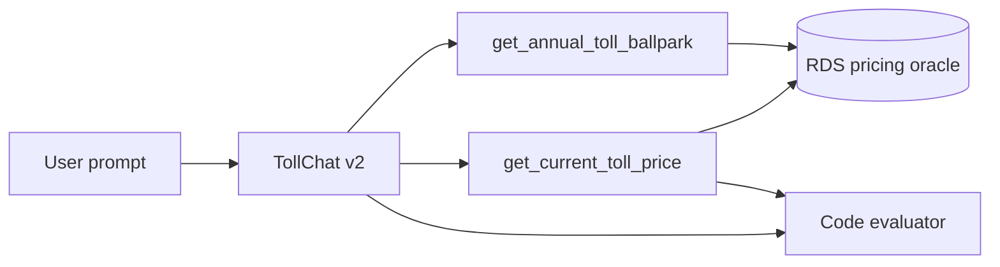

# Evaluation Plan for TollChat v2 Pricing and Affordability

## 1. Evaluation Requirements

- **User Input:** Add a 52-week annual commute-day proposal and bring annual-affordability coverage to parity with the six-case current-price suite.
- **Interpreted Evaluation Requirements:** Code-grade six annual cases spanning grounded fixed and modeled results, route and income clarification, adjustable annual-day estimation, complete required-input acquisition, and safe route unavailability while retaining existing current-price coverage.

---

## 2. Agent Analysis

| **Attribute** | **Details** |
| :-- | :-- |
| **Agent Name** | TollChat v2 |
| **Purpose** | Estimate tolled-commute affordability and current prices. |
| **Core Capabilities** | Resolve prompt points and call current or annual pricing tools. |
| **Input** | Natural-language toll question. |
| **Output** | Markdown response grounded in structured tool results. |
| **Agent Framework** | Strands Agents |
| **Technology Stack** | Python 3.13+, OpenAI Responses, IAM-authenticated PostgreSQL, Strands Evals 1.1.0 |

**Key Components:**

- **Agent SOP:** Resolves route-compatible endpoints and controls TP1NB/TP1SB offers.
- **Current-price tool:** Validates the full route, lane state, fallback gaps, and price.
- **Code evaluator:** Checks exact calls, tool results, fallback safety, and response grounding.

**Available Tools:** `get_current_toll_price`, `get_annual_toll_ballpark`.

**Observability Status:** Strands message trajectories are captured in-memory; no separate trace service is required.

---

## 3. Evaluation Metrics

### Exact route and tool-result correctness

- **Evaluation Area:** Tool-call accuracy and result validity
- **Description:** Each pricing turn makes the exact expected current-price call and returns the required direct price, fallback, or lane-state unavailability contract.
- **Method:** Code-based

### Grounded response and fallback safety

- **Evaluation Area:** Final response quality
- **Description:** Responses use Markdown and emoji, ground prices and observation times, explain closures, make only eligible TP1NB/TP1SB offers, disclose omitted general-purpose travel, and wait for acceptance.
- **Method:** Code-based

### Annual affordability grounding

- **Evaluation Area:** Job-offer decision support
- **Description:** The annual case makes the exact income-aware call and reports tool-provided annualized daily-P25/P50/P90 money in a Markdown table with emoji, tax, mileage, fixed TollChat vehicle-cost assumption, scope, and historical-evidence disclosures.
- **Method:** Code-based

### Frozen-evidence quantitative hallucination rate

- **Evaluation Area:** Final-response grounding under repeated generation
- **Description:** Across 1,000 production-shaped Batch responses, reject any money, percentage, coverage, date, or time claim absent from one reviewed Springfield-Franconia–Westpark ballpark result while retaining the existing annual-response requirements.
- **Method:** Code-based

---

## 4. Test Data Generation

- **Reagan Airport to Westpark:** Direct two-component price in the southbound window.
- **Pentagon/Eads Street to Westpark:** Direct two-component price in the southbound window.
- **Springfield-Franconia to Westpark:** Direct two-component price in the northbound window with no restart.
- **Dulles Airport to Backlick Road:** TP1SB fallback offer and accepted price in northbound and reversal windows.
- **Old Keene Mill Road to Reagan Airport:** Northbound unavailability without an ineligible fallback offer in southbound and reversal windows.
- **Leesburg Bypass to Route 28:** Annual job-offer affordability with gross income, a complete work schedule, and fixed-rate Greenway tolls.
- **Springfield-Franconia to Tysons:** Exit clarification followed by an exact Westpark round-trip annual affordability call.
- **Leesburg missing schedule:** Request every missing schedule field in one turn without calling a tool or re-requesting supplied income.
- **Leesburg annual-day estimate:** Propose 260 for Monday-Friday, wait for confirmation or adjustment, then honor 240 in the exact annual call.
- **Leesburg salary range:** Request one annual gross estimate, retain the supplied commute details, then make the exact annual call after selection.
- **Dulles Airport to Reagan Airport:** Accept the cross-direction current-price route, then explain a deterministically unsupported annual return route without scenarios, totals, or a current-price restart.
- **Total number of test cases:** 12; six current-price and six annual-affordability cases.

The separate hallucination battery uses one canonical annual-ballpark context,
five reviewed prompt variants, and 200 repeat generations per variant. Repeats
measure reliability for that context, not route coverage.

| **Scheduled window** | **Cases run** |
| :-- | :-- |
| `i95_northbound` | Direct Springfield-to-Westpark and Dulles-to-Reagan routes; TP1SB unavailable/fallback |
| `i95_reversal` | TP1SB unavailable/fallback; northbound unavailable |
| `i95_southbound` | Two direct Westpark prices; northbound unavailable |
| `all` with `annual` suite | Six annual success, clarification, annual-day estimation, input-acquisition, and unavailable-route behaviors |

---

## 5. Evaluation Implementation Design

### 5.1 Evaluation Code Structure

All artifacts live in `v2/eval/`: this plan, JSONL cases, runner, README, report, and results.

### 5.2 Recommended Evaluation Technical Stack

| **Component** | **Selection** |
| :-- | :-- |
| **Language/Version** | Python 3.13+ |
| **Evaluation Framework** | Strands Evals SDK 1.1.0 |
| **Evaluators** | One custom code evaluator with scenario dispatch |
| **Agent Integration** | Fresh direct `build_agent()` per case |
| **Results Storage** | Timestamped JSON |

---

## 6. Progress Tracking

### 6.1 User Requirements Log

| **Timestamp** | **Phase** | **Requirement** |
| :-- | :-- | :-- |
| 2026-08-22 | Planning | Add tool tests and Strands evals for the two Westpark failures, then wire both into CI. |
| 2026-08-22 | Coverage | Add TP1SB acceptance and scheduled northbound/southbound/reversal unavailability; exclude the adversarial three-turn case. |
| 2026-08-22 | Affordability | Add an income-aware annual job-offer case with deterministic response grounding. |
| 2026-08-22 | Springfield-Tysons | Replace the false current-price restart with a direct northbound route and add a Tysons-clarification annual case. |
| 2026-08-22 | Methodology review | Label annualized daily percentiles precisely, remove unsupported AAA attribution, round annual vehicle cost after annualization, and collapse prompt releases for PR CI. |
| 2026-08-22 | Annual parity | Expand annual coverage to five behavioral cases without changing production behavior or weakening graders for failures. |
| 2026-08-22 | Annual-day estimate | Propose 52 times the weekly schedule, wait for acceptance or adjustment, and bind response money to its labeled context. |
| 2026-08-22 | Hallucination Batch | Use a direct two-phase OpenAI Batch workflow, a frozen Springfield-Franconia–Westpark ballpark, five prompts, 1,000 responses, and a tiktoken gate against the Tier 3 40M queue. |

### 6.2 Evaluation Progress

| **Timestamp** | **Component** | **Status** | **Notes** |
| :-- | :-- | :-- | :-- |
| 2026-08-22 | Plan and cases | Completed | Five cases with scheduled-window selection. |
| 2026-08-22 | Offline evaluator | Completed | Pass/fail branches, CI contract, and the full non-live v2 suite pass. |
| 2026-08-22 | Live execution | Scheduled | TP1NB passed live; state-specific cases await fresh timed windows because current I-95 evidence was stale. |
| 2026-08-22 | Annual affordability | Implemented | Offline evaluator covers exact inputs, money grounding, Markdown table, emoji, assumptions, and tolled-only scope. |
| 2026-08-22 | Springfield-Tysons regressions | Implemented | Current and annual cases code-grade the correct northbound endpoint and reject premature annual calls. |
| 2026-08-22 | Springfield-Tysons live annual | Completed | Both annual cases passed; the Tysons conversation clarified the exit and made the exact corrected round-trip call. |
| 2026-08-22 | Springfield-Westpark live current | Scheduled | Saturday route selection used the exact corrected call, but the live feed reported `NORTHBOUND_OPENING`; the strict price eval is weekday-only. |
| 2026-08-22 | Annual behavioral parity | Implemented | Five annual cases cover fixed and modeled success, route and income clarification, missing-input acquisition, and deterministic route unavailability. |
| 2026-08-22 | Annual parity live run | Completed with finding | 4/5 passed. Dulles-to-Reagan exposed a false client invariant that coupled an I-495 boundary direction to the subsequent I-95 direction; the failed report is not curated. |
| 2026-08-22 | Cross-direction gap fix | Implemented | Both tools now accept the legitimate southbound I-495 boundary to northbound I-395 movement while retaining strict boundary and direction enums. |
| 2026-08-22 | Cross-direction live current | Completed | 1/1 passed; the exact Dulles-to-Reagan call returned grounded stale-evidence unavailability rather than an internal validation error. |
| 2026-08-22 | Final annual parity run | Completed | 5/5 passed against the final prompt contract. |
| 2026-08-22 | Annual-day estimate and evaluator hardening | Completed | 6/6 passed live: the agent proposed 260, waited, honored 240, and the evaluator enforced scenario-row and P50-context money binding. |
| 2026-08-22 | Ballpark hallucination packet | Completed | Batch `batch_6a8a15e8f5fc81909b45e7e5831d0917` returned 1,000/1,000 responses. Adjudication found 99.6% strict quantitative grounding, one genuinely incorrect fact, and 93.1% conservative end-to-end compliance. |
