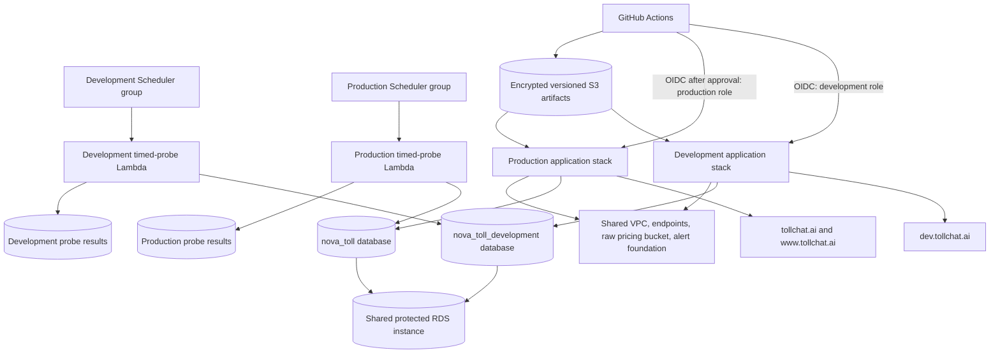

# TollChat Environment and Release Plan

Status: proposed for review

Scope: TollChat v2 environment separation and follow-on delivery automation

Target region: AWS `us-east-1`

## 1. Objective

First create a persistent development environment at `dev.tollchat.ai` while
retaining production at `tollchat.ai`. Complete and verify that environment
split before adding deployed-database migration automation or persistent agent
tracing. Those follow-on capabilities should be proven in development before
production rollout.

After the split is stable, a merge to `main` should deploy to development and a
published release should promote the exact development-proven revision to
production after the applicable evaluation and human approval gates.

The result should demonstrate production engineering judgment without cloning
expensive shared foundations or adding tools that TollChat does not need.

## 2. Current state

- `infra/` owns shared network, RDS, storage, polling, security, and the
  `nova-toll/terraform.tfstate` state.
- `v2/infra/` owns the TollChat application stack in the fixed
  `nova-toll/v2/terraform.tfstate` state.
- `v2/infra/` currently hard-codes production domains and many globally unique
  resource names, so a second state would collide rather than create an
  isolated environment.
- Production deployment is manual and follows `v2/RUNBOOK.md`.
- Pull-request CI already runs PostgreSQL 17/PostGIS migration tests from each
  declared prior version, checks migration immutability and idempotence, and
  compares migrated schemas with canonical bootstrap schemas.
- Pull-request CI checks the evaluator itself without making model calls.
- Scheduled protected workflows run live, code-graded TollChat evaluations
  against time-sensitive pricing windows.
- GitHub Actions is not a reliable clock for those windows: during August
  17-23, 2026, all 20 observed scheduled triggers started more than ten minutes
  late and 18 were skipped by the freshness guard without an evaluation result.

## 3. Decisions

| Area | Decision | Reason |
| :-- | :-- | :-- |
| Remote environments | Development and production | Enough promotion ceremony without a speculative third environment. |
| AWS accounts | One account initially | AWS recommends separate accounts as the stronger environment boundary, but that cost and ceremony are disproportionate for this reference implementation. Revisit if TollChat becomes a live service. |
| Terraform source | One `v2/infra` root | Prevent configuration drift and preserve one application definition. |
| Terraform state | Explicit S3 state key per environment | More visible and harder to select accidentally than CLI workspaces. |
| Production compatibility | Preserve current state key and physical names | The environment refactor must not replace production resources. |
| Environment identity | Every managed object is identified as `development` or `production` | Tags identify supported AWS resources; names, descriptions, PostgreSQL comments, and deployment manifests cover objects that cannot carry AWS tags. |
| Database isolation | Separate PostgreSQL databases and runtime roles on the existing RDS instance; add migrator roles later | Isolates ordinary application mistakes while keeping migration automation out of the initial split. It is not an instance-level security boundary. |
| Deployable artifact | Build once per commit and address by SHA-256 | Development and production should execute identical bytes. |
| Migration execution | Retain disposable PR checks; defer deployed migration automation until after the environment split | CI validation is already useful, while environment migrator roles and deployment sequencing can be proven later in development. |
| Agent tracing | Defer persistent traces, PII sanitization, storage, and privacy-notice changes until after the environment split | Establish the boundary first, then validate the complete telemetry path in development before production. |
| Timed deterministic probes | EventBridge Scheduler invokes separate development and production Lambda functions built from one artifact | AWS owns the clock while environment-specific functions, roles, databases, result prefixes, and failure handling preserve least privilege. |
| Timed agent evaluations | Run selectively in development; use only a small post-release production canary | Full Strands evaluations are CI/release work, not a continuously duplicated Lambda workload. |
| Production trigger | Published GitHub Release with an allowed `v*` tag | Creates an auditable promotion event distinct from merging code. |
| Saved production plans | Dedicated short-lived S3 bucket managed by the shared foundation | Keeps sensitive plans separate from durable Terraform state and runtime artifacts with their different access, encryption, immutability, and lifecycle requirements. |
| Production canary | One Dulles Greenway current-price conversation after every production apply | Exercises the public endpoint, agent, pricing tool, and production database without I-95 direction or feed-freshness instability. |
| Evaluation | Retain cheap PR checks and a basic split smoke test; add the release ceremony after the environment split | Isolation needs a working-dev check, not the full promotion gate. |
| Rollback | Roll Lambda and AgentCore versions back | Deployed schema changes are outside this plan. |

## 4. Target architecture

### 4.1 Shared foundations

Keep the existing `infra/` state responsible for:

- AWS account and region selection;
- VPC, private subnets, endpoints, and shared security foundations;
- the protected RDS PostgreSQL instance and its backups;
- raw pricing storage and common KMS foundations;
- Terraform state storage and locking;
- the dedicated production release-plan bucket and KMS key;
- the existing multi-Region CloudTrail and protected audit bucket;
- the existing production alert destination.

Shared does not mean broadly writable. Development deployment and runtime roles
must receive only the environment-specific grants they require. Reuse the
existing trail rather than creating an application-specific duplicate, and
verify that it records development management events plus protected state and
artifact object activity.

### 4.2 Environment-isolated resources

Each application environment should have its own:

- CloudFront distribution, ACM certificate, WAF ACL, DNS record, and site S3
  bucket;
- Lambda functions, aliases, queues, log groups, EventBridge rules and Scheduler
  groups/schedules, and alarms;
- AgentCore runtime and application roles;
- DynamoDB session and measurement data;
- PostgreSQL database and database roles/grants, bootstrapped outside Terraform;
- application KMS keys and environment-scoped IAM roles;
- a non-paging development alert topic or disabled alarm actions;
- deployment outputs and smoke-test endpoints.

Production retains its existing names. Development receives an explicit `-dev`
suffix or `dev-` prefix wherever AWS requires global uniqueness.

### 4.3 Intentional environment differences

Development should resemble production but remain cheaper and quieter:

- no provisioned Lambda concurrency until measurements justify it;
- a Terraform-enforced provisioned-concurrency value of zero;
- shorter Terraform-enforced log retention where policy permits;
- alarms visible but not routed as production pages;
- tighter public rate limits and explicit `noindex` behavior;
- separate anonymous-session and usage data;
- a dedicated PostgreSQL database and runtime principal;
- the same application packages and schema definitions as production.

The timed-probe package is also identical across environments. Deploy separate
Lambda resources rather than using aliases or an `environment` input to turn
one function into a shared security boundary. Each function receives only its
environment's execution role, VPC path, database identity, result prefix, logs,
alarm, and dead-letter queue.

## 5. Terraform design

### 5.1 Configuration

Add the minimum environment inputs needed to remove singleton assumptions:

- `environment`: `development` or `production`;
- domains and canonical public URL;
- environment resource-name affix;
- database name and environment-specific database roles;
- operational differences such as provisioned concurrency and alarm actions.

Centralize derived names in locals. The production values must resolve to the
current literal names so existing state addresses and physical resources remain
unchanged.

Do not split every resource into a module merely to call it twice. The same
root will be initialized against one of two explicit backend configurations:

- production: existing `nova-toll/v2/terraform.tfstate`;
- development: `nova-toll/v2/development/terraform.tfstate`.

That root declares the same timed-probe resources in each state. The two states
produce separate Scheduler groups, schedules, Lambda functions, execution
roles, log groups, alarms, dead-letter queues, and result prefixes while
referencing the same digest-addressed probe package.

Commit non-secret backend configuration and tfvars. Credentials remain in OIDC,
IAM, and SSM Parameter Store.

The AWS provider does not manage PostgreSQL databases or roles. Create the
development database and its initial roles through a separately approved,
one-time SQL bootstrap using a database administrator identity. Do not add a
PostgreSQL Terraform provider or `null_resource` merely to hide that operation
inside an application plan. Treat this as a one-time bootstrap, not a general
migration runner. Deployed schema changes remain out of scope until the
post-split migration phase.

### 5.2 Environment labeling and tagging

Use the exact values `environment=development` and `environment=production`.
Every taggable AWS resource managed by either Terraform root must carry one of
them. New development resources use `development`; existing application and
shared-foundation resources use `production`. Shared foundations, including the
RDS instance, additionally carry `shared_with=development` where development is
allowed to consume them. Here `environment` records ownership and security
control, while `shared_with` records the narrower secondary consumer.

First prove that the environment-aware refactor produces a zero-change
production plan. Then apply production tags to existing resources as a separate
reviewed metadata-only plan before creating development. Activate `environment`
for AWS cost allocation as soon as AWS lists it, because activation is not
retrospective. Inventory the resulting AWS resources and fail the milestone if
any taggable resource lacks its environment tag.

AWS tags apply to the RDS instance, not to individual PostgreSQL databases. Keep
the existing production database name `nova_toll`, name the new database
`nova_toll_development`, and apply PostgreSQL comments containing
`environment=production` and `environment=development`, respectively. Use full
environment words in new database-role names. Where an existing production name
cannot change safely, retain it and add the production comment. Independently
addressable managed objects that cannot carry AWS tags use the full environment
in a name or description and in the inventory. Child and configuration objects
that expose none of those fields, such as bucket versioning or IAM attachments,
inherit the environment from their tagged parent; record that parent mapping in
the inventory rather than inventing an impossible label.

### 5.3 Plan safety

Before creating development:

1. Initialize the refactored root against the existing production state.
2. Run a full production plan with the current reviewed packages.
3. Require zero resource changes.
4. If an unavoidable metadata-only change exists, review and isolate it before
   continuing.
5. Check the applicable regional and global service quotas for the additional
   development resources and resolve any shortfall before the first apply.

Pull requests should produce non-mutating development and production plan
summaries. Saved binary plans can contain sensitive values and must not be
published as artifacts from a public repository.

For a production release, upload the exact saved plan to a unique versioned key
such as `production/<release-tag>/<run-id>/release.tfplan` in a dedicated private
release-plan S3 bucket managed by the shared foundation. Do not store plans in
the Terraform state or AgentCore runtime-artifact buckets. Enable Bucket Owner
Enforced ownership, Block Public Access, versioning, SSE-KMS with a dedicated
customer-managed key, and bucket-default Object Lock Compliance retention of
two days. Require the exact KMS key, an S3 SHA-256 object checksum, and a locally
computed plaintext SHA-256. Do not set retention headers per upload or grant CI
`s3:PutObjectRetention`; the bucket default supplies the immutable retention.
Record the object version, both checksums, KMS key ARN, creation time, retain-
until time, and expected state serial in the deployment manifest. The apply job
must fetch that exact version and verify every value before running Terraform.

Plans are eligible for approval for 24 hours, immutable for 48 hours, and
expired by lifecycle after three days. S3 lifecycle is day-granular and Object
Lock retention wins if expiration runs earlier. Do not use the SSE-KMS ETag as
an integrity digest; it is not a reliable MD5 of either plaintext or ciphertext.

The trusted plan job may read the exact production state object, manage its
exact lockfile, and write and encrypt only a unique plan object; it cannot write
state. It otherwise receives Describe/Get/List discovery permissions. The
production apply role may read and decrypt only the recorded plan version,
Get/Put the exact production state object, and Get/Put/Delete its exact lockfile
so Terraform can persist the apply safely. Bucket policy and KMS encryption-
context conditions provide a second layer. Include release-plan object data
events in the existing CloudTrail. Planning uses a Cloudflare zone/DNS read
token; applying uses separate mutation credentials released only after
approval.

After the trusted planner exists, run a weekly and manually dispatchable,
report-only `terraform plan -detailed-exitcode` against both state keys. Report
changes or errors for investigation; never auto-apply a drift result.

## 6. Database boundary during the split

### 6.1 Pull-request CI

Pull requests must never mutate a deployed database. Retain the existing
disposable checks:

1. Detect changed schema-owned files and new upgrade migrations.
2. Reject edits to previously released migrations.
3. Start from each migration's declared prior schema version.
4. Apply new migrations in dependency order with `ON_ERROR_STOP`.
5. Verify target versions, failure atomicity, and safe reruns.
6. Compare the final schema and canonical data with the bootstrap definition.

### 6.2 Initial environment split

The environment split needs one approved administrator bootstrap to create
`nova_toll_development`, its runtime role and grants, its environment comment,
and the current canonical schemas. It does not need reusable migrator roles or
a deployment migration runner.

Until the follow-on migration phase is complete, do not deploy changes that
require a deployed schema change. Production keeps its existing database and
deployment procedure unchanged.

### 6.3 Post-split migration work

Design deployed migration automation only after the environment split is
verified. That follow-on plan must start in development and cover identities,
ordering, failure behavior, production approval, and recovery. The detailed
runner design is intentionally outside this plan.

### 6.4 Shared-instance database boundary

- Never use the RDS master user or any `rds_superuser` identity in CI,
  migrations, or application runtime.
- Create distinct PostgreSQL login roles for dev/prod runtime. Revoke `CONNECT`
  on both databases from `PUBLIC`, then grant it only to the named roles for
  that environment. Scope schema and object privileges likewise.
- Assert that application roles are not members of `pg_monitor`,
  `rds_superuser`, `rdsadmin`, `rds_replication`, or `rds_extension`.
- Audit installed extensions and user mappings. Do not give development roles
  `dblink`, `postgres_fdw`, cross-database credentials, or extension-install
  privileges. If `pg_cron` is used, keep it out of
  `nova_toll_development`.
- Add automated isolation probes: each dev identity must fail to connect to or
  inspect production, and each prod identity must fail against development.

## 7. Delivery workflows

The initial environment split stops after development is bootstrapped and
isolation is verified. The workflow below initially supports only changes that
do not require deployed schema changes. Persistent tracing is also outside this
milestone.

```mermaid
flowchart LR
  PR[Pull request] --> CI[Tests, disposable DB migrations, eval check, tf plans]
  CI --> MAIN[Merge to main]
  MAIN --> BUILD[Build once and record digests]
  BUILD --> DAPPLY[Apply development Terraform]
  DAPPLY --> DSMOKE[Dev smoke and live eval]
  DSMOKE --> RELEASE[Publish v* release]
  RELEASE --> REVAL[Repeated candidate release eval]
  REVAL --> PPLAN[Production saved plan]
  PPLAN --> APPROVE[Production environment approval]
  APPROVE --> PAPPLY[Apply exact saved plan]
  PAPPLY --> CANARY[Production canary and evidence]
```

### 7.1 Pull request

- Run existing application, database, security, and offline evaluator checks.
- Build deterministic packages and verify their manifests.
- Run read-only plans for both application states.
- Do not expose apply roles, Cloudflare credentials, or deployed-database
  privileges to pull-request jobs.

### 7.2 Merge to `main`

- Wait for required CI checks.
- Build each deployable package once.
- Store packages in encrypted, versioned S3 keys addressed by commit and digest.
- Reject candidates that require deployed schema changes.
- Plan and apply development using those package versions.
- Wait for CloudFront and runtime readiness.
- Run endpoint smoke checks and a small live agent evaluation.
- Record a successful GitHub development deployment for the commit.

Development concurrency must serialize deployments and must not cancel an
apply that has started. A newer commit may wait and then supersede an older
queued deployment.

### 7.3 Published release

- Enable immutable GitHub Releases and a `v*` tag ruleset that prevents tag
  update, force-push, and deletion. Accept only the first publication of an
  allowed release tag whose commit has a successful development deployment.
- Resolve and record the GitHub release ID, tag object SHA when present, and
  peeled commit SHA. Reject a tag or release ID already associated with a
  different commit or production deployment.
- Resolve packages by the development-proven commit and verify every digest.
- Run the release evaluation gate against that exact candidate.
- Reject releases that require deployed schema changes.
- Generate the saved Terraform plan and present non-secret plan, artifact, and
  eval summaries for review.
- Require the protected production environment approval.
- Apply the exact saved Terraform plan.
- Run bounded production canaries and record deployment evidence.

Production concurrency must allow only one plan/apply sequence at a time and
must never cancel an active apply.

### 7.4 Edge and runtime ordering

Do not use `terraform apply -target` to manufacture deployment phases. The
CloudFront origin depends on the Lambda Function URL, while the IAM-only URL is
restricted to the CloudFront distribution ARN; Terraform should retain that
dependency graph and apply the reviewed saved plan as a whole.

Before any initial DNS enablement or canary, verify that CloudFront reports
`Deployed`, the WAF ARN is associated, the Function URL still requires AWS IAM,
and the origin access control is effective. If a future release introduces a
new distribution or hostname, use a separate normal saved plan with an
explicit DNS-enable input after readiness, not a targeted apply. Existing
production DNS normally remains unchanged.

New or materially changed custom WAF blocking rules first deploy with
`action { count {} }` in development and then in a production observation
release before promotion to `block`. Managed rule groups use their appropriate
rule-action overrides. Unchanged proven rules need not cycle through COUNT on
every release.

## 8. Evaluation ceremony

The environment split milestone requires only the existing network-free
evaluator check plus a basic development smoke and isolation check. Existing
scheduled GitHub suites may continue during the split, but they do not block
completion and are not the long-term clock for time-sensitive checks. The
AWS-native probes, recorded release environment, repeated gates, deployment
evidence, and production canaries in this section are follow-on delivery work
after Step 3.

The existing deterministic code graders remain the primary evaluators. They are
better than an LLM judge for exact route selection, money, tool arguments,
disclosures, and forbidden behavior.

### 8.1 Tiers

| Tier | Trigger | Environment | Purpose |
| :-- | :-- | :-- | :-- |
| Evaluator check | Every pull request | Network-free | Prove cases load and every grader's pass/fail branches behave. |
| Dev smoke | Successful development deployment | Development live services | Catch packaging, IAM, database, endpoint, and obvious agent regressions. |
| Timed deterministic probe | EventBridge Scheduler at every relevant pricing window | Separate development and production Lambdas | Verify live direction, freshness, route, and price state without model calls. |
| Timed agent evaluation | Select schedules or manual dispatch | Development | Exercise full agent behavior in real time without duplicating model cost in production. |
| Release gate | Published release before prod approval | Exact development candidate | Measure full agent behavior repeatedly under controlled inputs. |
| Production canary | Successful production apply | Production | Confirm the public path and one stable critical journey, not rerun the full suite. |

### 8.2 AWS-native timed probes

Use EventBridge Scheduler with `America/New_York` schedule expressions and
`FlexibleTimeWindow = OFF` to invoke one single-purpose timed-probe Lambda per
environment. Both functions use the exact same immutable package, but they are
separate AWS resources with separate invocation and execution roles. A
Scheduler group is organizational grouping, not a security boundary; IAM, VPC
security groups, PostgreSQL grants, KMS and S3 policies provide the isolation.

Each invocation carries a stable window identifier and enough schedule context
to reject stale execution. The Lambda calls the application domain functions
directly; it does not install dependencies, invoke `pytest`, or impersonate a
CI runner. It writes a structured result to its environment's operational
prefix and emits CloudWatch success, failure, stale, and duplicate metrics.
Development results must never overwrite or publish through production.

Scheduler provides at-least-once delivery, so publication must be idempotent
for an environment/window/scheduled-occurrence key. Configure a short maximum
event age, bounded retries, and an environment-specific SQS dead-letter queue.
A stale invocation records a metric and publishes no pricing result; a
duplicate is a successful no-op. Alarm on missing expected results, probe
failures, stale invocations, and non-empty dead-letter queues.

Run the cheap deterministic probes for every relevant window in both
environments. Keep full Strands/LLM timed evaluations selective in development,
and reserve production model calls for the bounded post-release canary. Retire
the GitHub cron triggers only after the AWS schedules have produced complete
on-time development evidence across every window.

### 8.3 Deterministic release environment

The current live suite depends on tolling direction and feed freshness, so it
cannot be the sole release gate. Add versioned recorded tool results for the
full candidate behavior suite. Run the real agent with those controlled tool
results, then retain live dev smoke cases to detect integration drift. Avoid a
new eval service until this combination proves insufficient.

### 8.4 Production canary

After every successful production apply, send this single-turn synthetic
conversation through `tollchat.ai`:

> What is the current toll from the Leesburg Bypass entrance to Route 28 for a
> two-axle vehicle with E-ZPass?

Require exactly one `get_current_toll_price` call from
`greenway:1:entry:EB` to `greenway:28:exit:EB`, a successful tool result, a
response amount grounded in that result, the required estimate disclaimer, and
an initial hard end-to-end timeout of 60 seconds. Grade the contract and
grounded values, not exact model prose. Replace the fixed timeout with a
reviewed regression threshold only after enough releases establish a stable
baseline. Use a dedicated synthetic canary session marker, make no writes
beyond normal session and deployment evidence, and record model, tool,
artifact, and deployment versions. Failure follows the production-canary
recovery path in Section 11.

Run this exact conversation and grader against development before the first
production use and whenever its prompt, tool contract, or grader changes. Keep
small pass/fail fixtures proving wrong tool arguments, ungrounded money,
missing disclosures, tool failure, and timeout all fail the canary.

### 8.5 Release measurements and gates

- Run each critical case three times.
- Require `pass^3` for routing, money grounding, safety, and required tool use.
- Record dataset hash, commit, artifact digests, model identifier, prompt and
  renderer versions, and tool-contract versions.
- Record per-case tool calls, turns, input/output tokens, latency, and estimated
  model cost.
- Classify infrastructure, quota, and dependency failures separately from agent
  quality failures. Either class blocks release, but only agent failures affect
  the quality score.
- Use fixed correctness gates initially. Collect cost and latency for the first
  releases, then adopt regression thresholds only after a stable baseline
  exists.
- If the model, system prompt, tool contract, or dataset changes, include a
  small human review sample of transcripts with the approval packet.

All release workflow results may be retained in restricted operational storage.
Only technically valid, representative reports should be curated in
`v2/eval/results/`; failed and superseded reports must not be committed.

## 9. Identity, secrets, and permissions

- Pre-create the `development` and `production` GitHub environments before any
  workflow references them. Restrict development to `main`; restrict production
  to allowed `v*` tags and require approval. Do not rely on GitHub's implicit
  creation of an unprotected environment. Enable immutable releases and a tag
  ruleset that prevents published `v*` tags from being updated or deleted.
- Set the default `GITHUB_TOKEN` permission to read-only and elevate only the
  jobs that need more. Pin every third-party action to a full commit SHA and do
  not persist checkout credentials unless a job requires them.
- Use GitHub OIDC; do not create long-lived AWS access keys.
- Create a trusted planner, development deploy, and production deploy role. The
  trusted planner may also be the plan-object writer; do not create another
  dedicated writer role or grant this capability to untrusted pull-request CI.
- Every trust policy requires the supported GitHub OIDC condition keys
  `aud = sts.amazonaws.com` and an exact immutable repository `sub`.
  Development requires `ref:refs/heads/main`; production deploy requires the
  protected `production` GitHub environment in its subject. AWS IAM does not
  expose GitHub's `job_workflow_ref` as an independent condition key, so do not
  test it in a trust policy. Protect the production workflow path and reviewed
  ref through repository rules and review. If workflow identity must later be
  enforced by AWS, first configure GitHub's customized `sub` template to
  include `repo`, `context`, and `job_workflow_ref`, then atomically update
  every affected role to require the exact resulting subject.
- Give the planner explicit discovery reads plus only the narrow state-lock and
  unique plan-object writes it needs. A permissions boundary prevents other
  infrastructure mutation. Do not attempt a brittle hand-written deny list of
  every AWS mutation, and do not authorize `sts:TagSession` or trust unverified
  principal tags in resource policies.
- Scope deploy roles and bucket policies to their exact state prefixes:
  development under `nova-toll/v2/development/`, production at
  `nova-toll/v2/terraform.tfstate` and its lockfile. Apply matching `s3:prefix`
  conditions to list operations. Each deploy role may Get/Put only its exact
  state object and Get/Put/Delete only its exact lockfile.
- Beyond those state and lock operations, give each deploy role write access
  only to its artifacts and application resources. Development raw-pricing
  access is Get-only on required `raw/` prefixes with no write/delete grant.
- Give each timed-probe Lambda its own execution role and each environment's
  schedules one execution role. Scope each Scheduler role to
  `lambda:InvokeFunction` on its exact function and `sqs:SendMessage` on its
  exact dead-letter queue, including the required KMS permissions if the queue
  uses a customer-managed key. Scope the Lambda role to the environment
  database identity, KMS key, result prefix, log group, and metric namespace;
  do not grant it DLQ access unless application code separately writes there.
  Do not share either role across development and production.
- Use distinct Tailscale ACL identities such as `tag:ci-dev` and `tag:ci-prod`
  and test that only approved jobs can reach the RDS endpoint. AWS security
  groups cannot match a Tailscale tag, and because both databases share one
  endpoint the database grants remain the decisive boundary. AWS-native timed
  probes use their environment VPC path directly and do not depend on Tailscale.
- Production mutation credentials must not be available before environment
  approval. A release workflow may use separately scoped read-only AWS,
  database-inspection, and Cloudflare credentials for the approval packet.
- Read the Cloudflare write token from SSM only inside the approved Terraform
  apply process and unset it afterward.
- Never place database credentials, provider tokens, plan files, or decrypted
  parameters in job summaries or public artifacts.
- Use exact KMS key ARNs in IAM, key, and bucket policies. Verify development
  principals are absent from production key policies and grants; a KMS alias
  does not itself grant access.
- Configure the IAM OIDC provider using current AWS guidance. Do not build a
  manual GitHub certificate-rotation ceremony unless AWS again requires a
  pinned thumbprint.

### 9.1 Plan object permissions

- Writer: `PutObject` only to a unique
  `production/<release-tag>/<run-id>/release.tfplan` key, with the required
  SHA-256 checksum and exact SSE-KMS key. Bucket-default two-day Compliance
  retention applies; the writer receives no retention-management permission.
- Applier: `GetObject`, `GetObjectVersion`, and metadata reads only for the
  manifest-recorded key/version.
- Neither CI role may overwrite/delete plan versions or change retention.
- KMS writer permissions are limited to encryption/data-key operations;
  production apply receives decrypt only, both constrained by encryption
  context. No CI role receives `kms:*`.
- Deny insecure transport and missing/wrong encryption in bucket policy.
  Bucket-default Compliance retention, rather than a root-deny statement,
  protects the object.

## 10. Deployment evidence

Every development and production deployment should produce a machine-readable
manifest containing:

- environment and public URL;
- Git commit, release ID, release tag, tag object SHA when present, and peeled
  commit SHA;
- package object versions and SHA-256 digests;
- Terraform version, state key, plan object version, plaintext SHA-256, S3
  SHA-256 checksum, KMS key, age, and result;
- installed `pricing` and `oracle` schema versions;
- current and prior AgentCore runtime ARN, endpoint ARN, live version, and
  target version, plus the Lambda alias/version;
- model, prompt, renderer, tool-contract, and eval-dataset versions;
- eval pass counts plus separated infrastructure failures;
- timed-probe package digest, function version, Scheduler group and schedule
  identifiers, result prefix, and latest complete occurrence evidence;
- smoke-test result and deployment timestamps.

Store the manifest in encrypted operational storage and render a non-secret
summary in GitHub. It is evidence for review and incident reconstruction, not a
second configuration database.

## 11. Failure behavior

| Failure | Required behavior |
| :-- | :-- |
| PR migration or plan fails | Block merge; no deployed state was touched. |
| Development smoke/eval fails | Mark the commit unhealthy and prohibit production promotion. |
| Release eval fails | Stop before production credentials or mutations. |
| Production baseline differs | Stop and investigate drift; never skip versions automatically. |
| Saved plan is stale or digest differs | Reject it and require a new plan and approval. |
| Production apply fails | Keep or restore the prior application artifact and roll forward the infrastructure fix. |
| Production canary fails | Stop further actions; repoint the Lambda alias and AgentCore endpoint to the recorded prior versions when indicated, then follow the runbook. |
| Timed probe arrives stale | Publish no pricing result; emit the stale metric and retain diagnostic evidence. |
| Timed probe is delivered more than once | Use the occurrence key to make later deliveries successful no-ops. |
| Timed probe fails or its DLQ is non-empty | Alarm in the environment, preserve the last valid result, and investigate without copying a result from the other environment. |

## 12. Implementation checklist

Tracked by umbrella issue
[#298](https://github.com/rhprasad0/nova-toll-budget-agent/issues/298).

Environment split milestone:

- [ ] [Step 1](https://github.com/rhprasad0/nova-toll-budget-agent/issues/299):
  Record the delivery contract and protect the production baseline.
- [ ] [Step 2](https://github.com/rhprasad0/nova-toll-budget-agent/issues/300):
  Make both Terraform roots environment-aware and tag existing resources.
- [ ] [Step 3](https://github.com/rhprasad0/nova-toll-budget-agent/issues/302):
  Bootstrap the isolated development database and application stack.

Follow-on work after the split is verified:

- [ ] [Step 4](https://github.com/rhprasad0/nova-toll-budget-agent/issues/301):
  Add secure plan storage, pull-request plans, and least-privilege identities.
- [ ] [Step 5](https://github.com/rhprasad0/nova-toll-budget-agent/issues/306):
  Automate schema-neutral development deployment and smoke checks.
- [ ] [Step 6](https://github.com/rhprasad0/nova-toll-budget-agent/issues/303):
  Add AWS-native timed probes and deployment evidence.
- [ ] [Step 7](https://github.com/rhprasad0/nova-toll-budget-agent/issues/304):
  Automate the approved immutable production release.
- [ ] [Step 8](https://github.com/rhprasad0/nova-toll-budget-agent/issues/309):
  Exercise release failures and recovery, then update documentation.

## 13. Implementation steps

### Step 1: Record the delivery contract and protect the production baseline

**Objective:** Make environment, artifact, evaluation, and rollback rules
explicit before infrastructure changes.

**Guidance:** Update agent guidance and the runbook to prohibit deployed database
mutations on pull requests, define main and release behavior, and document the
existing production names and state key that must remain stable.

**Tests:** Add or retain contract checks for migration immutability, production
backend selection, and absence of production credentials from PR jobs.

**Integration:** This becomes the acceptance contract for every later step.

**Demo:** A reviewer can follow one written flow from a database-changing pull
request through development and production without finding contradictory
instructions.

### Step 2: Make both Terraform roots environment-aware and tag existing resources

**Objective:** Allow the application root to describe development and
production, and label existing application and shared-foundation resources,
without replacing production infrastructure.

**Guidance:** Introduce the minimal inputs and derived names, explicit backend
configs, domains, operational settings, and environment tags in `v2/infra/`.
Add the matching production/shared tags to resources owned by `infra/`.
Preserve production defaults and resource addresses in both states. First prove
that refactoring each root produces no changes, then apply separate reviewed
tag-only plans for both roots, activate the cost-allocation key as soon as AWS
lists it, and verify the combined inventory before creating development.

**Tests:** Run formatting and validation, add focused infrastructure contract
tests, require every taggable managed resource to carry exactly one allowed
environment value, and require a zero-change production refactor before the
tag-only plan.

**Integration:** Builds on the written production baseline, prepares the
application root for a second state, and labels the shared foundation it will
consume.

**Demo:** Show zero-change refactors and tag-only applies for both roots, then
initialize production and development application backends from the same
checkout with distinct names and domains.

### Step 3: Bootstrap the isolated development database and application stack

**Objective:** Create `nova_toll_development` and deploy a usable
`dev.tollchat.ai`.

**Guidance:** Run one separately approved administrator bootstrap to create the
development database and environment-specific identities/grants, bootstrap
canonical schemas, add the required PostgreSQL environment comments, check
applicable service quotas, apply the development Terraform state, and keep
shared foundations read-only where possible. Reuse the existing account audit
trail.

**Tests:** Verify database-role isolation, canonical schema versions, DNS/TLS,
private origins, WAF behavior, public API gates, no production resource changes,
and CloudTrail delivery for development management and protected state events.

**Integration:** Uses the environment-aware root and existing shared network,
RDS, raw data, and state foundations.

**Demo:** Load the development site, stream a development chat response, and
show that its session data and database are separate from production.

Completing this step completes the environment split milestone. Later steps do
not block that milestone.

### Step 4: Add plan storage, pull-request plans, and least-privilege identities

**Objective:** Make proposed infrastructure changes visible without granting PR
jobs mutation authority.

**Guidance:** In `infra/`, create the dedicated release-plan bucket, KMS key,
two-day default Compliance retention, lifecycle, policies, and existing-
CloudTrail data selector. Add the trusted planner and two deploy roles; bind
each to supported `aud` and exact branch/environment `sub` conditions; add
exact state-object and lockfile access; and emit sanitized plan summaries.
Pre-create the GitHub environments, enable immutable releases and the `v*` tag
ruleset, retain full-SHA action pins and minimum token permissions, and add
report-only scheduled/manual drift plans for both states.

**Tests:** Verify bucket-default retention without per-object retention
permission, checksums, KMS isolation, CloudTrail data events, allowed branch/
environment subjects, denied cross-environment state and database
access, successful exact state writes and lock cleanup by deploy roles,
read-only state access by the planner, prohibited session tags, immutable
release/tag behavior, fork-safe pull-request behavior, environment deployment
rules, workflow permissions/action pins, and drift-plan exit handling without
apply authority.

**Integration:** Reuses existing CI and both initialized states.

**Demo:** A pull request shows development and production plan summaries while
attempts to apply or read deployment secrets fail.

### Step 5: Automate schema-neutral development deployment and smoke checks

**Objective:** Deploy every accepted `main` commit to development safely.

**Guidance:** Build once, publish digest-addressed packages, apply Terraform,
wait for readiness, and run endpoint plus agent smoke checks. Reject candidates
that require a deployed schema change until the separate migration plan is
implemented.

**Tests:** Exercise schema-change rejection, failed build, failed apply, and
failed smoke paths. Confirm active applies are never canceled.

**Integration:** Converts successful CI output into the first complete CD path.

**Demo:** Merge a harmless visible change and show the same commit, artifact
digests, schema versions, and successful checks on `dev.tollchat.ai`.

### Step 6: Add AWS-native timed probes, deterministic release evals, and deployment evidence

**Objective:** Replace the unreliable scheduled clock and produce a repeatable
quality decision for an exact candidate.

**Guidance:** Build one small timed-probe package, add the environment-scoped
Scheduler, Lambda, role, result, logging, alarm, and dead-letter resources to
the application Terraform root, and deploy them first in development. Grant
each Scheduler execution role only its target invocation and DLQ delivery
permissions; the probe Lambda does not own Scheduler delivery failures. Keep
full timed agent evaluations selective in development, and add versioned recorded
tool results, repeated critical cases, efficiency measurements, failure
classification, and the deployment manifest. Retire GitHub cron only after
every AWS window has on-time development evidence. The matching production
resources and exact probe digest are promoted in Step 7.

**Tests:** Prove the development probe cannot invoke or write production
resources; verify late delivery, duplicate delivery, bounded retries, DLQ
routing from the Scheduler role, denial from the Lambda role, and missing-result
alarms. Intentionally break tool choice, money
grounding, latency collection, artifact identity, and infrastructure
classification. Prove each applicable failure blocks promotion with an
actionable report.

**Integration:** Runs against the development-proven artifact before production
credentials are available.

**Demo:** AWS schedules produce complete, on-time development probe results and
the production plan shows the matching isolated resources and package digest;
the candidate review packet also shows `pass^3`, exact versions and digests,
cost/latency observations, and selected transcripts.

### Step 7: Automate the approved production release

**Objective:** Promote an accepted development candidate to production without
rebuilding or bypassing evaluation gates.

**Guidance:** Validate the immutable release ID, tag object, peeled commit, and
development deployment; create the immutable encrypted saved plan, require
production approval, verify its object version/checksums/age, apply the exact
plan, verify the resulting state version, and run the Section 8.4 canary. Reject
releases that require deployed schema changes. Promote the exact development-
proven timed-probe package, activate the production schedules, and keep their
roles, database access, results, logs, alarms, and dead-letter queue isolated
from development.

**Tests:** Reject unproven commits, mutable or reused release identities,
disallowed tags, stale plans, digest changes, schema drift, concurrent releases,
missing approval, and production-role use from development. Verify matching
probe package digests, successful state persistence and lock cleanup, denied
cross-environment invocation/database/result access, the exact canary's
development rehearsal, its pass/fail fixtures, and its production rollback
trigger.

**Integration:** Completes the promotion path using the artifact, eval gate, and
manifest built in previous steps.

**Demo:** Publish a schema-neutral release and show an approval packet, exact
artifact and timed-probe promotion, isolated on-time production probe evidence,
a successful `tollchat.ai` canary, and the final deployment record.

### Step 8: Exercise failure and recovery paths, then update documentation

**Objective:** Prove the workflow handles failure rather than merely describing
it.

**Guidance:** Run controlled development game days for stale or changed plans,
eval regression, Lambda rollback, and AgentCore endpoint revert. Update the
runbook, ADR, architecture diagram, and portfolio-facing README with actual
evidence and measured costs.

**Tests:** The exercises are the tests. Each must leave development healthy,
preserve production, and produce a concise incident or game-day record.

**Integration:** Validates the complete system and closes gaps found during
real operation.

**Demo:** Walk through one failed release from automated detection to recovery,
including the evidence that explains what changed and why production remained
safe.

## 14. Completion criteria

### 14.1 Environment split milestone

- Refactoring both production Terraform roots produces zero changes before the
  separate tag-only plans run or development is created.
- A separately reviewed metadata-only plan tags every taggable existing
  production and shared-foundation resource with `environment=production`;
  development resources carry `environment=development`, and shared resources
  additionally record `shared_with=development`.
- `dev.tollchat.ai` and `tollchat.ai` use isolated application resources and
  PostgreSQL databases.
- Pull requests cannot mutate AWS resources or deployed databases.
- The development database is bootstrapped once from the current canonical
  schemas without introducing a general deployment migration runner.
- Development runtime identities cannot connect to the production database or
  assume production roles in automated negative tests.
- The `environment` cost-allocation key is active, the resource inventory has no
  missing or invalid environment tags. Independently addressable non-taggable
  objects use full-word names, descriptions, comments, or inventory labels;
  child/configuration objects inherit from a parent recorded in that inventory.
- The shared RDS instance is tagged `environment=production` and
  `shared_with=development`; `nova_toll` and `nova_toll_development` carry the
  matching PostgreSQL environment comments and isolated roles.
- Applicable service quotas were checked before the first development apply.
- The existing CloudTrail records development management and protected state
  activity; no duplicate application trail is introduced.
- Existing disposable migration tests remain in pull-request CI.
- Only the existing network-free evaluator check and a basic development smoke
  and isolation check are required for the split.
- AWS-native timed probes, deployed migration automation, persistent trace
  collection, and the expanded release-evaluation ceremony are not required to
  declare the environment split complete.

### 14.2 Follow-on delivery completion

- Merges to `main` automatically deploy the exact built artifacts to
  development and record success or failure.
- Production accepts only an allowed release whose commit is healthy in
  development and whose repeated eval gate passes.
- Production applies the reviewed plan and artifacts identified by recorded
  versions and SHA-256 checksums, then persists the resulting state and releases
  its exact lockfile.
- The release-plan bucket applies default two-day Compliance retention without
  granting either CI role retention-management permission.
- The rollback runbook records and can restore both Lambda and AgentCore
  versions.
- Dev log retention and zero provisioned concurrency are Terraform-enforced;
  dev alerts do not page the production destination.
- Account-level AWS Budget notifications fire at 80% forecast/actual and 100%
  actual monthly spend.
- Development and production deployments serialize safely and cannot cancel an
  active apply.
- GitHub deployment environments are pre-created with explicit branch/tag
  restrictions, and production requires approval.
- GitHub immutable releases and the `v*` tag ruleset prevent a published
  release identity from changing; manifests record release ID, tag object SHA,
  and peeled commit SHA and reject reuse.
- Deployment workflows retain minimum token permissions and full-commit-SHA
  action pins.
- Report-only drift plans run against both state keys without apply authority.
- Separate development and production Scheduler/Lambda probe resources use the
  same immutable package while their roles, database access, results, logs,
  alarms, and dead-letter queues remain isolated.
- Each Scheduler execution role can invoke only its environment function and
  send only to its environment DLQ; the Lambda role has no Scheduler-DLQ access.
- Every relevant pricing window produces deterministic probe evidence in both
  environments without depending on GitHub cron timing; stale and duplicate
  invocations cannot publish a pricing result.
- Full timed agent evaluations run selectively in development, and every
  production release runs only the bounded Dulles Greenway canary from Section
  8.4 after its development rehearsal and grader fixtures pass.
- A failed release exercise demonstrates diagnosis and recovery.
- CI, deployment, eval, and curated evidence instructions agree with one
  another.

## 15. Planned follow-on work after the environment split

- [Run environment-scoped database migrations through approved CI/CD jobs](https://github.com/rhprasad0/nova-toll-budget-agent/issues/305),
  validate them in development, then authorize production use.
- [Enable AgentCore observability with PII-safe telemetry](https://github.com/rhprasad0/nova-toll-budget-agent/issues/307),
  restricted storage, retention, and the matching privacy notice in
  development, then decide on production enablement.
- [Establish the release evaluation ceremony and performance/cost baseline](https://github.com/rhprasad0/nova-toll-budget-agent/issues/308),
  including recorded inputs, repeated gates, deployment evidence, and the
  production canary.
- Replace GitHub cron with environment-isolated EventBridge Scheduler and
  Lambda deterministic probes, then retain GitHub only for selective timed
  agent evaluations and manual diagnostics.

These are required follow-on capabilities, but they are not blockers for the
environment split milestone.

## 16. Deferred until evidence justifies them

- Separate AWS accounts for development and production.
- A third persistent staging environment.
- Kubernetes, GitOps controllers, or a custom deployment platform.
- Canary traffic shifting beyond the existing Lambda alias and concurrency
  controls.
- An LLM judge for requirements already covered exactly by code graders.
- HCP Terraform or another paid remote-run service.
- S3 Intelligent-Tiering for the artifact bucket until object sizes and
  retention measurements show savings beyond its monitoring overhead.
- Parameterized CloudWatch dashboards until duplicate dashboards actually
  exist; use one environment selector when they do.

## 17. Resolved review decisions

Resolved:

- Publishing an allowed `v*` GitHub Release initiates the protected production
  deployment; deployment status records whether that release reached
  production successfully.
- Short-lived sensitive production plans live in the dedicated release-plan S3
  bucket described in Section 5.3, not in the state or runtime-artifact buckets.
- Every production release runs the single-turn Dulles Greenway current-price
  canary defined in Section 8.4.

## 18. Research inputs

- [Agentic Evals: A Software Engineer's Guide](https://yeshas93.substack.com/p/agentic-evals-a-software-engineers)
- [GitHub Actions deployments and environments](https://docs.github.com/en/actions/reference/workflows-and-actions/deployments-and-environments)
- [GitHub immutable releases and tags](https://docs.github.com/en/actions/how-tos/create-and-publish-actions/using-immutable-releases-and-tags-to-manage-your-actions-releases)
- [GitHub Actions secure use reference](https://docs.github.com/en/actions/reference/security/secure-use)
- [GitHub Actions OIDC with AWS](https://docs.github.com/en/actions/how-tos/secure-your-work/security-harden-deployments/oidc-in-aws)
- [GitHub OIDC subject customization](https://docs.github.com/en/actions/reference/security/oidc#customizing-the-subject-claims-for-an-organization-or-repository)
- [AWS service quota guidance](https://docs.aws.amazon.com/wellarchitected/latest/framework/rel_manage_service_limits_aware_quotas_and_constraints.html)
- [AWS tagging schema guidance](https://docs.aws.amazon.com/whitepapers/latest/tagging-best-practices/defining-and-publishing-a-tagging-schema.html)
- [AWS cost allocation strategy](https://docs.aws.amazon.com/whitepapers/latest/tagging-best-practices/building-a-cost-allocation-strategy.html)
- [AWS CloudTrail security best practices](https://docs.aws.amazon.com/awscloudtrail/latest/userguide/best-practices-security.html)
- [AWS Well-Architected: use multiple environments](https://docs.aws.amazon.com/wellarchitected/latest/framework/ops_dev_integ_multi_env.html)
- [AWS Lambda infrastructure as code](https://docs.aws.amazon.com/lambda/latest/dg/foundation-iac.html)
- [AWS serverless security boundaries](https://aws.amazon.com/blogs/compute/building-well-architected-serverless-applications-managing-application-security-boundaries-part-2/)
- [Amazon EventBridge Scheduler](https://docs.aws.amazon.com/scheduler/latest/UserGuide/managing-schedule.html)
- [EventBridge Scheduler dead-letter queues](https://docs.aws.amazon.com/scheduler/latest/UserGuide/configuring-schedule-dlq.html)
- [EventBridge Scheduler delivery behavior](https://aws.amazon.com/blogs/compute/introducing-amazon-eventbridge-scheduler/)
- [AWS IAM GitHub OIDC condition keys](https://docs.aws.amazon.com/IAM/latest/UserGuide/reference_policies_iam-condition-keys.html#condition-keys-wif)
- [RDS IAM database access policies](https://docs.aws.amazon.com/AmazonRDS/latest/UserGuide/UsingWithRDS.IAMDBAuth.IAMPolicy.html)
- [Amazon RDS resource tagging](https://docs.aws.amazon.com/AmazonRDS/latest/UserGuide/USER_Tagging.html)
- [Amazon S3 object integrity](https://docs.aws.amazon.com/AmazonS3/latest/userguide/checking-object-integrity.html)
- [Amazon S3 Object Lock](https://docs.aws.amazon.com/AmazonS3/latest/userguide/object-lock.html)
- [Configuring S3 Object Lock](https://docs.aws.amazon.com/AmazonS3/latest/userguide/object-lock-configure.html)
- [Amazon S3 data-isolation patterns](https://aws.amazon.com/blogs/storage/design-patterns-for-multi-tenant-access-control-on-amazon-s3/)
- [Terraform environment organization](https://developer.hashicorp.com/terraform/tutorials/modules/organize-configuration)
- [Terraform plan command](https://developer.hashicorp.com/terraform/cli/commands/plan)
