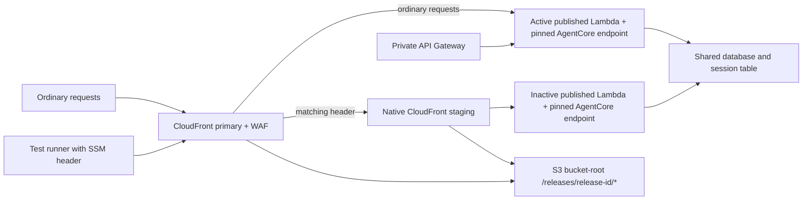

# Blue-green delivery

**Bootstrap must be reviewed before enabling `DEVELOPMENT_BLUE_GREEN_BOOTSTRAPPED`.**
Production uses the same release phases behind `PRODUCTION_BLUE_GREEN_BOOTSTRAPPED`.
Keep that flag disabled until a separate production bootstrap review after the
development rehearsal. Its planner stages immutable objects and saves the exact
preparation plan; the protected migration workflow revalidates that plan, applies
compatible migrations, and validates the candidate. **Production then waits for
Ryan to approve cutover.** Green stays running as the candidate while blue keeps
serving ordinary traffic (the colors alternate on subsequent releases).
Production claims remain the existing numeric deployment IDs.

For production bootstrap, populate `production_blue_green` in the foundation with
the exact generated identities, and pass `--environment production` to the
bootstrap binary-plan gate. The default gate only admits development plans.
Review the production planner’s release-prefix-only object writes and the delivery
role’s exact two-slot permissions; neither enables bootstrap resource creation.

## Architecture



The header value is read from SSM `/nova-toll/development/candidate-header` into
runner memory. Never print it or upload private plans as evidence. WAF redacts
it. CloudFront may fall back to primary, so candidate checks verify the actual
Lambda ARN/version, runtime ARN/version/endpoint, and runtime-emitted release ID.
[CloudFront considerations](https://docs.aws.amazon.com/AmazonCloudFront/latest/DeveloperGuide/continuous-deployment-quotas-considerations.html)

## Release state

| Phase | Action | Failure behavior |
|---|---|---|
| Bootstrap | Review exact development identities, permissions, resource moves, proxy allocations, protected traces and saved plan | Ordinary release gates still reject moves |
| Prepare | Gate one saved inactive-slot plan; run approved compatible migrations under the fixed migration role; re-assume delivery and apply that exact plan | Ordinary routing stays active |
| Validate | Readiness, grounded terminal answer, guardrail rejection, archive redaction, origin/session/reset, assets and actual identity; absent/wrong headers reach primary | No promotion |
| Approve (production) | Persist the exact prepared state in the existing private, versioned recovery record; wait for Ryan's `production-cutover` approval | Candidate remains running; public/private traffic remains on the active slot |
| Promote | Recheck claim, evidence and state; persist recovery record; apply a separate routing-only plan | Inspect state and attempt one fresh restoration plan |
| Observe | Wait for public/private deployment; five core probes one minute apart, each with a 60-second deadline | Two consecutive failures trigger one rollback; success resets the count |
| Recover | Fresh gated Terraform plan restores retained public/private routing; verify both streamed answers and retained assets | Report recovery separately; deployment remains failed |
| Complete | Record active/previous identities and keep the previous slot | After observation, cancellation or runner loss, use manual recovery |

Preparation rejects active-slot, primary-routing, IAM, network, scheduled-job and
shared cache/function changes. Those require a separate infrastructure review.
Promotion/recovery reject artifacts or unrelated changes. Plans reject drift,
unexpected moves and uncertain routing targets. A retry may reuse the identical
inactive descriptor but cannot change artifacts under its release ID.

Descriptors freeze versioned S3 artifacts, configuration and asset prefixes;
release-state output records actual published versions. Promotion only changes
active selection. Private API Gateway invokes the selected slot's `live` alias,
pinned to its published version without weighted alias routing.

Both retained pages reference `/releases/<id>/*` on the bucket-root origin.
Document caching is disabled. Shared reports keep their existing root paths.
Uploads use conditional writes and checksum/version verification.

## Production cutover approval

The existing `production` environment still protects preparation and migration.
A separate `production-cutover` environment protects the later approval job,
after preparation and candidate validation succeed. That job has no AWS
credentials. The following protected job reuses the existing delivery identity;
no IAM expansion or new deployment service is needed.

Configure `production-cutover` with required reviewer `rhprasad0` (user ID
`91573985`) only, administrator bypass disabled, self-review allowed so Ryan
can approve his own release, and a custom deployment policy allowing only the
`main` branch. The workflow verifies these settings before obtaining delivery
credentials; a missing or weakened gate stops the release.

In the Actions run, inspect the preparation summary and test the candidate using
the existing private SSM header. Then select **Review deployments → production-cutover
→ Approve and deploy**. Approval of preparation does not approve cutover.
GitHub may also request the existing `production` environment approval for the
resumed protected job; keep that protection in place.

After approval, the workflow revalidates the release claim, artifact and checkout,
loads the exact S3 version of the prepared record, and requires an unchanged state
lineage, serial and both slot descriptors. It runs fresh candidate/security/private
checks and gates a new routing-only plan before switching traffic. It does not
rerun migrations or reapply the earlier preparation plan. The legacy automatic
`finish --environment production` command is rejected.

No timer switches traffic. Rejecting approval, cancelling, or exceeding GitHub's
30-day approval wait fails the run and leaves the candidate provisioned and
ordinary routing unchanged. Expired release artifacts or intervening changes can
require a newly reviewed release sooner; an old approval never overrides the
fresh checks. The existing production concurrency group holds the release
sequence during the wait.

Automatic rollback remains enabled after approved cutover: two consecutive
observation failures trigger one saved-plan restore. This approval governs
promotion, not emergency restoration of the previously serving release.

[GitHub environment approval behavior](https://docs.github.com/en/actions/how-tos/deploy/configure-and-manage-deployments/control-deployments)
and [environment configuration](https://docs.github.com/en/actions/how-tos/deploy/configure-and-manage-deployments/manage-environments).

## Sessions

Sessions carry `release_id`. Foreign-release and legacy sessions expire before
either AgentCore chat or reset. The cookie clears and the browser displays:

> The application was updated. Start a new conversation.

Executing requests may finish; prompts are never replayed automatically.
Public/private updates are not globally atomic. Both retained frontend/API
contracts must remain compatible. There is no draining, custom router, weighted
customer canary or watchdog.

## Bootstrap review

Read-only development inventory on 2026-09-16 found account `903859731897`,
primary distribution `E33DVF3KT7BTAC`, blue runtime
`nova_toll_v2_development-Y69XBf88Bl` version `18`, and blue proxy
`tollchat-v2-chat-proxy-dev` published version `51`. No green runtime or staging
distribution existed; the site bucket was not versioned. Re-read these facts
before setup. **This inventory is not an approved plan.**

1. Keep delivery disabled. Review both complete descriptors. Bootstrap blue with
   the current application plus release/session instrumentation; green initially
   uses a compatible copy with a distinct release ID. Review/apply site-bucket
   versioning before uploading immutable packages and release assets.
2. Pre-provision `nova_toll_v2_development_green`; import its generated ID into
   `aws_bedrockagentcore_agent_runtime.tollchat["green"]`. AgentCore assigns this
   ID; do not invent it. If initial creation requires a temporary name-scoped
   execution role, that is a **separate reviewed setup action**. Remove that role
   after assigning the final exact-identity execution role.
3. Populate reviewed `release_slots`, keep `active_slot=blue`, and create the
   candidate header as an SSM SecureString without logging its value.
4. Generate a saved application bootstrap plan with the fixed development
   backend, foundation output and reviewed variables. Inspect every change
   privately and approve the binary SHA-256. Generate the JSON from that same
   binary with `terraform -chdir=v2/infra show -json`, then:
   ```sh
   python3 v2/scripts/blue_green.py bootstrap \
     --plan "$PRIVATE/bootstrap.json" --saved-plan "$PRIVATE/bootstrap.tfplan" \
     --approved-sha256 "$REVIEWED_PLAN_SHA256"
   terraform -chdir=v2/infra apply -input=false "$PRIVATE/bootstrap.tfplan"
   ```
   The bootstrap gate permits only declared moves and retained-object forgets.
   Do not commit the private plan, state or header.
5. Record green's runtime ID and the generated staging/policy IDs in foundation
   `development_blue_green`; review/apply that foundation plan. Delivery gets
   the exact additional identities/routing permissions; the PR planner gets
   corresponding reads. Trace subscription trust includes both exact runtimes'
   DEFAULT/preview log groups.
6. Prove both runtimes produce masked archived traces, inspect concurrency and
   origin permissions, and confirm ordinary public/private requests still serve
   blue. Only then enable the repository bootstrap variable.

AWS-generated IDs make bootstrap a sequence of dependent reviewed plans. Do not
substitute wildcard final permissions or relax ordinary release gates.

### Production ordering and approval packet

Keep `PRODUCTION_BLUE_GREEN_BOOTSTRAPPED` disabled and hold the production
serialization boundary below throughout setup. Complete source PR CI and human
review, deliver the final merged SHA through protected development delivery, and
verify its retained bundle/digest, readiness, installed schemas and canary evidence.
Keep `DEVELOPMENT_DELIVERY_ENABLED=true` after verification so subsequent reviewed
main changes continue through protected development delivery. Preserve the
application model, prompt, schedules, fixed migration limits and account isolation.

1. **Activate evaluation publishing before blue-green bootstrap.** Follow the
   [evaluation activation procedure](eval-dashboard.md#production-runtime-activation).
   For this activation only, retain PR #527's original checkout
   `b5d91ee4f99270d40976a8aec2173b7e7897c65c` in an isolated worktree. Prove its
   `v2/infra/timed_checks.tf` matches the merged reviewed change. Its pre-blue-green
   infrastructure keeps staging resources out of the two-resource activation plan.
   Recheck production identity, deployed packages, schema versions, writer grants
   and recovery evidence. Generate a **fresh private saved plan** using the deployed
   packages; old activation plans are invalid. Require only the timed-check Lambda's
   two evaluation variables and its IAM policy's three dashboard statements to
   change. Reject code/hash changes, removed permissions, schedules, routing or
   other resource mutations. Present the binary checksum and exact effects for
   human approval, then apply only that binary. This approval activates shared
   publishing immediately, independently of traffic cutover.
2. Verify the unchanged Lambda code hash and exact configuration. Use bounded
   read-only production queries to check `pricing.evaluation_runs`, `eval_writer`
   privileges and installed versions; do not rerun role creation or migration 033.
   Follow the next real scheduled occurrence through **database record → production
   `evals.json` → rendered dashboard**, matching occurrence identity, timestamps and
   ToolCallCount/Completeness/Correctness verdicts. Capture browser evidence and
   retain actual results, including failures. Never backfill or manufacture an
   occurrence; investigate missing completion after the existing 25-minute allowance.
3. Capture original serving runtime/proxy versions and retained assets. Reuse the
   verified development release bundle with distinct blue/green bootstrap release
   IDs. Review dependent saved setup plans for bucket versioning, immutable artifacts,
   the production candidate-header SecureString and green runtime provisioning.
   Establish exact green trace trust and generated resource identities. Perform only
   declared moves, imports and retained-object handoffs; remove temporary provisioning
   permissions after ownership transfers.
4. Prepare the application bootstrap plan with **`active_slot=blue`**. Explicitly
   review changes to serving blue and existing sessions: bootstrap may update blue
   before the later cutover approval, and release/session fencing can expire existing
   conversations. Preserve activated evaluation configuration. Show any package-path
   normalization separately and prove deployed code hashes remain identical for
   those normalization changes. Gate the same binary before human approval:
   ```sh
   python3 v2/scripts/blue_green.py bootstrap --environment production \
     --plan "$PRIVATE/bootstrap.json" --saved-plan "$PRIVATE/bootstrap.tfplan" \
     --approved-sha256 "$REVIEWED_PLAN_SHA256"
   ```
   Apply only that approved binary. Populate foundation `production_blue_green`
   permissions using actual runtime, staging-distribution and deployment-policy IDs.
5. Verify both slots' identities, immutable assets, origin restrictions, session
   handling, guardrails and protected traces; ordinary public/private traffic must
   still serve healthy blue. Require ordinary release plans to leave shared
   infrastructure unchanged. Have `pre_release_reviewer` assess the final candidate,
   bootstrap evidence and remaining gates before enabling production delivery.
   Retire the historical activation checkout after bootstrap; subsequent operations
   use the current reviewed source.

Publish the next unused stable release tag at the exact development-verified SHA.
Require release admission, artifact verification, a zero-change foundation plan and
the reviewed inactive-slot preparation plan. After the `production` approval, the
workflow connects Tailscale as `tag:ci` and checks the fixed production
`/preview/api/config` endpoint **before migrations or application apply**, requiring
HTTP 200 and `chatEnabled=true`. The HTTPS destination is pinned to `172.31.225.174`
(endpoint `vpce-0a618eb71eb2882b1`, interface `eni-0bc7a43fe0b90c14c`, verified
2026-09-18). If the interface changes, verify its replacement and update both the
ACL and preflight through review. An owner-device probe does not establish CI access.

At `production-cutover`, supply the run URL, candidate SHA, validation summary and
exact recovery-record identity. Capture browser screenshots before explicit human
approval. Browse `https://tollchat.ai` with the
`aws-cf-cd-tollchat` header from the existing
`/nova-toll/production/candidate-header` SSM SecureString to requests for that
production origin only (for example, a scoped Playwright route); the reviewed
CloudFront policy selects staging for matching requests. Keep the header and
cookies out of screenshots, logs and saved evidence. Verify the candidate identity,
chat/session/reset behavior and assets, then inspect ordinary public/private blue
traffic separately. `/eval-dashboard` uses the shared production publisher; it is
not isolated by slot and there is no additional public API.

After approval, fresh candidate/state checks and a new routing-only plan still gate
cutover; honor any additional protected-environment approval GitHub requests. Observe
the five existing probes one minute apart. Two consecutive failures trigger one
routing restore; verify both ingress paths after recovery. Never roll back the
database automatically. Completion requires both ingress paths serving the approved
candidate, a healthy retained slot, the observation window, a clean final plan and
a fresh persisted/published/rendered evaluation. Save sanitized release/recovery
evidence and limitations. A failed check holds the next stage; source or state changes
invalidate earlier plans and require fresh review.

## Manual application recovery

Automatic recovery ends with the observation window. For cancellation or runner
loss, stop newer delivery work and hold the same `v2-development-apply`
serialization boundary before manual recovery. No background watchdog runs.
For production, hold `v2-production-release-delivery` instead. GitHub concurrency
does not lock a local shell: disable new delivery and confirm no run is active
before taking this operator-held boundary.

Use the original admitted release checkout/bundle and verified foundation
variables in an isolated worktree. Verify the bundle with
`verify_release_bundle.py verify --verify-checkout`; do not rebuild artifacts.
The private record is
`releases/<candidate-id>/recovery/<run-id>:<attempt>.json` in the fixed artifact
bucket. Read its exact S3 version from the delivery summary, or from the exact
key after runner loss. Do not use an unversioned record.

Review both retained identities and the current state lineage/serial. Compute
the reviewed state identity hash without publishing state:

```sh
terraform -chdir="$APPLICATION_ROOT" state pull |
  python3 -c 'import hashlib,json,sys; s=json.load(sys.stdin); v={k:s[k] for k in ("lineage","serial")}; print(hashlib.sha256(json.dumps(v,sort_keys=True,separators=(",",":")).encode()).hexdigest())'
```

Using the fixed delivery role or the recorded development SSO administrator role:

```sh
AWS_PROFILE=nova-toll-dev python3 v2/scripts/release_blue_green.py recover \
  --environment development --terraform-root "$APPLICATION_ROOT" \
  --bundle-root "$VERIFIED_BUNDLE" --foundation-vars "$FOUNDATION_VARS" \
  --work-dir "$PRIVATE/recovery" --output "$PRIVATE/recovery-result.json" \
  --claim "$ORIGINAL_RUN_ID:$ORIGINAL_ATTEMPT" --release-id "$CANDIDATE_ID" \
  --record-version "$RECOVERY_RECORD_VERSION" \
  --expected-state-sha256 "$REVIEWED_STATE_IDENTITY_SHA256"
```

For production, dispatch `v2-production-recovery.yml` from `main` with the original
numeric `claim_id`, exact `record_version`, and reviewed `expected_state_sha256`.
Approve its protected `production` environment. The workflow serializes with
production delivery and uses the existing deployment role; no local production
administrator session is required. Its record key is
`releases/<candidate-id>/recovery/<claim-id>.json` in the fixed production bucket.
It verifies the completed original release run and development evidence, restores
the exact admitted bundle and original candidate checkout, and reads foundation
variables from the versioned record. Records without an exact bundle ID/digest
binding are rejected. The serving application need not pass a health check before
restoration; both ingress paths must pass afterward.

The command checks claim, lineage, both descriptors and reviewed state identity,
generates a fresh routing-only plan, rechecks serial before apply, and attempts
restoration once. A newer release is rejected. Exit status remains nonzero on
successful recovery: `deployment=failed, recovery=recovered`. Inspect that
separate result. The production workflow reports that recovery operation as
successful while preserving `deployment=failed`. No migration or database
downgrade is performed. Investigate a
failed restore; never repeatedly apply a stale plan or mutate routing directly.

Development private probes connect through the existing Tailscale site-1 4via6
route while retaining the API hostname for TLS, HTTP and origin checks. Public
candidate checks pace chat and reset requests below the existing WAF limit
(35 seconds apart in development; 17 in production). Allow several minutes for
validation; pacing occurs outside the individual canary deadline.

Shared loader, publisher and timed-check packages use paths relative to the
Terraform module (`build/*.zip`) in both planning and delivery. Bootstrap must
use these same paths: absolute workstation or runner paths cause unchanged
packages to appear as shared-resource updates, which the release gates reject.

## Rehearsal and evidence

Local tests exercise controller branches with mocked AWS/Terraform I/O: invalid
candidate, healthy promotion, two failed probes, partial switch, stale state and
restore failure. SQL tests run PR-base and candidate contracts against the same
upgraded disposable database. The PR base is not necessarily the deployed retained
release after skipped or failed delivery. Before approving migrations, the human
reviewer must require disposable contract-test evidence using the actual retained
release commit as the baseline (`bash v2/scripts/run_db_tests.sh <retained-commit>`),
and review compatibility with both retained applications. Ordinary PR CI alone
does not establish that deployed-release compatibility. **These tests do not prove a live deployment.**

The [sanitized simulated rollback record](evidence/blue-green-simulated-rollback.json)
records the executed controller-test outcomes separately from live evidence.

After bootstrap review, rehearse through protected exact-release delivery:

1. Deliver a reviewed broken candidate. Validation fails while ordinary blue
   public/private requests continue succeeding.
2. Deliver good green, record its actual proxy/runtime identities, promote it,
   and demonstrate the old-session restart.
3. Inject a reviewed development post-promotion check failure. Two consecutive
   failures must trigger exactly one restore. Record terminal streamed answers
   from both public and private blue ingress and retained green assets.
4. Deliver again to prove preparation preserves whichever slot is active.
   Use the retained release commit as the disposable SQL test baseline.

Preserve release IDs, published identities, timestamps, probe booleans,
public/private verification outcomes and separate deployment/recovery status.
Exclude candidate headers, cookies, prompts, private plans and credentials.

**Live bootstrap and rollback rehearsal: not run; separately reviewed setup is
required.** Shared database and capacity failures remain shared.
