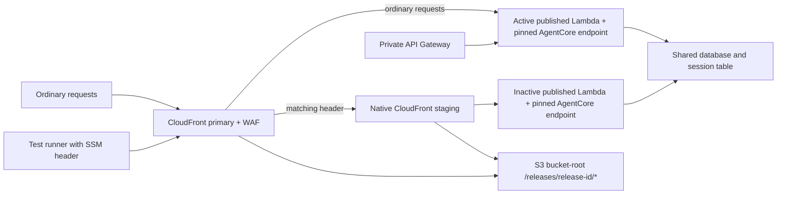

# Blue-green development delivery

**Bootstrap must be reviewed before enabling `DEVELOPMENT_BLUE_GREEN_BOOTSTRAPPED`.**
Production still uses its existing gate; adopting this application layout there
requires a separate bootstrap and workflow review after the development rehearsal.

## Architecture



The header value is read from SSM `/nova-toll/development/candidate-header` into
runner memory. Never print it or upload private plans as evidence. WAF redacts
it. CloudFront may fall back to primary, so candidate checks verify the actual
Lambda ARN/version, runtime ARN/version/endpoint, and runtime-emitted release ID.
[CloudFront considerations](https://docs.aws.amazon.com/AmazonCloudFront/latest/DeveloperGuide/continuous-deployment-quotas-considerations.html)

## Release state

| Phase | Action | Failure behavior |
|---|---|---|
| Bootstrap | Review exact development identities, permissions, resource moves, proxy allocations, protected traces and saved plan | Ordinary release gates still reject moves |
| Prepare | Gate one saved inactive-slot plan; run approved compatible migrations under the fixed migration role; re-assume delivery and apply that exact plan | Ordinary routing stays active |
| Validate | Readiness, grounded terminal answer, guardrail rejection, archive redaction, origin/session/reset, assets and actual identity; absent/wrong headers reach primary | No promotion |
| Promote | Recheck claim, evidence and state; persist recovery record; apply a separate routing-only plan | Inspect state and attempt one fresh restoration plan |
| Observe | Wait for public/private deployment; five core probes one minute apart, each with a 60-second deadline | Two consecutive failures trigger one rollback; success resets the count |
| Recover | Fresh gated Terraform plan restores retained public/private routing; verify both streamed answers and retained assets | Report recovery separately; deployment remains failed |
| Complete | Record active/previous identities and keep the previous slot | After observation, cancellation or runner loss, use manual recovery |

Preparation rejects active-slot, primary-routing, IAM, network, scheduled-job and
shared cache/function changes. Those require a separate infrastructure review.
Promotion/recovery reject artifacts or unrelated changes. Plans reject drift,
unexpected moves and uncertain routing targets. A retry may reuse the identical
inactive descriptor but cannot change artifacts under its release ID.

Descriptors freeze versioned S3 artifacts, configuration and asset prefixes;
release-state output records actual published versions. Promotion only changes
active selection. Private API Gateway invokes the selected slot's `live` alias,
pinned to its published version without weighted alias routing.

Both retained pages reference `/releases/<id>/*` on the bucket-root origin.
Document caching is disabled. Shared reports keep their existing root paths.
Uploads use conditional writes and checksum/version verification.

## Sessions

Sessions carry `release_id`. Foreign-release and legacy sessions expire before
either AgentCore chat or reset. The cookie clears and the browser displays:

> The application was updated. Start a new conversation.

Executing requests may finish; prompts are never replayed automatically.
Public/private updates are not globally atomic. Both retained frontend/API
contracts must remain compatible. There is no draining, custom router, weighted
customer canary or watchdog.

## Bootstrap review

Read-only development inventory on 2026-09-16 found account `903859731897`,
primary distribution `E33DVF3KT7BTAC`, blue runtime
`nova_toll_v2_development-Y69XBf88Bl` version `18`, and blue proxy
`tollchat-v2-chat-proxy-dev` published version `51`. No green runtime or staging
distribution existed; the site bucket was not versioned. Re-read these facts
before setup. **This inventory is not an approved plan.**

1. Keep delivery disabled. Review both complete descriptors. Bootstrap blue with
   the current application plus release/session instrumentation; green initially
   uses a compatible copy with a distinct release ID. Review/apply site-bucket
   versioning before uploading immutable packages and release assets.
2. Pre-provision `nova_toll_v2_development_green`; import its generated ID into
   `aws_bedrockagentcore_agent_runtime.tollchat["green"]`. AgentCore assigns this
   ID; do not invent it. If initial creation requires a temporary name-scoped
   execution role, that is a **separate reviewed setup action**. Remove that role
   after assigning the final exact-identity execution role.
3. Populate reviewed `release_slots`, keep `active_slot=blue`, and create the
   candidate header as an SSM SecureString without logging its value.
4. Generate a saved application bootstrap plan with the fixed development
   backend, foundation output and reviewed variables. Inspect every change
   privately and approve the binary SHA-256. Generate the JSON from that same
   binary with `terraform -chdir=v2/infra show -json`, then:
   ```sh
   python3 v2/scripts/blue_green.py bootstrap \
     --plan "$PRIVATE/bootstrap.json" --saved-plan "$PRIVATE/bootstrap.tfplan" \
     --approved-sha256 "$REVIEWED_PLAN_SHA256"
   terraform -chdir=v2/infra apply -input=false "$PRIVATE/bootstrap.tfplan"
   ```
   The bootstrap gate permits only declared moves and retained-object forgets.
   Do not commit the private plan, state or header.
5. Record green's runtime ID and the generated staging/policy IDs in foundation
   `development_blue_green`; review/apply that foundation plan. Delivery gets
   the exact additional identities/routing permissions; the PR planner gets
   corresponding reads. Trace subscription trust includes both exact runtimes'
   DEFAULT/preview log groups.
6. Prove both runtimes produce masked archived traces, inspect concurrency and
   origin permissions, and confirm ordinary public/private requests still serve
   blue. Only then enable the repository bootstrap variable.

AWS-generated IDs make bootstrap a sequence of dependent reviewed plans. Do not
substitute wildcard final permissions or relax ordinary release gates.

## Manual application recovery

Automatic recovery ends with the observation window. For cancellation or runner
loss, stop newer delivery work and hold the same `v2-development-apply`
serialization boundary before manual recovery. No background watchdog runs.

Use the original admitted release checkout/bundle and verified foundation
variables in an isolated worktree. Verify the bundle with
`verify_release_bundle.py verify --verify-checkout`; do not rebuild artifacts.
The private record is
`releases/<candidate-id>/recovery/<run-id>:<attempt>.json` in the fixed artifact
bucket. Read its exact S3 version from the delivery summary, or from the exact
key after runner loss. Do not use an unversioned record.

Review both retained identities and the current state lineage/serial. Compute
the reviewed state identity hash without publishing state:

```sh
terraform -chdir="$APPLICATION_ROOT" state pull |
  python3 -c 'import hashlib,json,sys; s=json.load(sys.stdin); v={k:s[k] for k in ("lineage","serial")}; print(hashlib.sha256(json.dumps(v,sort_keys=True,separators=(",",":")).encode()).hexdigest())'
```

Using the fixed delivery role or the recorded development SSO administrator role:

```sh
AWS_PROFILE=nova-toll-dev python3 v2/scripts/release_blue_green.py recover \
  --environment development --terraform-root "$APPLICATION_ROOT" \
  --bundle-root "$VERIFIED_BUNDLE" --foundation-vars "$FOUNDATION_VARS" \
  --work-dir "$PRIVATE/recovery" --output "$PRIVATE/recovery-result.json" \
  --claim "$ORIGINAL_RUN_ID:$ORIGINAL_ATTEMPT" --release-id "$CANDIDATE_ID" \
  --record-version "$RECOVERY_RECORD_VERSION" \
  --expected-state-sha256 "$REVIEWED_STATE_IDENTITY_SHA256"
```

The command checks claim, lineage, both descriptors and reviewed state identity,
generates a fresh routing-only plan, rechecks serial before apply, and attempts
restoration once. A newer release is rejected. Exit status remains nonzero on
successful recovery: `deployment=failed, recovery=recovered`. Inspect that
separate result. No migration or database downgrade is performed. Investigate a
failed restore; never repeatedly apply a stale plan or mutate routing directly.

## Rehearsal and evidence

Local tests exercise controller branches with mocked AWS/Terraform I/O: invalid
candidate, healthy promotion, two failed probes, partial switch, stale state and
restore failure. SQL tests run baseline and candidate contracts against the same
upgraded disposable database. **These tests do not prove a live deployment.**

The [sanitized simulated rollback record](evidence/blue-green-simulated-rollback.json)
records the executed controller-test outcomes separately from live evidence.

After bootstrap review, rehearse through protected exact-release delivery:

1. Deliver a reviewed broken candidate. Validation fails while ordinary blue
   public/private requests continue succeeding.
2. Deliver good green, record its actual proxy/runtime identities, promote it,
   and demonstrate the old-session restart.
3. Inject a reviewed development post-promotion check failure. Two consecutive
   failures must trigger exactly one restore. Record terminal streamed answers
   from both public and private blue ingress and retained green assets.
4. Deliver again to prove preparation preserves whichever slot is active.
   Use the retained release commit as the disposable SQL test baseline.

Preserve release IDs, published identities, timestamps, probe booleans,
public/private verification outcomes and separate deployment/recovery status.
Exclude candidate headers, cookies, prompts, private plans and credentials.

**Live bootstrap and rollback rehearsal: not run; separately reviewed setup is
required.** Shared database and capacity failures remain shared.
